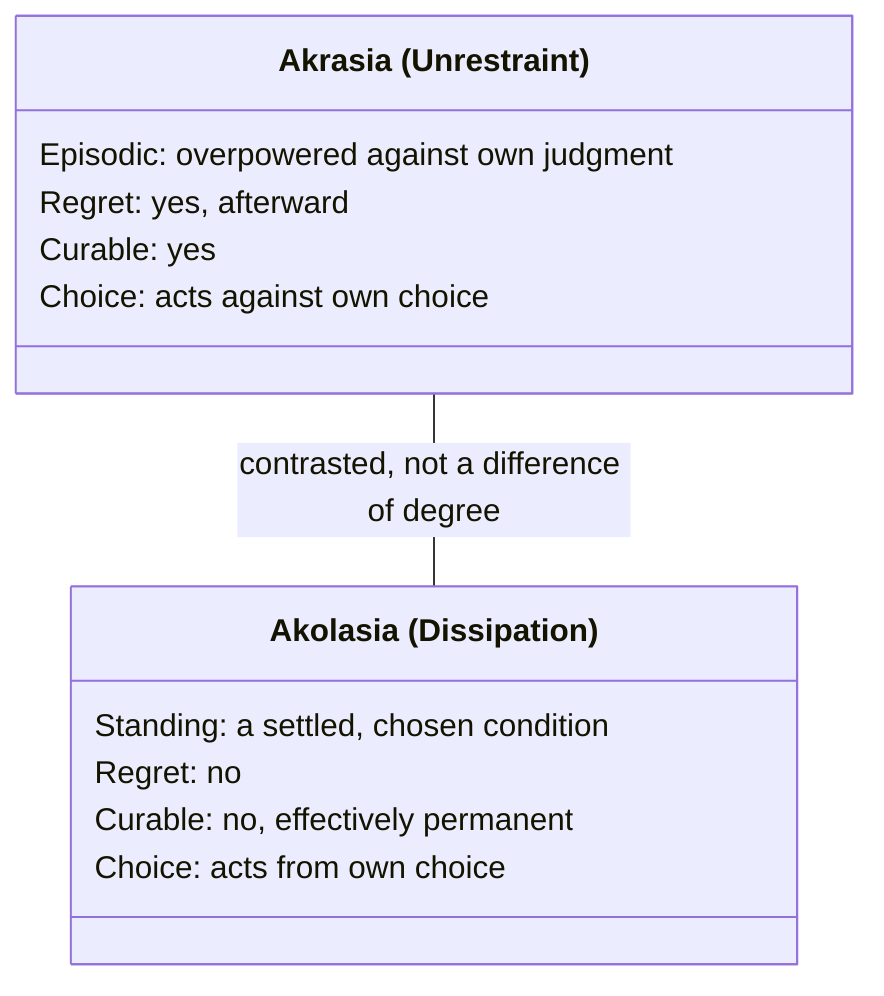

# Akolasia (Dissipation)

The vice of excess in the temperance row of the [[concepts/doctrine-of-the-mean|mean table]] (deficiency: insensibility / mean: temperance / **excess: akolasia**) — Greek **ἀκολασία** (*akolasia*), adjective **ἀκόλαστος** (*akolastos*). Sachs's consistent translation is "dissipation," a choice his glossary defends directly against the alternatives:

> "'Dissipation' is not an ideal translation, but it seems better than the usual alternatives, which are either obsolete (profligacy), quaint (licentiousness), or too weak (intemperance)." (Glossary)

The word trips up modern readers because English "dissipated" now mostly connotes wasted, scattered energy (a "dissipated effort"), not bodily indulgence — which is closer to what a reader might reach for with **"indulgence"** or **"self-indulgence"** instead. That instinct isn't wrong: W. D. Ross's standard translation actually uses "self-indulgence" for the same word, so it's a legitimate scholarly alternative, not a loose gloss — see *Open Questions* below for the one nuance it risks losing.

## Diagram

A direct side-by-side comparison: both conditions involve giving in to bodily pleasure, but Aristotle distinguishes them by the same four properties held to different values, not by any process or cycle.



How to read it: akrasia's cycle always returns to "knows better" between lapses — like the "epileptic seizures" Aristotle compares it to, it's intermittent and curable. Akolasia has no return path — the person has settled, like "dropsy and consumption," into a single self-reinforcing state with no regret to pull them out.

## Key Ideas

- **Literal root: "unpruned."** Footnote 76 (on the "spoiled child" passage, Bk. III, ch. 12) gives the etymology directly: "In Greek, the same word means 'spoiled' as in the case of an overindulged child, and 'dissipated' as in a fully formed adult state of character; its root sense is 'unpruned,' extending to mean 'unpunished,' 'uncorrected,' or 'undisciplined.'" Grammatically it is alpha-privative + *kolazein* ("to prune, chastise, correct") — *a-kolastos*, "not cut back." The same word is used colloquially of an overindulged child and of a grown person of settled bad character — Aristotle's point (Bk. III, ch. 12) is that the growth was simply never checked. ^[extracted]
- **Domain: only touch and taste, not pleasure generally.** [[concepts/doctrine-of-the-mean|Temperance and dissipation]] are restricted to the bodily pleasures shared with animals — food, drink, and sex — and explicitly *not* to pleasures of sight, hearing, or smell (enjoying paintings, music, or the smell of roses doesn't make someone "dissipated"), nor to non-bodily pleasures like the love of honor or of talking. Aristotle calls this the "most widely shared" and most "slavish and animal-like" class of pleasure, which is why dissipation is, in his words, "justly the most reproached vice... because it is present not insofar as we are human beings but insofar as we are animals" (Bk. III, ch. 10). ^[extracted]
- **Aristotle's working definition** (per Sachs's glossary, citing 1146b 22-23): "the vice by which one deliberately chooses to be, or acquiesces in being, someone who indulges in the pleasures of eating, drinking, and sex whenever they are available." The operative word is *chooses* — see next point. ^[extracted]
- **A settled active condition ([[concepts/hexis|hexis]]), not an episode — this is the crucial line separating it from [[concepts/akrasia|akrasia]].** The dissipated person has decided, as a matter of principle, that one ought always to pursue pleasure, and acts on that conviction consistently; the unrestrained (*akratic*) person believes the opposite but is overpowered by passion in the moment. This is why Aristotle says the dissipated person feels **no regret** ("stands by his choice") while the unrestrained person always does, and why he reaches for a medical contrast: vice (including dissipation) is "like such diseases as dropsy and consumption" — continuous and effectively incurable — while unrestraint is "like epileptic seizures" — intermittent, and curable (Bk. VII, ch. 8). Aristotle explicitly ranks the merely unrestrained person as *better* than the dissipated one, "since the best thing in him, the source, is preserved." ^[extracted]
- **Natural desires can be indulged to excess too, without being "dissipation" in the full sense.** Aristotle distinguishes overeating out of plain appetite (the "greedyguts," who merely exceeds a natural desire in amount) from dissipation proper, which is about *how* one relates to the pleasure — pursuing it by choice, indiscriminately, and beyond what is fitting, not merely eating too much on occasion (Bk. III, ch. 11). ^[extracted]
- **Connects to habituation**: the "unpruned plant" image lines up with Book II's general claim that virtue and vice are both produced by the actions one repeatedly performs — dissipation is the specific, describable *result* of a desiring part of the soul that was never brought under the rule of reason in the way [[concepts/hexis|habituation]] is supposed to bring it, left instead to "grow" toward whatever is pleasant, the way an unpruned branch grows wherever it likes. ^[inferred]

## Greek Gloss

Source for all four passages: Aristotle, *Ēthika Nikomacheia*, Bywater's 1894 Oxford Classical Text (Bekker 1831 pagination), via the [Perseus Digital Library](https://scaife.perseus.org/library/urn:cts:greekLit:tlg0086.tlg010/) (public domain). Every word of each cited sentence is glossed below, Leipzig-interlinear style.

### Bk. II, ch. 7 (Bekker 1107b5-6)

> μεσότης μὲν σωφροσύνη, ὑπερβολὴ δὲ ἀκολασία.

```
μεσότης   μὲν   σωφροσύνη       ὑπερβολὴ    δὲ   ἀκολασία
mesotēs   men   sōphrosynē      hyperbolē   de   akolasia
mean.NOM  PTCL  temperance.NOM  excess.NOM  but  dissipation.NOM
```

*"The mean is temperance, and the excess is dissipation."* This is the bare equation that anchors the temperance row of the mean table: **ἀκολασία** (*akolasia*) is built from alpha-privative *a-* ("not, un-") plus the root of *kolazō* ("to prune, dock, chastise") plus the abstract-noun suffix *-ia* — literally "un-checked-ness," the state of a branch never pruned back, set here in flat grammatical parallel against *sōphrosynē* ("soundness of mind") as its opposite pole.

### Bk. III, ch. 10 (Bekker 1118b1-3)

> κοινοτάτη δὴ τῶν αἰσθήσεων καθʼ ἣν ἡ ἀκολασία· καὶ δόξειεν ἂν δικαίως ἐπονείδιστος εἶναι, ὅτι οὐχ ᾗ ἄνθρωποί ἐσμεν ὑπάρχει, ἀλλʼ ᾗ ζῷα.

```
κοινοτάτη        δὴ    τῶν         αἰσθήσεων   καθʼ          ἣν         ἡ        ἀκολασία·        καὶ  δόξειεν         ἂν   δικαίως  ἐπονείδιστος      εἶναι,  ὅτι      οὐχ   ᾗ           ἄνθρωποί    ἐσμεν   ὑπάρχει,   ἀλλʼ  ᾗ           ζῷα.
koinotatē        dē    tōn         aisthēseōn  kath'         hēn        hē       akolasia         kai  doxeien         an   dikaiōs  eponeidistos      einai   hoti     ouch  hēi         anthrōpoi   esmen   hyparchei  all'  hēi         zōia
most-common.NOM  PTCL  the.GEN.PL  senses.GEN  according-to  which.ACC  the.NOM  dissipation.NOM  and  might-seem.OPT  MOD  justly   reproachable.NOM  to-be   because  not   insofar-as  humans.NOM  we-are  belongs    but   insofar-as  animals.NOM
```

*"The most common of the senses is the one dissipation belongs to; and it might justly seem reproachable, because it belongs to us not insofar as we are human beings, but insofar as we are animals."* This is the sentence behind the "most reproached vice" claim in Key Ideas: touch is singled out as the sense shared most fully with other animals, and **ἐπονείδιστος** (*eponeidistos*, "reproachable") is built from intensive *ep-* + the root of *oneidos* ("reproach, disgrace") + the verbal-adjective suffix *-istos* ("worthy of, fit to be") — grammatically marking dissipation as a state that *deserves* blame, not merely one that happens to attract it.

### Bk. III, ch. 11 (Bekker 1118b19-20)

> διὸ λέγονται οὗτοι γαστρίμαργοι, ὡς παρὰ τὸ δέον πληροῦντες αὐτήν.

```
διὸ        λέγονται    οὗτοι      γαστρίμαργοι,  ὡς   παρὰ    τὸ       δέον         πληροῦντες    αὐτήν.
dio        legontai    houtoi     gastrimargoi   hōs  para    to       deon         plērountes    autēn
therefore  are-called  these.NOM  gluttons.NOM   as   beyond  the.ACC  fitting.ACC  filling.PTCP  it.ACC
```

*"That is why these people are called belly-mad, as filling it beyond what is fitting."* This is the actual word behind the "greedyguts" bullet: **γαστρίμαργος** (*gastrimargos*) fuses the root of *gastēr* ("belly, stomach") to *margos* ("raging, ravenous, mad for") via a linking vowel, naming someone who merely overfills the belly past what nature requires — an error of amount that Aristotle treats as a lesser fault than dissipation proper, which is about the chosen *relation* to pleasure, not the quantity consumed.

### Bk. VII, ch. 8 (Bekker 1150b25-30)

> ἔστι δʼ ὁ μὲν ἀκόλαστος, ὥσπερ ἐλέχθη, οὐ μεταμελητικός· ἐμμένει γὰρ τῇ προαιρέσει· ὁ δʼ ἀκρατὴς μεταμελητικὸς πᾶς.

```
ἔστι  δʼ   ὁ        μὲν   ἀκόλαστος,          ὥσπερ    ἐλέχθη,   οὐ   μεταμελητικός·  ἐμμένει    γὰρ  τῇ       προαιρέσει·  ὁ        δʼ   ἀκρατὴς               μεταμελητικὸς  πᾶς.
esti  d'   ho       men   akolastos           hōsper   elechthē  ou   metamelētikos   emmenei    gar  tēi      prohairesei  ho       d'   akratēs               metamelētikos  pas
is    and  the.NOM  PTCL  dissipated-man.NOM  just-as  was-said  not  regretful.NOM   abides-by  for  the.DAT  choice.DAT   the.NOM  and  unrestrained-man.NOM  regretful.NOM  every
```

*"The dissipated person, as was said, is not prone to regret — for he abides by his choice; but the unrestrained person is always prone to regret."* This is the exact line supporting the "no regret" claim in Key Ideas: **μεταμελητικός** (*metamelētikos*) is built from *meta-* ("after, change of") + the root of *melei* ("to be a care/concern") + the adjectival suffix *-ētikos* ("disposed to, characterized by") — "disposed to after-care," i.e. prone to regret — and the dissipated man is flatly denied this disposition while the unrestrained man is said to have it *without exception* (*pas*, "every, wholly"), the same contrast the dropsy/consumption-vs-epilepsy medical image is meant to illustrate.

## Open Questions

- **Does "indulgence"/"self-indulgence" lose anything "dissipation" keeps?** Ross's "self-indulgence" nicely captures that the vice is chosen and self-directed (matching the *hexis* point above), but on its own, in casual use, "indulgence" can sound momentary or mild ("I indulged a little") — closer to what Aristotle would call *akrasia* than to the settled, unregretful, principled condition he actually means. If "indulgence" is adopted as a working gloss, it's worth mentally attaching "as a settled character trait" to it, to keep the *hexis*/*akrasia* distinction from blurring back together. ^[inferred]

## Related

- [[concepts/doctrine-of-the-mean]] — akolasia is the named excess-pole opposite temperance in the mean table
- [[concepts/hexis]] — akolasia is explicitly a settled active condition, chosen and stood by, not a passing lapse
- [[concepts/akrasia]] — the concept akolasia is most often confused with; distinguished by regret, curability, and whether the person's own choice endorses the pleasure-seeking
- [[synthesis/virtue-taxonomy]] — treemap depicting akolasia as the bodily-pleasure triad's excess leaf
- [[references/nicomachean-ethics]] — source text (Book III, ch. 10-12; Book VII, ch. 4-8)
