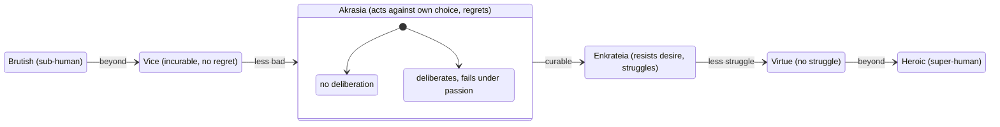

# Akrasia (Lack of Self-Restraint)

Book VII opens by naming three things to be avoided in character: vice, lack of self-restraint (*akrasia*), and an animal-like/brutish state (with virtue, self-restraint, and a rare "heroic/godlike" excess-of-virtue as their respective opposites). Unrestraint and self-restraint (*enkrateia*) are Aristotle's focus, treated as a distinct third category, not a degree of vice or virtue.

## Diagram

The states form a chain from worst to best, but akrasia itself is not a fixed condition the way vice is: it is a composite state that splits internally into impetuousness and weakness, and — unlike vice's dead end — it is curable, capable of transitioning into self-restraint through habituation.

## Key Ideas

- **The Socratic puzzle**: Socrates denied unrestraint is even possible, holding that no one acts against what they believe best while believing it — apparent unrestraint must really be ignorance. Aristotle rejects this as contradicting plain experience, but takes seriously the puzzle of *how* someone can act against knowledge. His resolution turns on distinguishing **having knowledge from using/attending to it** (someone asleep, drunk, or in a state of passion "has" knowledge in name only, reciting it the way an actor speaks lines or a beginner strings together words without understanding), and on the structure of a **practical syllogism**: an unrestrained person may hold the universal premise ("one ought not taste this") without having it active, while desire seizes the particular perceptual premise ("this is sweet") and drives the action — so unrestraint results from an opinion "opposed to right reason... incidentally," since it is the desire, not a competing judgment, that opposes it. Animals cannot be unrestrained, since they lack universal conceptions altogether, only imagination and memory of particulars. ^[extracted]
- **Unrestraint "simply" is narrower than the word's colloquial use**: Aristotle restricts unrestraint proper to the same domain as temperance and [[concepts/akolasia|dissipation]] — bodily pleasures of touch and taste. Failures of self-control regarding honor, money, or spiritedness are called unrestraint only "by an added qualification" (e.g. "unrestrained for anger"), by analogy, "as one might speak of a bad doctor or bad actor" without meaning simply bad. Unrestraint for spiritedness is judged less shameful than for desire, since spiritedness "listens to reason" in a rough way (like a servant who rushes off half-hearing an order) where desire does not listen at all. ^[extracted]
- **Unrestraint is not vice**, and is in an important sense curable while vice is not: the [[concepts/akolasia|dissipated]] (vicious) person has *chosen*, on principle, that one ought always pursue pleasure, and so feels no regret — vice is a continuous, hidden bad condition like dropsy. The unrestrained person acts *against* his own correct choice, driven by passion, and regrets it afterward — unrestraint is more like an intermittent, self-aware condition, "like epileptic seizures." Aristotle ranks the unrestrained person as better than the dissipated one, "since the best thing in him, the source, is preserved." Unrestraint is further subdivided into **impetuousness** (acting from passion without deliberating at all) and **weakness** (having deliberated correctly but failing to stick to it under passion) — the impetuous/excitable type is judged more easily cured. ^[extracted]
- **Self-restraint is not the same as temperance**: the self-restrained person has strong, base desires but does not act on them (a struggle); the temperate person simply does not have base desires to that degree (no struggle). Aristotle explicitly ranks self-restraint below temperance for this reason, and also distinguishes self-restraint from mere stubbornness (which resists persuasion out of pride, not principle) and from Neoptolemus-in-Sophocles's-*Philoctetes*-type failures to stand by a decision, which can actually be praiseworthy if standing by it would have meant continuing to do wrong. ^[extracted]
- **Practical judgment and unrestraint are incompatible** (revisiting [[concepts/phronesis]]): since a person of practical judgment is, by definition, someone of good character who is able to act on correct judgment, the unrestrained person — who fails to act on correct judgment — cannot simultaneously have practical judgment, though nothing prevents a merely *clever* person (who has the reasoning skill but not the character) from being unrestrained. ^[extracted]
- Chapters 11-14 of Book VII pivot to a **first pass at the theory of pleasure** later completed in Book X: against the view that pleasure is simply bad, Aristotle argues some pleasures are goods without qualification (e.g. contemplation), that pleasure is a being-at-work (*energeia*) completing an activity rather than a process of coming-into-being, and that bodily pleasures only look most real to most people because they are the most familiar and intense (often functioning as a "cure" for an antecedent pain, which is why they seem more urgent than they are). See [[concepts/pleasure-aristotle]] for the fuller Book X treatment. ^[extracted]

## Related

- [[concepts/hexis]] — unrestraint is explicitly denied the status of a settled active condition; it is a *pathos* (passive, episodic condition), unlike virtue and vice
- [[concepts/akolasia]] — the vicious counterpart akrasia is most often confused with; distinguished by regret, curability, and whether one's own choice endorses the pleasure-seeking
- [[concepts/phronesis]] — practical judgment and unrestraint cannot coexist in the same person
- [[concepts/prohairesis]] — the unrestrained person acts against choice, unlike the vicious person who acts from a corrupt choice
- [[concepts/pleasure-aristotle]] — Book VII's provisional theory of pleasure, completed in Book X
- [[references/nicomachean-ethics]] — source text (Book VII)
