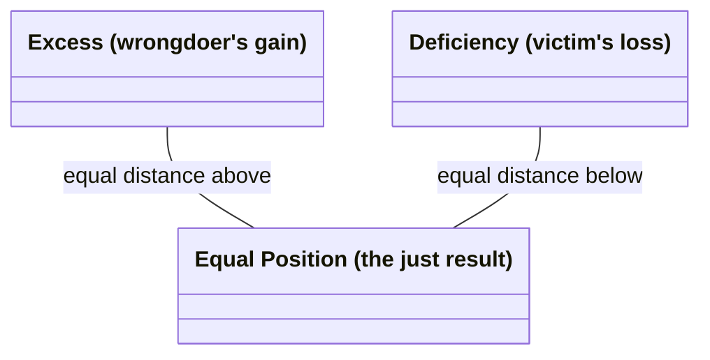

# Corrective (Rectificatory) Justice

The second of the two forms of **particular justice** (Bk. V, ch. 2, 4-5) — the Greek is *to diorthotikon dikaion*, "the corrective just," from *diorthoun*, "to straighten/set right." Translator Joe Sachs renders it literally as "the justice that sets things straight" rather than using the Latinate "corrective" or "rectificatory," though both of those are the standard labels in the secondary literature (confirmed in this edition's own footnotes). It governs **transactions**, both **willing** (selling, buying, lending at interest, giving security, investing, entrusting, renting) and **unwilling** — subdivided into *stealthy* (theft, adultery, poisoning, corrupting slaves, false witness) and *violent* (assault, imprisonment, murder, rape, verbal abuse).

## Diagram

The claim itself, stated directly: the just position is the arithmetic mean, equidistant from both unequal departures.



## Key Ideas

- **Structured as an arithmetic proportion**, in contrast to [[concepts/distributive-justice|distributive justice]]'s geometric proportion. The judge treats the parties as strict equals regardless of prior merit or status — "it makes no difference whether a decent person cheated a low person or the reverse" — the law looks only at the harm itself. Injustice is measured as a deviation from an equal position: the wrongdoer's illicit "gain" and the victim's "loss" are treated as unequal departures from a mean, even where "gain" and "loss" aren't literally the right words (Aristotle's example: a wound inflicted has no literal "gain" for the wounder, but the framework still applies). ^[extracted]
- **The judge as "ensouled justice"**: Aristotle's image is a line unequally cut, where the judge takes the excess from the larger segment and adds it to the smaller until both are equal — "people seek out a judge as a mean... if they hit the mean, they will hit upon what is just." He even puns on the etymology: the just (*dikaion*) is so called because it divides "in halves" (*dicha*), and the judge (*dikastes*) is, in effect, "the halver." ^[extracted]
- **Reciprocity is not, by itself, justice** — Aristotle explicitly rejects the Pythagorean/Rhadamanthine formula "if one suffers what one did, that is the straight and upright way" as a full account of the just: a subordinate who strikes a superior deserves *more* than simple retaliation in return, and willing and unwilling transactions differ too much to be governed by one rule of strict payback. ^[extracted]
- **But a *proportional* reciprocity holds economic and political community together.** Aristotle's example: a housebuilder and a leatherworker must exchange goods (a house for shoes) in proportion to the worth of their respective work, not in raw quantity — "linking along the diagonal," as he puts it — or "the parties do not stay together." **Currency** is introduced as the device that makes this possible: it "becomes in a certain way a mean," rendering otherwise incommensurable goods comparable by tying them to a common, conventional measure ultimately grounded in need — "it is not natural but by current custom, and it is in our power to change it or make it worthless." ^[extracted]
- Sits directly downstream of [[concepts/prohairesis|Aristotle's account of voluntary and involuntary action]] (Bk. V, ch. 8): whether an act counts as "doing injustice" or merely "doing an unjust thing" depends on whether it was done knowingly, willingly, and by choice — the same voluntary/involuntary machinery from Book III is redeployed here to distinguish culpable injustice from mere harm, mistake, or misfortune. ^[extracted]
- That same chapter grades harm into a **four-stage culpability scale** — accident, negligence, wrong, and injustice by choice — each stage adding one further condition (knowledge, then source-in-oneself, then deliberate choice) that raises the actor's responsibility; see [[synthesis/culpability-scale]] for the full breakdown. ^[extracted]

## Greek Gloss

Source: Aristotle, *Ēthika Nikomacheia*, Bywater's 1894 Oxford Classical Text (Bekker 1831 pagination), via the [Perseus Digital Library](https://scaife.perseus.org/library/urn:cts:greekLit:tlg0086.tlg010/) (public domain). Six passages, glossed word by word.

### Bk. V, ch. 4 (Bekker 1131b25)

> τὸ δὲ λοιπὸν ἓν τὸ διορθωτικόν, ὃ γίνεται ἐν τοῖς συναλλάγμασι καὶ τοῖς ἑκουσίοις καὶ τοῖς ἀκουσίοις.

```
τὸ   δὲ    λοιπὸν     ἓν   τὸ   διορθωτικόν,   ὃ      γίνεται  ἐν  τοῖς     συναλλάγμασι      καὶ  τοῖς     ἑκουσίοις    καὶ  τοῖς     ἀκουσίοις.
to   de    loipon     hen  to   diorthōtikon,  ho     ginetai  en  tois     synallagmasi      kai  tois     hekousiois   kai  tois     akousiois.
the  PTCL  remaining  one  the  corrective     which  occurs   in  the.DAT  transactions.DAT  and  the.DAT  willing.DAT  and  the.DAT  unwilling.DAT
```

*"The remaining one kind is the corrective, which occurs in transactions — both the willing and the unwilling."* This is the definitional sentence behind the page's opening line that the second species "governs transactions, both willing... and unwilling"; *diorthōtikon* itself is built from *dia-* "thoroughly, thru" + *orth-* (the root of *orthos*, "straight, upright") + *-tikon*, the adjectival "capable-of" suffix — literally "having the capacity to straighten things out."

### Bk. V, ch. 4 (Bekker 1132a1-6)

> οὐδὲν γὰρ διαφέρει, εἰ ἐπιεικὴς φαῦλον ἀπεστέρησεν ἢ φαῦλος ἐπιεικῆ, οὐδʼ εἰ ἐμοίχευσεν ἐπιεικὴς ἢ φαῦλος· ἀλλὰ πρὸς τοῦ βλάβους τὴν διαφορὰν μόνον βλέπει ὁ νόμος, καὶ χρῆται ὡς ἴσοις, εἰ ὃ μὲν ἀδικεῖ ὃ δʼ ἀδικεῖται, καὶ εἰ ἔβλαψεν ὃ δὲ βέβλαπται.

```
οὐδὲν    γὰρ   διαφέρει,   εἰ  ἐπιεικὴς    φαῦλον    ἀπεστέρησεν  ἢ   φαῦλος    ἐπιεικῆ,    οὐδʼ  εἰ  ἐμοίχευσεν          ἐπιεικὴς    ἢ   φαῦλος·   ἀλλὰ  πρὸς    τοῦ      βλάβους   τὴν      διαφορὰν        μόνον  βλέπει  ὁ        νόμος,   καὶ  χρῆται   ὡς   ἴσοις,      εἰ  ὃ            μὲν   ἀδικεῖ  ὃ              δʼ   ἀδικεῖται,  καὶ  εἰ  ἔβλαψεν   ὃ              δὲ   βέβλαπται.
ouden    gar   diapherei,  ei  epieikēs    phaulon   apestersen   ē   phaulos   epieikē,    oud'  ei  emoicheusen         epieikēs    ē   phaulos·  alla  pros    tou      blabous   tēn      diaphoran       monon  blepei  ho       nomos,   kai  chrētai  hōs  isois,      ei  ho           men   adikei  ho             d'   adikeitai,  kai  ei  eblapsen  ho             de   beblaptai.
nothing  PTCL  differs     if  decent.NOM  base.ACC  deprived     or  base.NOM  decent.ACC  nor   if  committed-adultery  decent.NOM  or  base.NOM  but   toward  the.GEN  harm.GEN  the.ACC  difference.ACC  only   looks   the.NOM  law.NOM  and  treats   as   equals.DAT  if  the-one.NOM  PTCL  wrongs  the-other.NOM  and  is-wronged  and  if  harmed    the-other.NOM  and  has-been-harmed
```

*"For it makes no difference whether a decent person deprived a base one or a base one a decent one, nor whether a decent or a base person committed adultery — the law looks only at the difference the harm makes, and treats the parties as equals: whether the one does injustice and the other suffers it, whether the one harmed and the other has been harmed."* This is the sentence behind the Key Ideas bullet on strict equality regardless of prior merit. Note the privative-root pair *ἀδικεῖ*/*ἀδικεῖται* ("wrongs"/"is-wronged"): both sit on the same *a-* (privative "not/un-") + *dik-* (root of *dikē*, "right, justice") stem, active vs. passive voice being the only thing that distinguishes doer from sufferer — grammar itself enacting the symmetry the law insists on.

### Bk. V, ch. 4 (Bekker 1132a30-32)

> διὰ τοῦτο καὶ ὀνομάζεται δίκαιον, ὅτι δίχα ἐστίν, ὥσπερ ἂν εἴ τις εἴποι δίχαιον, καὶ ὁ δικαστὴς διχαστής.

```
διὰ         τοῦτο  καὶ   ὀνομάζεται  δίκαιον,  ὅτι      δίχα    ἐστίν,  ὥσπερ   ἂν   εἴ  τις  εἴποι      δίχαιον,   καὶ  ὁ    δικαστὴς  διχαστής.
dia         touto  kai   onomazetai  dikaion,  hoti     dicha   estin,  hōsper  an   ei  tis  eipoi      dichaion,  kai  ho   dikastēs  dichastēs.
because-of  this   also  is-named    just      because  in-two  is      as      MOD  if  one  might-say  'twojust'  and  the  judge     'halver'
```

*"For this reason it is also named dikaion, because it is dicha ('in two') — as if one were to say dichaion — and the judge (dikastēs) is, in effect, a dichastēs ('a halver')."* This is Aristotle's own etymological pun, not a modern reconstruction, behind the Key Ideas bullet on the judge as "ensouled justice": *dikastēs* and the nonce coinage *dichastēs* are near-homophones because both share the agent suffix *-astēs* ("one who does X") bolted onto, respectively, *dik-* (root of *dikē*, "justice, lawsuit") and *dich-* (the same root that gives *dicha*, "in two," related to *dyo*, "two") — the wordplay only works aloud, in Greek, exactly as Aristotle intends it.

### Bk. V, ch. 5 (Bekker 1132b20-25)

> τὸ δʼ ἀντιπεπονθὸς οὐκ ἐφαρμόττει οὔτʼ ἐπὶ τὸ νεμητικὸν δίκαιον οὔτʼ ἐπὶ τὸ διορθωτικόν, καίτοι βούλονταί γε τοῦτο λέγειν καὶ τὸ Ῥαδαμάνθυος δίκαιον· εἴ κε πάθοι τά τʼ ἔρεξε, δίκη κʼ ἰθεῖα γένοιτο.

```
τὸ   δʼ   ἀντιπεπονθὸς        οὐκ  ἐφαρμόττει   οὔτʼ     ἐπὶ   τὸ       νεμητικὸν         δίκαιον   οὔτʼ  ἐπὶ   τὸ       διορθωτικόν,    καίτοι   βούλονταί  γε    τοῦτο  λέγειν  καὶ   τὸ       Ῥαδαμάνθυος       δίκαιον·     εἴ  κε   πάθοι         τά              τʼ   ἔρεξε,  δίκη         κʼ   ἰθεῖα         γένοιτο.
to   d'   antipeponthos       ouk  epharmottei  out'     epi   to       nemētikon         dikaion   out'  epi   to       diorthōtikon,   kaitoi   boulontai  ge    touto  legein  kai   to       Rhadamanthyos     dikaion·     ei  ke   pathoi        ta              t'   erexe,  dikē         k'   itheia        genoito.
the  but  suffered-in-return  not  fits         neither  onto  the.ACC  distributive.ACC  just.ACC  nor   onto  the.ACC  corrective.ACC  and-yet  they-wish  PTCL  this   to-say  also  the.ACC  Rhadamanthys.GEN  justice.ACC  if  MOD  might-suffer  the-things.ACC  and  did     justice.NOM  MOD  straight.NOM  would-become
```

*"But the suffered-in-return fits neither distributive nor corrective justice — though people mean this also by the justice of Rhadamanthys: 'if one should suffer what he did, that would be a straight and upright justice.'"* This is the Pythagorean/Rhadamanthine formula the Key Ideas bullet says Aristotle explicitly rejects as a full account of the just. *Antipeponthos* is built from *anti-* ("against, in return for") plus the reduplicated perfect stem of *paschō* ("to suffer, undergo") — grammatically a "having-suffered-in-return," bare mechanical retaliation — and it is this same word, glossed here in the very sentence that names and dismisses it, that a superior-striking subordinate's case (a few lines on) shows cannot be the whole story.

### Bk. V, ch. 5 (Bekker 1133a25-31)

> οἷον δʼ ὑπάλλαγμα τῆς χρείας τὸ νόμισμα γέγονε κατὰ συνθήκην· καὶ διὰ τοῦτο τοὔνομα ἔχει νόμισμα, ὅτι οὐ φύσει ἀλλὰ νόμῳ ἐστί, καὶ ἐφʼ ἡμῖν μεταβαλεῖν καὶ ποιῆσαι ἄχρηστον.

```
οἷον   δʼ   ὑπάλλαγμα   τῆς      χρείας    τὸ       νόμισμα       γέγονε      κατὰ  συνθήκην·   καὶ  διὰ         τοῦτο  τοὔνομα   ἔχει   νόμισμα,    ὅτι      οὐ   φύσει      ἀλλὰ  νόμῳ       ἐστί,  καὶ  ἐφʼ   ἡμῖν    μεταβαλεῖν  καὶ  ποιῆσαι  ἄχρηστον.
hoion  d'   hypallagma  tēs      chreias   to       nomisma       gegone      kata  synthēkēn·  kai  dia         touto  tounoma   echei  nomisma,    hoti     ou   physei     alla  nomōi      esti,  kai  eph'  hēmin   metabalein  kai  poiēsai  achrēston.
as     but  substitute  the.GEN  need.GEN  the.NOM  currency.NOM  has-become  by    convention  and  because-of  this   the-name  has    'currency'  because  not  by-nature  but   by-custom  it-is  and  upon  us.DAT  to-change   and  to-make  useless
```

*"As a substitute for need, currency has come about by convention — and this is why it has the name nomisma: because it exists not by nature but by custom (nomos), and it is in our power to change it or render it useless."* This backs the Key Ideas bullet on currency as the device that makes incommensurable goods comparable. *Nomisma* leans on the same *nom-* root as *nomos* ("custom, law," itself from *nemō*, "to apportion"), plus a verb-forming *-is-* and the result-of-action suffix *-ma* — Aristotle is not merely noting an etymology but arguing from it: the word for money itself already says money is custom, not nature.

### Bk. V, ch. 8 (Bekker 1135b15-20)

> ὅταν μὲν οὖν παραλόγως ἡ βλάβη γένηται, ἀτύχημα· ὅταν δὲ μὴ παραλόγως, ἄνευ δὲ κακίας, ἁμάρτημα (ἁμαρτάνει μὲν γὰρ ὅταν ἡ ἀρχὴ ἐν αὐτῷ ᾖ τῆς αἰτίας, ἀτυχεῖ δʼ ὅταν ἔξωθεν)· ὅταν δὲ εἰδὼς μὲν μὴ προβουλεύσας δέ, ἀδίκημα.

```
ὅταν   μὲν   οὖν   παραλόγως      ἡ        βλάβη     γένηται,  ἀτύχημα·    ὅταν   δὲ   μὴ   παραλόγως,     ἄνευ     δὲ   κακίας,   ἁμάρτημα   (ἁμαρτάνει   μὲν   γὰρ  ὅταν   ἡ        ἀρχὴ        ἐν  αὐτῷ     ᾖ   τῆς      αἰτίας,    ἀτυχεῖ              δʼ   ὅταν   ἔξωθεν)·      ὅταν   δὲ   εἰδὼς    μὲν   μὴ   προβουλεύσας        δέ,  ἀδίκημα.
hotan  men   oun   paralogōs      hē       blabē     genētai,  atychēma·   hotan  de   mē   paralogōs,     aneu     de   kakias,   hamartēma  (hamartanei  men   gar  hotan  hē       archē       en  autōi    ēi  tēs      aitias,    atychei             d'   hotan  exōthen)·     hotan  de   eidōs    men   mē   probouleusas        de,  adikēma.
when   PTCL  then  unaccountably  the.NOM  harm.NOM  occurs    misfortune  when   but  not  unaccountably  without  and  vice.GEN  mistake    errs         PTCL  for  when   the.NOM  source.NOM  in  him.DAT  is  the.GEN  cause.GEN  suffers-misfortune  but  when   from-outside  when   but  knowing  PTCL  not  having-deliberated  but  injustice
```

*"So whenever the harm occurs unaccountably, it is misfortune; whenever it occurs not unaccountably, yet without vice, it is a mistake — one makes a mistake when the origin of the cause lies within oneself, but suffers misfortune when it lies outside; and whenever one acts knowingly but without having deliberated beforehand, it is a wrong done."* This is the textual source of the four-stage culpability scale in the Key Ideas section. *Adikēma* closes the ladder on the same *dik-* root glossed above in *dikastēs*/*dichastēs*: *a-* (privative "not/un-") + *dik-* (root of *dikē*) + linking *-ē-* + the result-noun suffix *-ma* — the root that ran from "judge" through "halver" now names the top rung of culpability, an act done unjustly rather than merely by accident or mistake.

## Related

- [[concepts/justice-nicomachean]] — the parent discussion (general vs. particular justice) this page is one species of
- [[concepts/distributive-justice]] — the sibling form, governing shares of common goods by geometric rather than arithmetic proportion
- [[concepts/doctrine-of-the-mean]] — corrective justice is a "mean" realized as an equalizing quantity between excess and deficiency, not a disposition toward feeling
- [[synthesis/virtue-taxonomy]] — treemap depicting this as one of justice's two leaves
- [[synthesis/justice-taxonomy]] — full treemap expanding this branch into willing/unwilling and stealthy/violent transaction types
- [[concepts/voluntary-involuntary]] — the fuller treatment of the willing/unwilling/mixed/nonwilling machinery this page's culpability discussion is built on, including its asymmetric application to *suffering* injustice and the "unjust to oneself" question
- [[concepts/decency-epieikeia]] — decency, the standard for when the letter of corrective justice's mechanism should yield to what a case calls for
- [[references/nicomachean-ethics]] — source text (Book V, ch. 2, 4-5)
