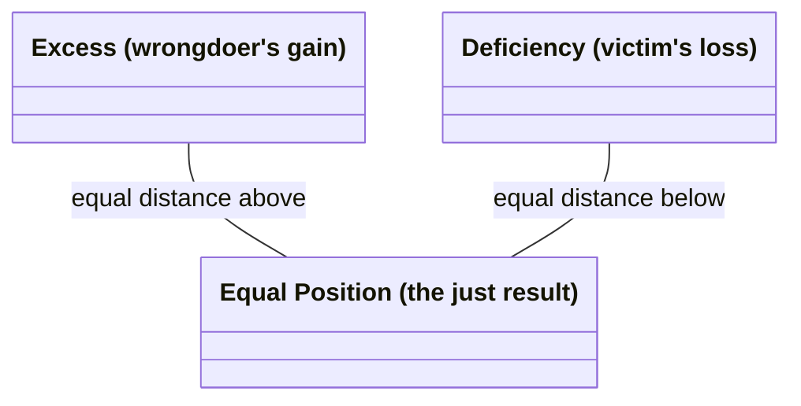

# Corrective (Rectificatory) Justice

The second of the two forms of **particular justice** (Bk. V, ch. 2, 4-5) — the Greek is *to diorthotikon dikaion*, "the corrective just," from *diorthoun*, "to straighten/set right." Translator Joe Sachs renders it literally as "the justice that sets things straight" rather than using the Latinate "corrective" or "rectificatory," though both of those are the standard labels in the secondary literature (confirmed in this edition's own footnotes). It governs **transactions**, both **willing** (selling, buying, lending at interest, giving security, investing, entrusting, renting) and **unwilling** — subdivided into *stealthy* (theft, adultery, poisoning, corrupting slaves, false witness) and *violent* (assault, imprisonment, murder, rape, verbal abuse).

## Diagram

The claim itself, stated directly: the just position is the arithmetic mean, equidistant from both unequal departures.

## Key Ideas

- **Structured as an arithmetic proportion**, in contrast to [[concepts/distributive-justice|distributive justice]]'s geometric proportion. The judge treats the parties as strict equals regardless of prior merit or status — "it makes no difference whether a decent person cheated a low person or the reverse" — the law looks only at the harm itself. Injustice is measured as a deviation from an equal position: the wrongdoer's illicit "gain" and the victim's "loss" are treated as unequal departures from a mean, even where "gain" and "loss" aren't literally the right words (Aristotle's example: a wound inflicted has no literal "gain" for the wounder, but the framework still applies). ^[extracted]
- **The judge as "ensouled justice"**: Aristotle's image is a line unequally cut, where the judge takes the excess from the larger segment and adds it to the smaller until both are equal — "people seek out a judge as a mean... if they hit the mean, they will hit upon what is just." He even puns on the etymology: the just (*dikaion*) is so called because it divides "in halves" (*dicha*), and the judge (*dikastes*) is, in effect, "the halver." ^[extracted]
- **Reciprocity is not, by itself, justice** — Aristotle explicitly rejects the Pythagorean/Rhadamanthine formula "if one suffers what one did, that is the straight and upright way" as a full account of the just: a subordinate who strikes a superior deserves *more* than simple retaliation in return, and willing and unwilling transactions differ too much to be governed by one rule of strict payback. ^[extracted]
- **But a *proportional* reciprocity holds economic and political community together.** Aristotle's example: a housebuilder and a leatherworker must exchange goods (a house for shoes) in proportion to the worth of their respective work, not in raw quantity — "linking along the diagonal," as he puts it — or "the parties do not stay together." **Currency** is introduced as the device that makes this possible: it "becomes in a certain way a mean," rendering otherwise incommensurable goods comparable by tying them to a common, conventional measure ultimately grounded in need — "it is not natural but by current custom, and it is in our power to change it or make it worthless." ^[extracted]
- Sits directly downstream of [[concepts/prohairesis|Aristotle's account of voluntary and involuntary action]] (Bk. V, ch. 8): whether an act counts as "doing injustice" or merely "doing an unjust thing" depends on whether it was done knowingly, willingly, and by choice — the same voluntary/involuntary machinery from Book III is redeployed here to distinguish culpable injustice from mere harm, mistake, or misfortune. ^[extracted]
- That same chapter grades harm into a **four-stage culpability scale** — accident, negligence, wrong, and injustice by choice — each stage adding one further condition (knowledge, then source-in-oneself, then deliberate choice) that raises the actor's responsibility; see [[synthesis/culpability-scale]] for the full breakdown. ^[extracted]

## Greek Gloss

Source: Aristotle, *Ēthika Nikomacheia*, Bk. V, ch. 4 (Bekker 1131b25, 1132a29-32), Bywater's 1894 Oxford Classical Text, via the [Perseus Digital Library](https://scaife.perseus.org/library/urn:cts:greekLit:tlg0086.tlg010/) (public domain).

> τὸ δὲ λοιπὸν ἓν τὸ διορθωτικόν, ὃ γίνεται ἐν τοῖς συναλλάγμασι καὶ τοῖς ἑκουσίοις καὶ τοῖς ἀκουσίοις.

**διορθωτικόν**, morpheme by morpheme:

| δι(α)- | ὀρθ- | -ω- | -τικ- | -όν |
|---|---|---|---|---|
| *di(a)-* | *orth-* | *-ō-* | *-tik-* | *-on* |
| "thoroughly, through" | root of *orthos*, "straight, upright, correct" | factitive/verb-forming ("make X," as in *orthoō* "to straighten") | capacity/tendency suffix ("-ive") | neut. nom./acc. sg. |

The second passage, a few lines later, is Aristotle's own etymological pun — not a modern reconstruction:

> διὰ τοῦτο καὶ ὀνομάζεται δίκαιον, ὅτι δίχα ἐστίν, ὥσπερ ἂν εἴ τις εἴποι δίχαιον, καὶ ὁ δικαστὴς διχαστής.

Three related words, aligned by their shared pieces:

| δικ- | -αστής | | δίχ- | -α | | δίχ- | -αστής |
|---|---|---|---|---|---|---|---|
| *dik-* | *-astēs* | | *dich-* | *-a* | | *dich-* | *-astēs* |
| root of *dikē*, "justice, lawsuit" | agent suffix on *-azō*-class verbs ("one who does X") | | root related to *dyo*, "two" | old adverbial ending | | (same root as *dicha*) | (same agent suffix as *dikastēs*) |
| → **δικαστής** "judge" | | | → **δίχα** "in two, asunder" | | | → **διχαστής**, Aristotle's coined pun-word, "a halver" | |

Sachs's "the halver" for *dichastēs* is a direct transliteration-preserving translation choice — the pun only works because *dikastēs* ("judge") and the nonce word *dichastēs* ("halver") are near-homophones in Greek, which is exactly the wordplay Aristotle is pointing at when he says the judge is, in effect, someone who "halves" a dispute back to equality.

## Related

- [[concepts/justice-nicomachean]] — the parent discussion (general vs. particular justice) this page is one species of
- [[concepts/distributive-justice]] — the sibling form, governing shares of common goods by geometric rather than arithmetic proportion
- [[concepts/doctrine-of-the-mean]] — corrective justice is a "mean" realized as an equalizing quantity between excess and deficiency, not a disposition toward feeling
- [[synthesis/virtue-taxonomy]] — treemap depicting this as one of justice's two leaves
- [[synthesis/justice-taxonomy]] — full treemap expanding this branch into willing/unwilling and stealthy/violent transaction types
- [[concepts/voluntary-involuntary]] — the fuller treatment of the willing/unwilling/mixed/nonwilling machinery this page's culpability discussion is built on
- [[concepts/decency-epieikeia]] — decency, the standard for when the letter of corrective justice's mechanism should yield to what a case calls for
- [[references/nicomachean-ethics]] — source text (Book V, ch. 2, 4-5)
