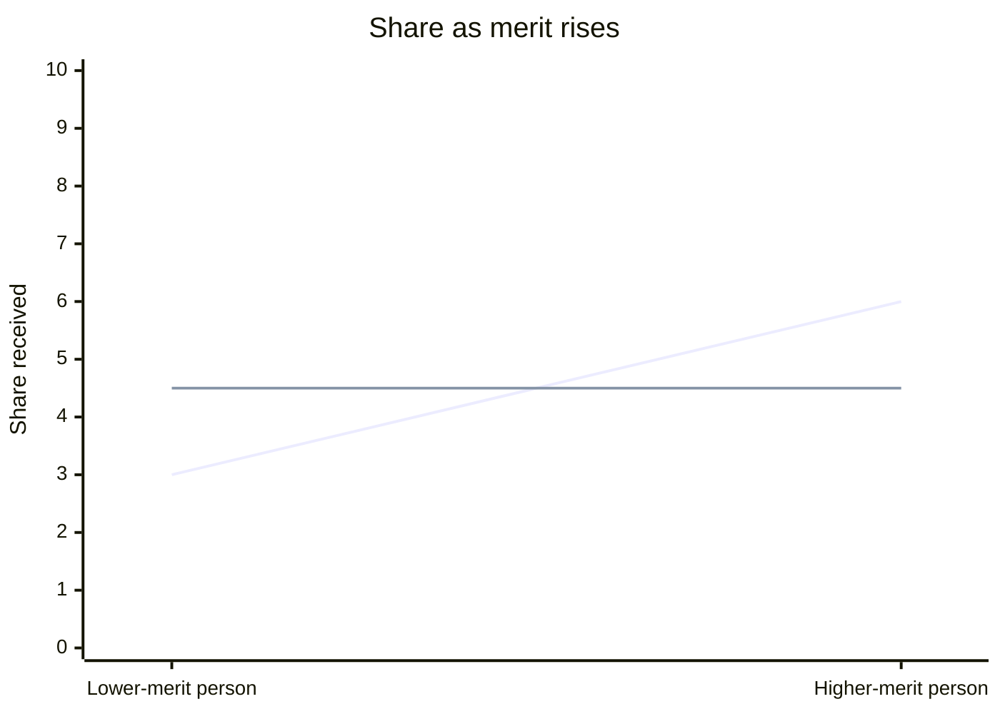

# Distributive Justice

One of the two forms into which Aristotle divides **particular justice** (Bk. V, ch. 2-3) — the Greek is *to dianemetikon dikaion*, "the distributive just," from *dianemein*, "to distribute/apportion." It governs "distributions of honor or money, or as many other things as are divisible, among those who share in the political community."

## Diagram

How to read it: each line tracks how a share changes from a lower-merit to a higher-merit person; the rising line keeps pace with merit (a geometric proportion — just), while the flat line hands out equal shares regardless of merit (the disproportion Aristotle calls unjust here).

## Key Ideas

- **Structured as a geometric proportion, not an equal share.** What is just is not that everyone gets the same amount, but that shares are proportionate to the people receiving them: "as person A is to person B, so should A's portion be to B's portion." Aristotle works this out formally as a four-term proportion (two people, two shares) — A:B :: C:D — and derives the "linking" of A with C and B with D as what a just distribution actually does, alternating and recombining the ratio so that "the whole is to the whole" as each person is to what they receive. Mathematicians call this *geometrical* proportionality, distinguishing it from the *arithmetic* proportionality of [[concepts/corrective-justice|corrective justice]]. ^[extracted]
- **Injustice here is disproportion, not mere inequality of amount.** Someone who receives too much or too little *relative to their proportionate merit* is treated unjustly, even if the raw quantities look "fair" by some other measure; conversely equal shares to unequal people is exactly where "fights and complaints" arise. ^[extracted]
- **The basis of merit is itself politically contested** — Aristotle notes that everyone agrees distributive justice must track *some* merit, but disagrees on which: "those who favor democracy mean freedom, those who favor oligarchy mean wealth, others mean being well born, and those who favor aristocracy mean virtue." The formal structure (geometric proportion) is constant; what counts as the relevant basis of proportion is a substantive political question the *Ethics* leaves open here (and defers to the *Politics*). ^[extracted]
- **Extends to bad things too, inverted**: with something bad to be apportioned, the lesser evil is treated as the "greater good" in the proportion, since "the lesser evil is more choiceworthy than the greater, and what is chosen is good" — the same proportional logic just runs in the opposite direction. ^[extracted]

## Related

- [[concepts/justice-nicomachean]] — the parent discussion (general vs. particular justice) this page is one species of
- [[concepts/corrective-justice]] — the sibling form, governing transactions by arithmetic rather than geometric proportion
- [[concepts/doctrine-of-the-mean]] — distributive justice is itself a "mean" realized as a proportion, not as a disposition toward feeling
- [[synthesis/virtue-taxonomy]] — treemap depicting this as one of justice's two leaves
- [[synthesis/justice-taxonomy]] — full treemap expanding this branch into honor / money / other divisible goods
- [[references/nicomachean-ethics]] — source text (Book V, ch. 2-3)
