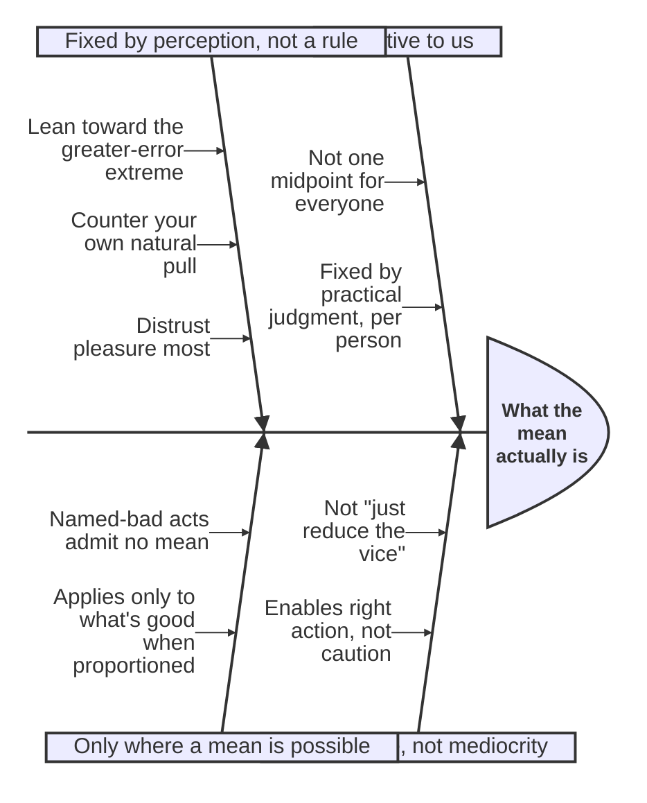

# The Doctrine of the Mean

Aristotle's central structural claim about virtue of character (Book II, chapters 6-9, elaborated with named virtues through Book IV): virtue is "a certain kind of mean condition, since it is, at any rate, something that makes one apt to hit the mean" between two vices, one of excess and one of deficiency.

## Diagram

The doctrine is best read as an argument that keeps correcting misreadings of "mean" until the real thing is pinned down; the diagram treats the correct account as the effect and each misreading-plus-correction as a contributing bone, fishbone-style.

## Key Ideas

- The mean in question is **relative to us**, not "the mean that belongs to the thing" (an arithmetic midpoint the same for everyone) — Aristotle's illustration: if ten pounds of food is a lot to eat and two pounds is little, it doesn't follow that six pounds is right for everyone, since six might be a lot for a beginner and a little for the wrestler Milo. The mean is determined "by a proportion and by the means by which a person with [[concepts/phronesis|practical judgment]] would determine it," not by a formula. ^[extracted]
- Translator Joe Sachs's introduction stresses that this is **not a quantitative compromise or mediocrity** — it is a mistake to read "always try to lower the absolute value of your vice" (as one critic literally proposed) into the doctrine. Aristotle says explicitly that virtue is a mean "in terms of its thinghood," but "in terms of what is best and what is done well, it is an extreme" — courage is not a cautious middle position but the condition from which right action becomes possible at all. ^[extracted]
- **Not everything admits of a mean**: actions and feelings that are base simply by being named — adultery, theft, murder, joy at others' misfortune, envy, shamelessness — have no "right amount"; there is no such thing as committing adultery with the right woman at the right time. The mean doctrine applies only to feelings and actions that are good when proportioned and bad only in excess or defect. ^[extracted]
- **The table of virtues** built up across Books II and IV (deficiency / mean / excess):
  - fear & confidence: cowardice / **courage** / rashness
  - bodily pleasure: insensibility / **temperance** / [[concepts/akolasia|dissipation]] (self-indulgence)
  - giving & taking money (small scale): stinginess / **generosity** / wastefulness
  - giving & taking money (large scale): chintziness / **magnificence** / vulgarity
  - honor & dishonor (large scale): smallness of soul / **greatness of soul** / vanity
  - honor & dishonor (small scale): lacking passion for honor / *(unnamed mean)* / excessive passion for honor
  - anger: slowness to anger / **gentleness** / irritability
  - self-presentation in speech/action: self-deprecation (irony) / **truthfulness** / boastfulness
  - social pleasantness (everyday life): boorishness / *(unnamed — near-)***friendliness** / obsequiousness or flattery
  - social pleasantness (play): boorishness / **wit/adroitness** / buffoonery
  - shame (a feeling, not a virtue, but structurally similar): shamelessness / sense of shame / bashfulness
  - righteous indignation (also a quasi-virtue): envy / righteous indignation / spite ^[extracted]
- **Several means are nameless in Greek** — Aristotle repeatedly notes this (for the mean concerning honor on a small scale, and for the friendliness-like disposition in social life), and in each case coins or borrows a name for clarity, showing the doctrine is meant to map real character-space rather than existing vocabulary. ^[extracted]
- **Practical guidance for hitting the mean** (Bk. II, ch. 9): since hitting the mean exactly is hard, (1) lean away from whichever extreme is the greater error/more contrary to the mean (for courage, that is cowardice, not rashness); (2) notice which extreme one is personally drawn toward (visible in what gives oneself pleasure or pain) and pull hard toward its opposite; (3) be most on guard against pleasure specifically, "since we do not judge it without bribes." The final judgment of "how much and how long" one may deviate before being blamed is not stated as a rule but is "in the perceiving" — a repeated refrain (also applied to anger and to justice) that practical matters are decided by perception, not by a formula ("rule," *kanôn*) — a point Sachs's notes stress Aristotle makes explicit, against a long secondary literature that speaks anachronistically of Aristotle's "rules." ^[extracted]
- **Justice is a distinct, quasi-mathematical case** of the mean doctrine, treated separately in Book V: see [[concepts/justice-nicomachean]]. ^[inferred]

## Related

- [[concepts/hexis]] — virtue as this kind of active condition
- [[concepts/akolasia]] — the named excess-vice opposite temperance, worked out in full on its own page
- [[concepts/to-kalon]] — the mean is chosen for the sake of the beautiful, which is what makes it more than a quantitative midpoint
- [[concepts/phronesis]] — the mean in any particular case is fixed by what a practically wise person would determine
- [[concepts/justice-nicomachean]] — justice as a mean of a mathematically-structured kind
- [[synthesis/virtue-taxonomy]] — treemap visualizing this whole table alongside virtue of thought's very different (non-triadic) structure
- [[references/nicomachean-ethics]] — source text
