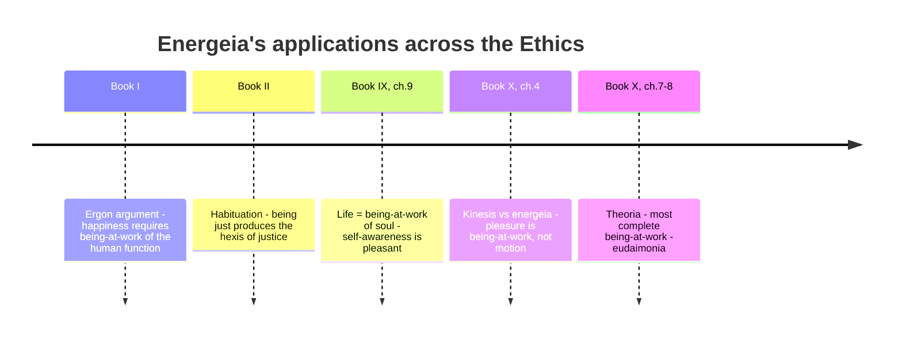

# Energeia (Being-at-Work)

Per translator Joe Sachs, "the most important word in all of Aristotle's thinking." Standard translations render *energeia* as "activity" (in the [[references/nicomachean-ethics]]) or "actuality" (in Aristotle's theoretical works), obscuring that it is the same word doing the same conceptual work in both contexts — connecting Aristotle's ethics directly to his general account of nature and being. ^[extracted]

## Diagram

Reads left to right: the same concept of being-at-work gets put to work at successive points in the Ethics, each stage adding a new application until it reaches its summit case in contemplation.

## Key Ideas

- Etymologically related to *ergon* (work): being-at-work is what is *at* work, as opposed to merely having the capacity (potency) to work. Sachs's introduction traces the word's centrality back to Book I's [[concepts/eudaimonia|ergon argument]]: human happiness turns out to require unlocking what "being-at-work" means. ^[extracted]
- Aristotle distinguishes **being-at-work from motion (*kinesis*) and process of coming-to-be**: a motion is incomplete at every point except its end (housebuilding is complete only when the house is finished; the intermediate stages — laying a foundation, cutting a groove — are each incomplete and differ in form from the whole). Being-at-work, by contrast, is complete at every moment: seeing, or feeling [[concepts/pleasure-aristotle|pleasure]], is not incomplete at any earlier time waiting to be finished later — "there is nothing it lacks which would complete its form by coming about at a later time." This distinction is Aristotle's chief argument (Bk. X, ch. 4) that pleasure is a being-at-work, not a process of restoration. ^[extracted]
- A capacity/potency (*dunamis*) is "for the sake of" its being-at-work: we do not acquire the senses by using them (we have them and then use them), but we acquire the virtues *by* being at work in them first — "we become just by doing things that are just." This is the mechanism behind [[concepts/hexis|habituation]]: repeated being-at-work of a certain kind produces the corresponding active condition. ^[extracted]
- Applied to the soul as a whole, life itself "in its governing sense" is defined as perceiving and thinking, i.e. as being-at-work of those capacities — which grounds Aristotle's claims (Bk. IX, ch. 9) that being aware one is alive is itself pleasant, since awareness of one's own good being-at-work is pleasant in itself. ^[extracted]
- At the summit of the inquiry (Bk. X, ch. 7-8), [[concepts/contemplative-life|contemplation]] (*theoria*) is identified as the most complete, most continuous, most self-sufficient being-at-work available to a human being, and therefore as complete [[concepts/eudaimonia|happiness]]. A god's being-at-work, by contrast, is said to be one, simple, and continuous — ours is interrupted because our nature is a compound, not simple, and needs variety and rest. ^[extracted]

## Related

- [[concepts/eudaimonia]] — happiness defined as a being-at-work of the soul
- [[concepts/hexis]] — active conditions arise from, and are exercised in, being-at-work of the corresponding kind
- [[concepts/pleasure-aristotle]] — pleasure is argued to be a being-at-work, not a motion or process
- [[concepts/contemplative-life]] — the most complete being-at-work available to humans
