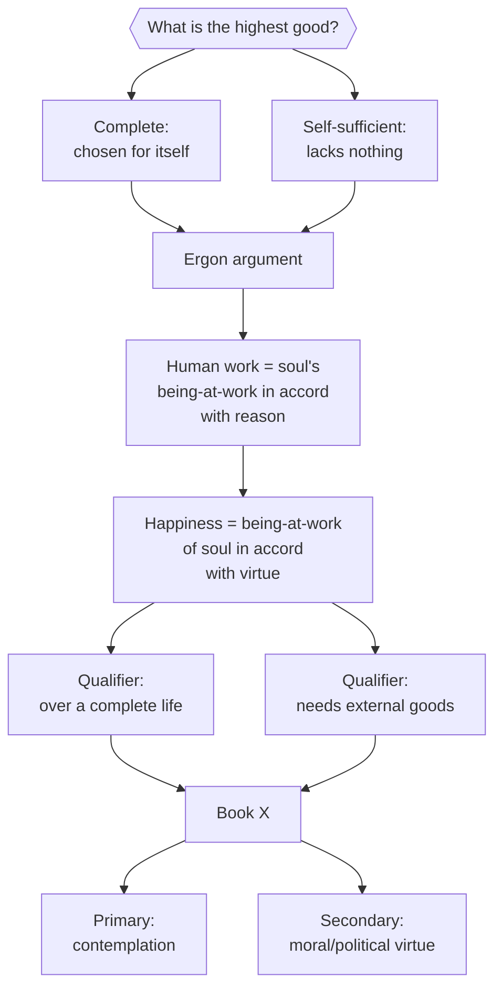

# Eudaimonia (Happiness)

Aristotle's term for the highest human good, at stake from the opening line of the [[references/nicomachean-ethics]]: "every art and every inquiry, and likewise every action and choice, seems to aim at some good." Sachs deliberately avoids over-translating *eudaimonia* as a simple synonym for subjective contentment; it names an objective condition of a life well lived. ^[inferred]

## Diagram

The argument runs as a chain: two criteria for the highest good converge on the ergon argument, which yields a working definition, which is then qualified by further requirements, and finally forks in Book X into primary and secondary candidates.

## Key Ideas

- Happiness is established as the highest good by two criteria: it is **complete** — chosen always for itself and never for the sake of anything else, unlike honor, pleasure, or intelligence, which people choose partly for the sake of happiness — and **self-sufficient** — by itself it makes life choiceworthy and lacking in nothing (this self-sufficiency is social, not solitary: it includes parents, children, friends, and fellow citizens). ^[extracted]
- The **ergon (work/function) argument**: just as a flute-player, sculptor, or any artisan has a characteristic work, and does that work well by virtue proper to the craft, a human being's work is a being-at-work of the soul "in accordance with reason, or not without reason" — so the human good is a [[concepts/energeia|being-at-work]] of the soul in accordance with virtue, and if there is more than one virtue, in accordance with the best and most complete one. Sachs stresses that translating *ergon* as "function" misleads, since "function" suggests something merely subordinate (like a stomach's function), whereas Aristotle's point is that a human life as a whole has a *work*, not merely component functions. ^[extracted]
- Happiness requires **a complete life**, not a moment or a day — "one swallow does not make a Spring." A child cannot yet be happy, since happiness requires being at-work in the relevant way; and Aristotle debates at length (Bk. I, ch. 10-11) whether the fortunes of one's descendants after death can affect whether one was happy, concluding any such effect is faint. ^[extracted]
- Aristotle also needs **external goods** (friends, wealth, political power, good birth, good looks) as instruments and conditions for beautiful action, though they do not constitute happiness itself — someone who is friendless, childless, or completely ugly is "not very apt to be happy." ^[extracted]
- The soul is provisionally divided into a rational and an irrational part (the latter further divided into a vegetative part with no share in reason, and a desiring part that can obey reason); virtue is correspondingly divided into virtues of thinking (wisdom, astuteness, [[concepts/phronesis|practical judgment]]) and virtues of character (generosity, temperance, and the rest), which are the subjects of the bulk of the work. ^[extracted]
- Book X ultimately identifies **complete happiness with [[concepts/contemplative-life|contemplation]]**, ranking the life of moral and political virtue as happy only "in a secondary way," since contemplation alone is self-sufficient, continuous, and loved for its own sake with nothing beyond it. ^[extracted]

## Open Questions

- Aristotle's own architecture is in tension: Book I's ergon argument seems to identify happiness with virtuous activity generally, not specifically contemplation, yet Book X narrows "complete happiness" to the contemplative life alone. Whether this is a real shift in position or a distinction between primary and secondary senses of happiness is disputed by commentators (per Sachs's notes) and not resolved in the text itself. ^[ambiguous]

## Related

- [[concepts/energeia]] — the being-at-work in which happiness consists
- [[concepts/doctrine-of-the-mean]] — how virtue of character is structured
- [[concepts/phronesis]] — the intellectual virtue that makes virtuous choice possible
- [[concepts/contemplative-life]] — Aristotle's candidate for complete happiness
- [[references/nicomachean-ethics]] — source text
