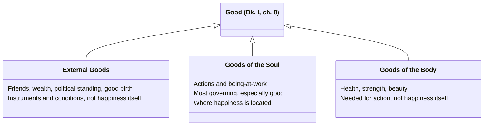

# Goods: External, of the Soul, of the Body

A three-way division Aristotle invokes in Bk. I, ch. 8 to test the ergon argument's conclusion against received opinion: "good things have been parceled out into three kinds, some being called external while the others are associated with the soul or the body." This is a completely different axis from the [[synthesis/threefold-good|beautiful/pleasant/advantageous triad]] — that one classifies goods by what they're *for* (chosen as an end vs. merely instrumental); this one classifies them by *where they reside* (outside a person, in the soul, or in the body).

## Key Ideas

- **Goods of the soul are called "the most governing and especially good"** — Aristotle explicitly identifies "the actions and ways of being at work that belong to the soul" as the ones set down under this heading, which is exactly the category [[concepts/eudaimonia|happiness]] needed to fall into, given the [[concepts/eudaimonia|ergon argument]]'s conclusion that happiness is a [[concepts/energeia|being-at-work]] of the soul rather than a possession. ^[extracted]
- **This is a consistency check, not a new argument** — Aristotle notes it's "consonant with our statement" that the end (happiness) belongs among goods of the soul, since he had already independently reached that conclusion via the ergon argument; the threefold division is invoked to show the conclusion fits an "ancient" opinion "agreed to by the philosophers," not to derive it. ^[extracted]
- **External goods still matter, just not as the substance of happiness.** Elsewhere Aristotle is explicit that a happy person needs external goods (friends, wealth, political standing, good birth, good looks) as instruments and conditions for beautiful action — someone friendless or destitute is "not very apt to be happy" — but these remain instrumental *supports*, categorically distinct from the being-at-work of the soul that happiness actually consists in. ^[extracted]
- **Bodily goods (health, strength, beauty of body) form the third category**, needed for action but likewise not where happiness itself resides — this is the same three-way split that later grounds Book X's point that the contemplative life "has need of external props," even though it needs the least of any life, since contemplation is the being-at-work most purely located in the soul alone. ^[inferred]

## Diagram

A direct containment claim, not a metaphor: Aristotle names these as three genuinely distinct kinds of good, and places happiness in exactly one of them.



## Greek Gloss

### Bk. I, ch. 8 (Bekker 1098b12-17)

> νενεμημένων δὴ τῶν ἀγαθῶν τριχῇ, καὶ τῶν μὲν ἐκτὸς λεγομένων τῶν δὲ περὶ ψυχὴν καὶ σῶμα, τὰ περὶ ψυχὴν κυριώτατα λέγομεν καὶ μάλιστα ἀγαθά, τὰς δὲ πράξεις καὶ τὰς ἐνεργείας τὰς ψυχικὰς περὶ ψυχὴν τίθεμεν.

```
νενεμημένων  δὴ    τῶν      ἀγαθῶν     τριχῇ          καὶ  τῶν      μὲν          ἐκτὸς     λεγομένων     τῶν      δὲ        περὶ        ψυχὴν     καὶ  σῶμα      τὰ          περὶ        ψυχὴν     κυριώτατα       λέγομεν  καὶ  μάλιστα      ἀγαθά        τὰς         δὲ   πράξεις      καὶ  τὰς         ἐνεργείας           τὰς         ψυχικὰς      περὶ  ψυχὴν     τίθεμεν
nenemēmenōn  dē    tōn      agathōn    trichēi        kai  tōn      men          ektos     legomenōn     tōn      de        peri        psychēn   kai  sōma      ta          peri        psychēn   kyriōtata       legomen  kai  malista      agatha       tas         de   praxeis      kai  tas         energeias           tas         psychikas    peri  psychēn   tithemen
apportioned  PTCL  the.GEN  goods.GEN  in-three-ways  and  the.GEN  on-one-hand  external  being-called  the.GEN  on-other  concerning  soul.ACC  and  body.ACC  the.things  concerning  soul.ACC  most-sovereign  we-call  and  most-of-all  good.ACC.PL  the.ACC.PL  and  actions.ACC  and  the.ACC.PL  being-at-works.ACC  the.ACC.PL  of-soul.ADJ  in    soul.ACC  we-place
```

*"With goods having been divided three ways, some called external and others concerning soul and body, we call the ones concerning soul the most sovereign and especially good, and we place the actions and the being-at-works belonging to the soul under [the heading of] soul."* This is the sentence the page's first two bullets both draw on: it names the threefold division itself (ἐκτός / περὶ ψυχήν / περὶ σῶμα) as a genitive-absolute premise (*nenemēmenōn*, "[goods] having been divided") and calls the soul's goods **κυριώτατα** — built from the stem of κύριος, "having authority, sovereign," plus the superlative suffix *-ώτατ-* — "most governing," the very authority that lets happiness, already located in the soul by the ergon argument, count as belonging to the highest-ranked class of goods rather than merely being asserted to.

### Bk. I, ch. 8 (Bekker 1099a33-1099b2)

> πολλὰ μὲν γὰρ πράττεται, καθάπερ διʼ ὀργάνων, διὰ φίλων καὶ πλούτου καὶ πολιτικῆς δυνάμεως.

```
πολλὰ        μὲν   γὰρ  πράττεται  καθάπερ   διʼ      ὀργάνων          διὰ      φίλων        καὶ  πλούτου     καὶ  πολιτικῆς      δυνάμεως
polla        men   gar  prattetai  kathaper  di'      organōn          dia      philōn       kai  ploutou     kai  politikēs      dynameōs
many-things  PTCL  for  is-done    just-as   through  instruments.GEN  through  friends.GEN  and  wealth.GEN  and  political.GEN  power.GEN
```

*"For many things are done, just as if through instruments, through friends and wealth and political power."* Friends, wealth, and political power are named here as **ὄργανα** — built on the same root as *ergon*/*energeia* ("work, deed, being-at-work") plus the instrumental suffix *-αν-* marking "means/tool for doing X" — the external means *through* (διά, repeated twice) which beautiful action happens, never the being-at-work itself; that is exactly the categorical line the page draws between external goods and goods of the soul.

### Bk. X, ch. 8 (Bekker 1178a23-25)

> δόξειε δʼ ἂν καὶ τῆς ἐκτὸς χορηγίας ἐπὶ μικρὸν ἢ ἐπʼ ἔλαττον δεῖσθαι τῆς ἠθικῆς.

```
δόξειε         δʼ   ἂν   καὶ   τῆς      ἐκτὸς     χορηγίας          ἐπὶ  μικρὸν        ἢ   ἐπʼ  ἔλαττον        δεῖσθαι   τῆς      ἠθικῆς
doxeie         d'   an   kai   tēs      ektos     chorēgias         epi  mikron        ē   ep'  elatton        deisthai  tēs      ēthikēs
it-would-seem  and  MOD  also  the.GEN  external  provisioning.GEN  to   small-degree  or  to   lesser-degree  to-need   the.GEN  of-character.GEN
```

*"And it would seem that [the contemplative life] needs external provisioning to a small degree, or to a lesser degree, than the [life] of character."* The word for "external props," **χορηγία**, is built from χορ- ("chorus," cf. χορός) plus the root of ἡγέομαι ("to lead") plus the abstract-noun suffix *-ία* — literally "chorus-leading," the wealthy citizen's funding of a dramatic chorus, extended here to mean "provision, supply, resources"; contemplation, being the being-at-work most purely located in the soul, needs the least borrowed χορηγία of any life, confirming the page's claim that bodily and external goods support action without ever being where happiness itself resides.

## Related

- [[concepts/eudaimonia]] — the ergon argument this division is used to vindicate
- [[concepts/energeia]] — being-at-work, the category that makes happiness a good "of the soul"
- [[synthesis/threefold-good]] — the other, independent threefold division of goods (by end vs. means, not by location)
- [[references/nicomachean-ethics]] — source text (Book I, ch. 8)
