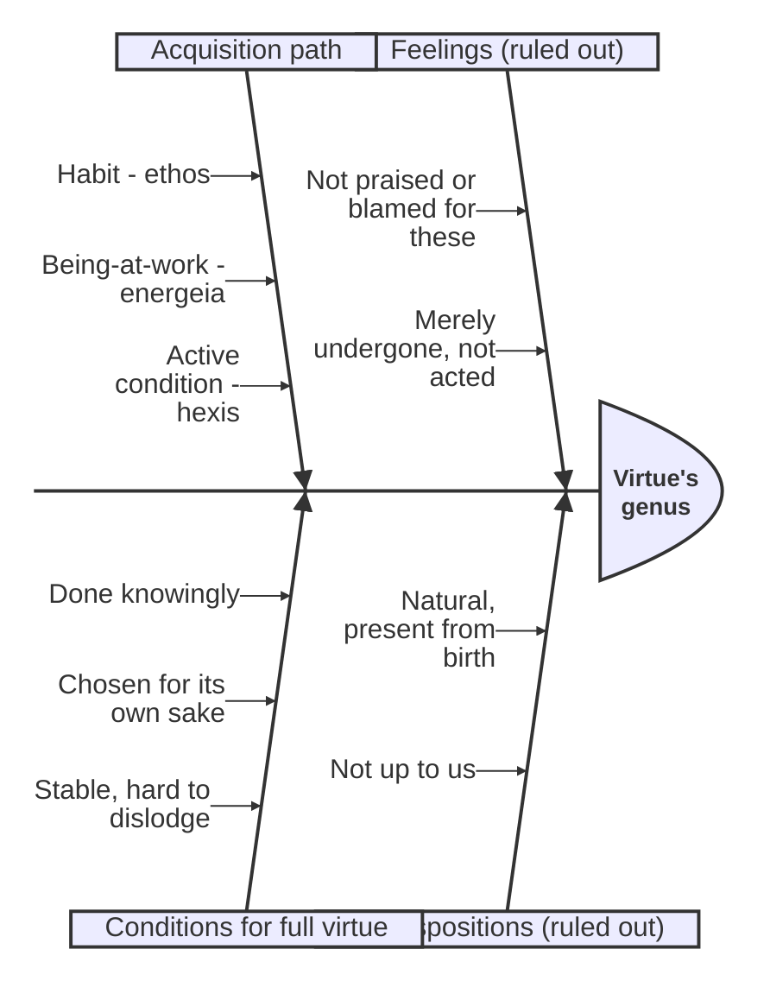

# Hexis (Active Condition / Character)

Per translator Joe Sachs, "one of the most important words in the [[references/nicomachean-ethics]]" and "the foundation of Aristotle's understanding of human responsibility." Standard translations render it "habit," "disposition," or "state" — Sachs argues all three mislead, since a *hexis* is an actively-held, effortful condition, not a passive one. ^[extracted]

## Diagram

Aristotle's argument for *hexis* as virtue's genus works like a fishbone: it rules out two rival candidates (feelings, predispositions) as causes disqualified from the "effect" of being virtue's genus, while the acquisition path and the three conditions for full virtue stand as the causes that do hold up.

## Key Ideas

- Aristotle distinguishes three things that occur in the soul: **feelings** (desire, anger, fear — things we undergo), **predispositions** (capacities to feel these), and **active conditions** (*hexeis* — the settled way we bear ourselves toward our feelings, e.g. bearing anger "violently or slackly" vs. "in a measured way"). Virtue is neither a feeling nor a predisposition (we are not praised or blamed for feelings themselves, and predispositions belong to us by nature, but we do not become good or bad by nature) — virtue must therefore be a *hexis*. ^[extracted]
- The word derives from *echein* ("to have" in an effortful, sustained sense — "having-and-holding," per the Platonic background in the *Theaetetus*), not from mere possession (*ktesis*, like money stored in a box). Sachs stresses this against the common mistranslation of *hexis* as "habit" (*ethos* in Greek — a related but etymologically and conceptually distinct word), a confusion he traces to Aquinas's Latin *habitus*. ^[inferred]
- Character (*ethos*, with an eta) is said to result *from* habit (*ethos*, with an epsilon) — "it makes no small difference to be habituated this way or that way straight from childhood, but an enormous difference, or rather all the difference" — but the habit is not itself part of the resulting character. Sachs's introduction reconstructs the transition as: habit → [[concepts/energeia|being-at-work]] (*energeia*) → active condition (*hexis*), so that habituation is only the first, necessary-but-insufficient stage toward virtue. ^[extracted]
- We acquire active conditions **by first being at work in them**: "we become just by doing things that are just, temperate by doing things that are temperate, and courageous by doing things that are courageous," exactly as one becomes a housebuilder by building houses. Virtue and vice arise from, and are destroyed by, the same kinds of actions (excessive or deficient exercise ruins strength just as excessive or deficient indulgence ruins temperance). ^[extracted]
- Fully virtuous action, as an active condition, requires doing the right thing (1) knowingly, (2) having chosen it for its own sake, and (3) "being in a stable condition and not able to be moved all the way out of it" (*bebaiôs kai ametakinêtôs* — Aristotle's coinage evoking a weighted toy that rights itself: not rigid, but returning to equilibrium under pressure). Someone who merely does just acts without these three conditions is not yet a just person. ^[extracted]
- Virtue and vice as active conditions are what we are "jointly responsible for," since although we do not control how our character develops in its particulars once formed (any more than we can retroactively un-throw a stone), it was up to us at the outset not to become the sort of person we became — this underwrites Aristotle's claim (developed via [[concepts/prohairesis|choice]]) that both virtue and vice are voluntary. ^[extracted]

## Related

- [[concepts/energeia]] — the being-at-work from which active conditions arise and through which they are exercised
- [[concepts/doctrine-of-the-mean]] — the specific structure virtue of character takes as a hexis
- [[concepts/eudaimonia]] — happiness as being-at-work in accordance with the best hexis (virtue)
- [[concepts/akrasia]] — lack of self-restraint is explicitly *not* classified as a hexis, but as a passive, episodic condition (*pathos*)
- [[entities/joe-sachs]] — translator whose introduction centers this term
