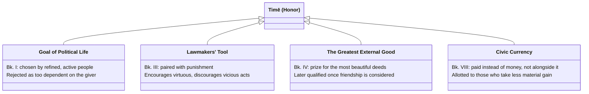

# Honor (Timē)

*Timē* — "honor," the good opinion of others displayed in prizes, offices, and public recognition — recurs across the *Ethics* in four distinct functional roles, not just as one static idea: a candidate goal of political life (Bk. I), a tool lawmakers wield (Bk. III), the single greatest external good (Bk. IV), and a civic currency communities pay out in place of money (Bk. VIII).

## Key Ideas

- **Bk. I: honor as the goal of political life, and why it's too superficial.** "Refined and active people choose honor, for this is pretty much the goal of political life" — but Aristotle immediately objects that honor "seems to be in the ones who give honor rather than in the one who is honored," making it depend on others rather than being securely one's own. This is why the ergon argument ultimately looks past it; see [[concepts/eudaimonia]] and [[synthesis/three-lives]] for the fuller three-lives comparison this passage sets up. ^[extracted]
- **Bk. III: lawmakers use honor and punishment as a pair.** Aristotle treats the fact that lawmakers "punish and take vengeance on those who do bad things... but honor those who do beautiful things, so as to encourage some and restrain others" as evidence that virtue and vice are both voluntary — see [[concepts/voluntary-involuntary]]. Honor here isn't abstract praise; it's a lever legislators pull deliberately. ^[extracted]
- **Bk. III: honor (alongside legal penalty and reproach) is also what makes citizen-courage look like courage.** Citizens "seem to endure dangers because of the penalties that come from the laws, and the reproaches, and because of the honors" — this is the *closest* of [[concepts/virtues/andreia]]'s five look-alikes to the real thing, precisely because honor and shame are at least virtue-adjacent motives, unlike fear of punishment alone. ^[extracted]
- **Bk. IV: honor is named outright as "the greatest of external goods."** In the discussion of greatness of soul, honor is "the prize given for the most beautiful deeds... for this is the greatest of external goods" — see [[concepts/doctrine-of-the-mean]] for the small-souled/great-souled/vain triad this grounds. Sachs's glossary flags that this conclusion is explicitly *not* the Ethics' last word: it gets overturned later once friendship is on the table (1159a, 1169b), where money, honor, and everything people compete for turn out to be things a person of serious worth will forgo for the sake of [[concepts/to-kalon|the beautiful]]. ^[extracted]
- **Bk. VIII: honor functions as a community's alternative currency, and the two can't be drawn on at once.** "It is not possible at the same time to make money from the common fund and be honored" — communities allot honor to whoever takes *less* money, and money to whoever takes bribes, treating the two as reciprocal compensations rather than things anyone gets both of. This is the household/political-community reward structure [[concepts/philia]] and [[synthesis/constitutions-and-households]] describe from the friendship side. ^[extracted]

## Greek Gloss

Every word of each cited sentence is glossed below, Leipzig-interlinear style: original line, transliteration, gloss, aligned column by column.

### Bk. I, ch. 5 (Bekker 1095b19-22)

```ngloss
\ex οἱ δὲ χαρίεντες καὶ πρακτικοὶ τιμήν· τοῦ γὰρ πολιτικοῦ βίου σχεδὸν τοῦτο τέλος.
\gl οἱ [hoi] [the.NOM.PL]
    δὲ [de] [but]
    χαρίεντες [charientes] [refined-people.NOM]
    καὶ [kai] [and]
    πρακτικοὶ [praktikoi] [active-people.NOM]
    τιμήν· [timēn] [honor.ACC]
    τοῦ [tou] [the.GEN]
    γὰρ [gar] [for]
    πολιτικοῦ [politikou] [political.GEN]
    βίου [biou] [life.GEN]
    σχεδὸν [schedon] [nearly]
    τοῦτο [touto] [this.NOM]
    τέλος. [telos] [end.NOM]
\ft But refined and active people [choose] honor, for this is nearly the end of the political life.
```

The verb of choosing is elided — Greek lets *timēn* stand alone as the understood object, which is itself a small piece of evidence for how automatic this choice is meant to sound. τέλος ("end") is the same word anchoring the whole ergon argument; this sentence supplies the second of Book I's three candidate ends (pleasure, honor, contemplation) that [[synthesis/three-lives]] tracks in full.

### Bk. III, ch. 5 (Bekker 1113b21-26)

```ngloss
\ex κολάζουσι γὰρ καὶ τιμωροῦνται τοὺς δρῶντας μοχθηρά, ὅσοι μὴ βίᾳ ἢ διʼ ἄγνοιαν ἧς μὴ αὐτοὶ αἴτιοι, τοὺς δὲ τὰ καλὰ πράττοντας τιμῶσιν, ὡς τοὺς μὲν προτρέψοντες τοὺς δὲ κωλύσοντες.
\gl κολάζουσι [kolazousi] [they-punish]
    γὰρ [gar] [for]
    καὶ [kai] [and]
    τιμωροῦνται [timōrountai] [take-vengeance-on]
    τοὺς [tous] [the.ACC.PL]
    δρῶντας [drōntas] [doing.PTCP.ACC]
    μοχθηρά, [mochthēra] [bad-things.ACC]
    ὅσοι [hosoi] [as-many-as.NOM]
    μὴ [mē] [not]
    βίᾳ [biai] [by-force.DAT]
    ἢ [ē] [or]
    διʼ [di'] [through]
    ἄγνοιαν [agnoian] [ignorance.ACC]
    ἧς [hēs] [of-which.GEN]
    μὴ [mē] [not]
    αὐτοὶ [autoi] [themselves.NOM]
    αἴτιοι, [aitioi] [responsible.NOM]
    τοὺς [tous] [the.ACC.PL]
    δὲ [de] [but]
    τὰ [ta] [the.ACC.PL]
    καλὰ [kala] [beautiful-things.ACC]
    πράττοντας [prattontas] [doing.PTCP.ACC]
    τιμῶσιν, [timōsin] [they-honor]
    ὡς [hōs] [so-as]
    τοὺς [tous] [the.ACC.PL]
    μὲν [men] [on-one-hand]
    προτρέψοντες [protrepsontes] [to-encourage.FUT.PTCP]
    τοὺς [tous] [the.ACC.PL]
    δὲ [de] [on-the-other]
    κωλύσοντες. [kōlysontes] [to-restrain.FUT.PTCP]
\ft For they punish and take vengeance on those doing bad things, as many as are not [acting] by force or through an ignorance for which they themselves are not responsible, and they honor those doing beautiful things, so as to encourage some and restrain others.
```

Honor and punishment appear as one deliberately symmetrical mechanism — the very passage [[concepts/voluntary-involuntary]] cites as evidence that lawmakers treat both virtue and vice as voluntary.

### Bk. III, ch. 8 (Bekker 1116a17-19)

```ngloss
\ex δοκοῦσι γὰρ ὑπομένειν τοὺς κινδύνους οἱ πολῖται διὰ τὰ ἐκ τῶν νόμων ἐπιτίμια καὶ τὰ ὀνείδη καὶ διὰ τὰς τιμάς.
\gl δοκοῦσι [dokousi] [they-seem]
    γὰρ [gar] [for]
    ὑπομένειν [hypomenein] [to-endure.INF]
    τοὺς [tous] [the.ACC.PL]
    κινδύνους [kindynous] [dangers.ACC]
    οἱ [hoi] [the.NOM.PL]
    πολῖται [politai] [citizens.NOM]
    διὰ [dia] [because-of]
    τὰ [ta] [the.ACC.PL]
    ἐκ [ek] [from]
    τῶν [tōn] [the.GEN.PL]
    νόμων [nomōn] [laws.GEN]
    ἐπιτίμια [epitimia] [penalties.ACC]
    καὶ [kai] [and]
    τὰ [ta] [the.ACC.PL]
    ὀνείδη [oneidē] [reproaches.ACC]
    καὶ [kai] [and]
    διὰ [dia] [because-of]
    τὰς [tas] [the.ACC.PL]
    τιμάς. [timas] [honors.ACC]
\ft For citizens seem to endure dangers because of the penalties that come from the laws, and the reproaches, and because of the honors.
```

This is citizen-courage, the closest of [[concepts/virtues/andreia]]'s five look-alikes to the real thing — τιμάς here sits alongside legal *epitimia* ("penalties," an ironic near-homonym of *timē*) and *oneidē* ("reproaches") as one bundle of civic motivation, not yet acting "for the sake of the beautiful" the way true courage does.

### Bk. IV, ch. 3 (Bekker 1123b18-20)

```ngloss
\ex τοιοῦτον δʼ ἡ τιμή· μέγιστον γὰρ δὴ τοῦτο τῶν ἐκτὸς ἀγαθῶν.
\gl τοιοῦτον [toiouton] [such.NOM]
    δʼ [d'] [and]
    ἡ [hē] [the.NOM]
    τιμή· [timē] [honor.NOM]
    μέγιστον [megiston] [greatest.NOM]
    γὰρ [gar] [for]
    δὴ [dē] [indeed]
    τοῦτο [touto] [this.NOM]
    τῶν [tōn] [the.GEN.PL]
    ἐκτὸς [ektos] [external]
    ἀγαθῶν. [agathōn] [goods.GEN]
\ft And of such a kind is honor — for this is indeed the greatest of external goods.
```

Superlative μέγιστον, not comparative: among external goods, nothing outranks honor. The very next chapters go on to complicate this "greatest" claim considerably — see [[concepts/doctrine-of-the-mean]] and [[concepts/philia]] for where it gets revisited.

### Bk. IV, ch. 3 (Bekker 1123b35)

```ngloss
\ex τῆς ἀρετῆς γὰρ ἆθλον ἡ τιμή, καὶ ἀπονέμεται τοῖς ἀγαθοῖς.
\gl τῆς [tēs] [the.GEN.SG]
    ἀρετῆς [aretēs] [virtue.GEN.SG]
    γὰρ [gar] [for]
    ἆθλον [athlon] [prize.NOM.SG]
    ἡ [hē] [the.NOM.SG]
    τιμή, [timē] [honor.NOM.SG]
    καὶ [kai] [and]
    ἀπονέμεται [aponemetai] [it-is-assigned]
    τοῖς [tois] [to-the.DAT.PL]
    ἀγαθοῖς. [agathois] [good-ones.DAT.PL]
\ft For honor is the prize of virtue, and it is assigned to the good.
```

Here, Aristotle defines exactly what honor (*timē*) structurally is: it is not a good that floats freely or has value in a vacuum, but is the specific "prize" (*athlon*, the root of athlete/athletics) awarded for virtue. This explains why the great-souled person cares about honor but also looks down on it when it comes from random people: because honor is merely the reflection or prize of their own internal excellence (*aretē*), the virtue itself is what matters, and only the recognition of other good people (*tois agathois*) actually counts as the prize.

### Bk. IV, ch. 3 (Bekker 1124a8-9)

```ngloss
\ex ἀρετῆς γὰρ παντελοῦς οὐκ ἂν γένοιτο ἀξία τιμή,
\gl ἀρετῆς [aretēs] [virtue.GEN.SG]
    γὰρ [gar] [for]
    παντελοῦς [pantelous] [complete.GEN.SG]
    οὐκ [ouk] [not]
    ἂν [an] [PTCL]
    γένοιτο [genoito] [could-there-be.OPT]
    ἀξία [axia] [worthy.NOM.SG]
    τιμή, [timē] [honor.NOM.SG]
\ft For there could be no honor worthy of complete virtue,
```

Here, Aristotle explains why the great-souled person remains somewhat detached even from the greatest honors bestowed by serious and good people. Even though honor is the proper prize for virtue (as stated in 1123b35), *complete virtue* (*aretēs pantelous*) is of such magnitude that no external honor could ever actually equal its worth. The great-souled person accepts it only because others have nothing greater to give, but always recognizes that the external reward falls short of the internal excellence.

### Bk. VIII, ch. 14 (Bekker 1163b6-7)

```ngloss
\ex οὐ γὰρ ἔστιν ἅμα χρηματίζεσθαι ἀπὸ τῶν κοινῶν καὶ τιμᾶσθαι.
\gl οὐ [ou] [not]
    γὰρ [gar] [for]
    ἔστιν [estin] [is-possible]
    ἅμα [hama] [at-the-same-time]
    χρηματίζεσθαι [chrēmatizesthai] [to-make-money.INF]
    ἀπὸ [apo] [from]
    τῶν [tōn] [the.GEN.PL]
    κοινῶν [koinōn] [common-funds.GEN]
    καὶ [kai] [and]
    τιμᾶσθαι. [timasthai] [to-be-honored.INF]
\ft For it is not possible to make money from the common fund and be honored at the same time.
```

The two infinitives (*chrēmatizesthai*, *timasthai*) are grammatically parallel and mutually exclusive — Aristotle treats honor and material gain as a genuine either/or budget a political community allots, not two goods anyone simply accumulates together.

## Diagram

A direct classification, not a metaphor: the same word names four functionally distinct roles across the work, each tied to a different passage.



## Related

- [[concepts/eudaimonia]] — honor as one of Book I's rejected candidates for the highest good
- [[synthesis/three-lives]] — the three-way comparison (enjoyment, honor, contemplation) Bk. I's honor passage belongs to
- [[concepts/virtues/andreia]] — citizen-courage, the look-alike motivated partly by honor and legal penalty
- [[concepts/voluntary-involuntary]] — lawmakers' honor/punishment pairing as evidence virtue and vice are both voluntary
- [[concepts/doctrine-of-the-mean]] — greatness of soul's mean-table row, built on honor as the greatest external good
- [[concepts/philia]] — where honor's "greatest external good" status gets revisited and qualified
- [[concepts/seeming]] — the three distinct Greek "seem" verbs (phainetai, dokei, eoikasi) this page's Bk. I passage uses in three consecutive sentences
- [[references/nicomachean-ethics]] — source text (Bk. I ch. 5; Bk. III ch. 1, 8; Bk. IV ch. 3; Bk. VIII ch. 14)
