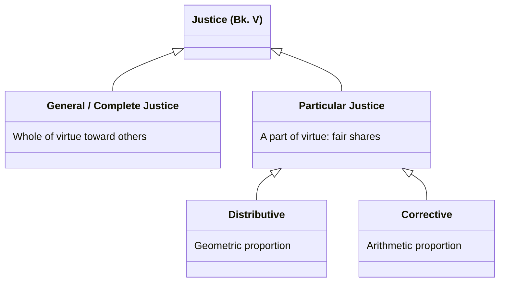

# Justice in the Nicomachean Ethics

Book V's treatment of justice, which Aristotle flags as unlike the other virtues discussed so far because the word is used in more than one sense — general (justice as complete virtue toward others) and particular (justice as one virtue among others, concerned specifically with fair shares).

## Diagram

A direct is-a hierarchy, not a metaphor: "justice" genuinely names two senses (general/particular), and particular justice genuinely divides into the two species below — this diagram states only that containment, nothing more. Equity, the mean-as-quantity point, and the friendship thread are separate claims *about* these classes, not further species, so they stay in prose rather than being forced into the tree.

## Key Ideas

- **General/"complete" justice** is "not a part of virtue but the whole of virtue... in relation to someone else" — the same active condition as virtue as such, but named justice insofar as it is exercised toward other people. This is why justice "often seems to be the greatest of the virtues" and why "ruling will reveal a man" (Bias's saying) — virtue exercised only toward oneself or friends is easy compared to virtue exercised toward the political community generally. ^[extracted]
- **Particular justice** — justice as one virtue among others, "a part of virtue" rather than the whole of it — splits into two discrete species, each with its own Greek name, its own type of proportion, and its own domain:
  - [[concepts/distributive-justice|Distributive justice]] (*to dianemetikon dikaion*) — shares of honor, money, and divisible common goods, structured as a **geometric** proportion.
  - [[concepts/corrective-justice|Corrective (rectificatory) justice]] (*to diorthotikon dikaion*) — transactions, willing and unwilling, structured as an **arithmetic** proportion, and including Aristotle's treatment of reciprocity and currency.
  
  See those two pages for the full working-out of each; this page covers what applies to justice at the general level, above that split. ^[extracted]
- **Justice, as a mean, is a distinct case of the [[concepts/doctrine-of-the-mean|mean doctrine]]**: unlike courage or temperance, justice's mean is "not in the same way" — it is concerned with a mean *quantity* between having more (doing injustice) and having less (suffering injustice), rather than with a mean disposition toward feelings. This applies to both species of particular justice, each in its own way (see their pages for specifics). ^[extracted]
- **Can one do injustice to oneself?** Aristotle argues no, in the strict political sense — injustice requires two distinct parties and a proportion violated between them — though he allows a metaphorical sense in which the rational and irrational parts of one's own soul can stand toward each other as ruler and ruled, admitting an analogous "justice" within a single self. Suicide from passion is classed as an injustice done to the city, not to oneself. ^[extracted]
- **Political justice vs. household "justice" (Bk. V, ch. 6)** — strict/political justice presupposes "an equality of ruling and being ruled" between free, self-sufficient people; household relations only approximate this, and Aristotle explicitly grades how closely, using the same "two distinct parties" logic as the point above. A slave or piece of property, *insofar as* it is a slave or property, is "just like a part of oneself" — legally an extension of the master's own person, not a second party — so there is almost no room for injustice in the strict sense (though justice does apply to a slave *insofar as he is human*). A child gets the identical description ("just like a part of oneself"), but with an explicit expiration date — "until it is of a certain age and independent" — making it a transitional case, not a permanent one. A wife is never described this way; she has her own domain ("as many things as are suited to a woman, he turns over to her," Bk. VIII, ch. 10), so real justice — "the justice that belongs to household management" — applies to her, even though Aristotle is careful to add it is still "different from the political sort." The ranking (wife > child > slave/property) tracks degree of recognized separate personhood, not degree of moral consideration. ^[extracted]
- **Natural vs. conventional justice**: some just things hold "the same power everywhere" (naturally just), while others make no difference until a community fixes them by agreement (e.g. a specific ransom amount) — Aristotle rejects the inference (drawn by some of his contemporaries) that because conventional justice varies, *all* justice must be conventional; both kinds are, in different ways, changeable in application even though one has a fixed natural basis. ^[extracted]
- **Equity (*epieikeia*, "the decent")** corrects law's inherent limitation: law must speak universally, but "there are some things about which it is not possible to speak rightly when speaking universally," so equity is "a setting straight of what is legally just" in the cases a well-intentioned lawmaker would have carved out if he could have foreseen them — equity is not a rival to justice but a *better form of justice* for particular cases, "not better than what is simply just, but better than the error that results from speaking simply." ^[extracted]
- Sachs's introduction argues Aristotle ultimately treats justice as **inherently incomplete on its own account**, since Book V never invokes [[concepts/to-kalon|the beautiful]] (unlike every other virtue discussed), and Aristotle notes that lawmakers "do not take justice as seriously as friendship" and "accord friendship a higher moral stature" — read by Sachs as Aristotle's signal that the discussion of [[concepts/philia|friendship]] in Books VIII-IX effectively supersedes and completes what justice alone cannot achieve. This is an interpretive claim, not a thesis Aristotle states outright. ^[ambiguous]

## Greek Gloss

Source: Bk. V, ch. 1 (Bekker 1130a7–10).

> αὕτη μὲν οὖν ἡ δικαιοσύνη οὐ μέρος ἀρετῆς ἀλλʼ ὅλη ἀρετή ἐστιν, οὐδʼ ἡ ἐναντία ἀδικία μέρος κακίας ἀλλʼ ὅλη κακία.

| δικ- | -αιο- | -σύνη |
|---|---|---|
| *dik-* | *-aio-* | *-synē* |
| root of δίκη, "judgment, a case, what is due" | adjective-forming element, as in δίκαιος, "just" | abstract-noun suffix, "-ness," a settled state or quality |
| → **δικαιοσύνη**, "justice," the fixed condition of being δίκαιος, one who renders each party what is due | | |

The morphology backs up the claim directly: δικαιοσύνη is built from "what is due" plus a suffix meaning a whole settled condition of character, which is exactly why Aristotle says here it names the whole of virtue rather than a part of it.

Source: Bk. V, ch. 2 (Bekker 1130b30–1131a1).

> τῆς δὲ κατὰ μέρος δικαιοσύνης καὶ τοῦ κατʼ αὐτὴν δικαίου ἓν μέν ἐστιν εἶδος τὸ ἐν ταῖς διανομαῖς τιμῆς ἢ χρημάτων ἢ τῶν ἄλλων ὅσα μεριστὰ τοῖς κοινωνοῦσι τῆς πολιτείας (ἐν τούτοις γὰρ ἔστι καὶ ἄνισον ἔχειν καὶ ἴσον ἕτερον ἑτέρου), ἓν δὲ τὸ ἐν τοῖς συναλλάγμασι διορθωτικόν.

| εἶδ- | -ος |
|---|---|
| *eid-* | *-os* |
| root shared with ἰδεῖν/οἶδα, "to see," hence "the shape a thing is seen to have" | neuter noun ending |
| → **εἶδος**, "species," "form" — the distinct look each kind of thing takes | |

This is the sentence where Aristotle actually performs the split named in Key Ideas: one εἶδος of particular justice in distributions, another (διορθωτικόν) in transactions — "species" is the word doing the dividing work.

Source: Bk. V, ch. 11 (Bekker 1138a10–13).

> διὸ καὶ ἡ πόλις ζημιοῖ, καί τις ἀτιμία πρόσεστι τῷ ἑαυτὸν διαφθείραντι ὡς τὴν πόλιν ἀδικοῦντι.

| ἀ- | τιμ- | -ία |
|---|---|---|
| *a-* | *tim-* | *-ia* |
| privative prefix, "not, without" | root of τιμή, "honor, worth, price" | abstract-noun suffix |
| → **ἀτιμία**, "dishonor," loss of the standing that belongs to a full member of the city | | |

The penalty Aristotle names for a man who kills himself in anger is ἀτιμία, a civic, not a personal, loss — the linguistic marker that the wrong falls on the city rather than on the man himself.

Source: Bk. V, ch. 7 (Bekker 1134b18–24).

> τοῦ δὲ πολιτικοῦ δικαίου τὸ μὲν φυσικόν ἐστι τὸ δὲ νομικόν, φυσικὸν μὲν τὸ πανταχοῦ τὴν αὐτὴν ἔχον δύναμιν, καὶ οὐ τῷ δοκεῖν ἢ μή, νομικὸν δὲ ὃ ἐξ ἀρχῆς μὲν οὐδὲν διαφέρει οὕτως ἢ ἄλλως, ὅταν δὲ θῶνται, διαφέρει.

| νομ- | -ικόν |
|---|---|
| *nom-* | *-ikon* |
| root of νόμος, "law, custom" (from νέμω, "to distribute, allot") | adjectival suffix, "pertaining to" |
| → **νομικόν** (δίκαιον), "conventional/legal" (justice) — binding once a community has "allotted" it a fixed form | |

νομικόν's root sense of allotment is precisely why Aristotle can hold that conventional justice varies by agreement without that variability infecting φυσικόν, the naturally fixed kind, alongside it.

Source: Bk. V, ch. 10 (Bekker 1137b25–27).

> καὶ ἔστιν αὕτη ἡ φύσις ἡ τοῦ ἐπιεικοῦς, ἐπανόρθωμα νόμου, ᾗ ἐλλείπει διὰ τὸ καθόλου.

| ἐπανα- | ὀρθ- | -μα |
|---|---|---|
| *epana-* | *orth-* | *-ma* |
| ἐπί, "upon," + ἀνά, "back, again," fused: "a further correction to" | root of ὀρθός, "straight, right" | result-noun suffix, "the thing done" |
| → **ἐπανόρθωμα**, "a straightening-out," "a correction" | | |

This is the line Sachs's "setting straight" language traces back to: equity is defined here, in one word, as a correction supplied exactly where law's universal wording runs short.

## Related

- [[concepts/distributive-justice]] — the geometric-proportion species of particular justice
- [[concepts/corrective-justice]] — the arithmetic-proportion species of particular justice, transactions and reciprocity
- [[concepts/doctrine-of-the-mean]] — justice as a distinctively quantitative/proportional case of the mean
- [[concepts/philia]] — friendship and justice are said to "concern the same things and be present in the same things," but per Sachs's reading, friendship completes what justice leaves incomplete
- [[concepts/prohairesis]] — Aristotle's account of voluntary/involuntary action is directly reapplied to distinguish acts of injustice from merely unjust outcomes
- [[synthesis/virtue-taxonomy]] — treemap showing justice as a 2-leaf exception even within virtue of character's otherwise-uniform triads
- [[synthesis/justice-taxonomy]] — full treemap of every classificatory axis this page and its two children cover, plus natural/conventional, political/household, and equity
- [[synthesis/household-justice-inheritance]] — inheritance diagram of the three cumulative properties (separate personhood, own domain, full equality) behind the wife > child > slave/property ranking
- [[synthesis/constitutions-and-households]] — a second, distinct household classification: the same relations mapped onto constitutional forms (kingship/tyranny, aristocracy/oligarchy, timocracy/democracy) rather than graded by justice
- [[synthesis/crown-of-virtue]] — Sachs's editorial claim that justice is the second of four successive candidates for what organizes all the virtues
- [[concepts/decency-epieikeia]] — decency, the correction internal to justice for what a universal law leaves out in a particular case
- [[references/nicomachean-ethics]] — source text (Book V)
