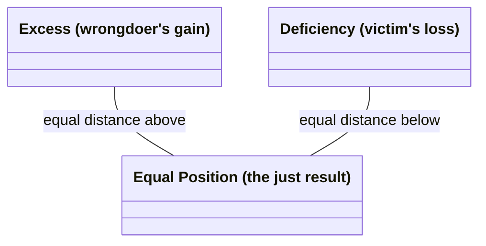

# Corrective (Rectificatory) Justice

The second of the two forms of **particular justice** (Bk. V, ch. 2, 4-5) — the Greek is *to diorthotikon dikaion*, "the corrective just," from *diorthoun*, "to straighten/set right." Translator Joe Sachs renders it literally as "the justice that sets things straight" rather than using the Latinate "corrective" or "rectificatory," though both of those are the standard labels in the secondary literature (confirmed in this edition's own footnotes). It governs **transactions**, both **willing** (selling, buying, lending at interest, giving security, investing, entrusting, renting) and **unwilling** — subdivided into *stealthy* (theft, adultery, poisoning, corrupting slaves, false witness) and *violent* (assault, imprisonment, murder, rape, verbal abuse).

## Diagram

The claim itself, stated directly: the just position is the arithmetic mean, equidistant from both unequal departures.



## Key Ideas

- **Structured as an arithmetic proportion**, in contrast to [[concepts/distributive-justice|distributive justice]]'s geometric proportion. The judge treats the parties as strict equals regardless of prior merit or status — "it makes no difference whether a decent person cheated a low person or the reverse" — the law looks only at the harm itself. Injustice is measured as a deviation from an equal position: the wrongdoer's illicit "gain" and the victim's "loss" are treated as unequal departures from a mean, even where "gain" and "loss" aren't literally the right words (Aristotle's example: a wound inflicted has no literal "gain" for the wounder, but the framework still applies). ^[extracted]
- **The judge as "ensouled justice"**: Aristotle's image is a line unequally cut, where the judge takes the excess from the larger segment and adds it to the smaller until both are equal — "people seek out a judge as a mean... if they hit the mean, they will hit upon what is just." He even puns on the etymology: the just (*dikaion*) is so called because it divides "in halves" (*dicha*), and the judge (*dikastes*) is, in effect, "the halver." ^[extracted]
- **Reciprocity is not, by itself, justice** — Aristotle explicitly rejects the Pythagorean/Rhadamanthine formula "if one suffers what one did, that is the straight and upright way" as a full account of the just: a subordinate who strikes a superior deserves *more* than simple retaliation in return, and willing and unwilling transactions differ too much to be governed by one rule of strict payback. ^[extracted]
- **But a *proportional* reciprocity holds economic and political community together.** Aristotle's example: a housebuilder and a leatherworker must exchange goods (a house for shoes) in proportion to the worth of their respective work, not in raw quantity — "linking along the diagonal," as he puts it — or "the parties do not stay together." **Currency** is introduced as the device that makes this possible: it "becomes in a certain way a mean," rendering otherwise incommensurable goods comparable by tying them to a common, conventional measure ultimately grounded in need — "it is not natural but by current custom, and it is in our power to change it or make it worthless." ^[extracted]
- Sits directly downstream of [[concepts/prohairesis|Aristotle's account of voluntary and involuntary action]] (Bk. V, ch. 8): whether an act counts as "doing injustice" or merely "doing an unjust thing" depends on whether it was done knowingly, willingly, and by choice — the same voluntary/involuntary machinery from Book III is redeployed here to distinguish culpable injustice from mere harm, mistake, or misfortune. ^[extracted]
- That same chapter grades harm into a **four-stage culpability scale** — accident, negligence, wrong, and injustice by choice — each stage adding one further condition (knowledge, then source-in-oneself, then deliberate choice) that raises the actor's responsibility; see [[synthesis/culpability-scale]] for the full breakdown. ^[extracted]

## Greek Gloss

Source: Aristotle, *Ēthika Nikomacheia*, Bywater's 1894 Oxford Classical Text (Bekker 1831 pagination), via the [Perseus Digital Library](https://scaife.perseus.org/library/urn:cts:greekLit:tlg0086.tlg010/) (public domain). Six passages, glossed word by word.

### Bk. V, ch. 4 (Bekker 1131b25)

```ngloss
\ex τὸ δὲ λοιπὸν ἓν τὸ διορθωτικόν, ὃ γίνεται ἐν τοῖς συναλλάγμασι καὶ τοῖς ἑκουσίοις καὶ τοῖς ἀκουσίοις.
\gl τὸ [to] [the]
    δὲ [de] [PTCL]
    λοιπὸν [loipon] [remaining]
    ἓν [hen] [one]
    τὸ [to] [the]
    διορθωτικόν, [diorthōtikon,] [corrective]
    ὃ [ho] [which]
    γίνεται [ginetai] [occurs]
    ἐν [en] [in]
    τοῖς [tois] [the.DAT]
    συναλλάγμασι [synallagmasi] [transactions.DAT]
    καὶ [kai] [and]
    τοῖς [tois] [the.DAT]
    ἑκουσίοις [hekousiois] [willing.DAT]
    καὶ [kai] [and]
    τοῖς [tois] [the.DAT]
    ἀκουσίοις. [akousiois.] [unwilling.DAT]
\ft The remaining one kind is the corrective, which occurs in transactions — both the willing and the unwilling.
```
 This is the definitional sentence behind the page's opening line that the second species "governs transactions, both willing... and unwilling"; *diorthōtikon* itself is built from *dia-* "thoroughly, thru" + *orth-* (the root of *orthos*, "straight, upright") + *-tikon*, the adjectival "capable-of" suffix — literally "having the capacity to straighten things out."

### Bk. V, ch. 4 (Bekker 1132a1-6)

```ngloss
\ex οὐδὲν γὰρ διαφέρει, εἰ ἐπιεικὴς φαῦλον ἀπεστέρησεν ἢ φαῦλος ἐπιεικῆ, οὐδʼ εἰ ἐμοίχευσεν ἐπιεικὴς ἢ φαῦλος· ἀλλὰ πρὸς τοῦ βλάβους τὴν διαφορὰν μόνον βλέπει ὁ νόμος, καὶ χρῆται ὡς ἴσοις, εἰ ὃ μὲν ἀδικεῖ ὃ δʼ ἀδικεῖται, καὶ εἰ ἔβλαψεν ὃ δὲ βέβλαπται.
\gl οὐδὲν [ouden] [nothing]
    γὰρ [gar] [PTCL]
    διαφέρει, [diapherei,] [differs]
    εἰ [ei] [if]
    ἐπιεικὴς [epieikēs] [decent.NOM]
    φαῦλον [phaulon] [base.ACC]
    ἀπεστέρησεν [apestersen] [deprived]
    ἢ [ē] [or]
    φαῦλος [phaulos] [base.NOM]
    ἐπιεικῆ, [epieikē,] [decent.ACC]
    οὐδʼ [oud'] [nor]
    εἰ [ei] [if]
    ἐμοίχευσεν [emoicheusen] [committed-adultery]
    ἐπιεικὴς [epieikēs] [decent.NOM]
    ἢ [ē] [or]
    φαῦλος· [phaulos·] [base.NOM]
    ἀλλὰ [alla] [but]
    πρὸς [pros] [toward]
    τοῦ [tou] [the.GEN]
    βλάβους [blabous] [harm.GEN]
    τὴν [tēn] [the.ACC]
    διαφορὰν [diaphoran] [difference.ACC]
    μόνον [monon] [only]
    βλέπει [blepei] [looks]
    ὁ [ho] [the.NOM]
    νόμος, [nomos,] [law.NOM]
    καὶ [kai] [and]
    χρῆται [chrētai] [treats]
    ὡς [hōs] [as]
    ἴσοις, [isois,] [equals.DAT]
    εἰ [ei] [if]
    ὃ [ho] [the-one.NOM]
    μὲν [men] [PTCL]
    ἀδικεῖ [adikei] [wrongs]
    ὃ [ho] [the-other.NOM]
    δʼ [d'] [and]
    ἀδικεῖται, [adikeitai,] [is-wronged]
    καὶ [kai] [and]
    εἰ [ei] [if]
    ἔβλαψεν [eblapsen] [harmed]
    ὃ [ho] [the-other.NOM]
    δὲ [de] [and]
    βέβλαπται. [beblaptai.] [has-been-harmed]
\ft For it makes no difference whether a decent person deprived a base one or a base one a decent one, nor whether a decent or a base person committed adultery — the law looks only at the difference the harm makes, and treats the parties as equals: whether the one does injustice and the other suffers it, whether the one harmed and the other has been harmed.
```
 This is the sentence behind the Key Ideas bullet on strict equality regardless of prior merit. Note the privative-root pair *ἀδικεῖ*/*ἀδικεῖται* ("wrongs"/"is-wronged"): both sit on the same *a-* (privative "not/un-") + *dik-* (root of *dikē*, "right, justice") stem, active vs. passive voice being the only thing that distinguishes doer from sufferer — grammar itself enacting the symmetry the law insists on.

### Bk. V, ch. 4 (Bekker 1132a7-8)

```ngloss
\ex ὥστε τὸ ἄδικον τοῦτο ἄνισον ὂν ἰσάζειν πειρᾶται ὁ δικαστής·
\gl ὥστε [hōste] [so]
    τὸ [to] [the.ACC]
    ἄδικον [adikon] [unjust-thing.ACC]
    τοῦτο [touto] [this.ACC]
    ἄνισον [anison] [unequal.ACC]
    ὂν [on] [being.PTCP.ACC]
    ἰσάζειν [isazein] [to-equalize]
    πειρᾶται [peiratai] [tries]
    ὁ [ho] [the.NOM]
    δικαστής· [dikastēs] [judge.NOM]
\ft So the judge tries to equalize this unjust thing, which is unequal.
```
 This continues the same thought: since the injustice is a departure from equality, the judge's specific role is to act as the equalizer, restoring the balance.

### Bk. V, ch. 4 (Bekker 1132a30-32)

```ngloss
\ex διὰ τοῦτο καὶ ὀνομάζεται δίκαιον, ὅτι δίχα ἐστίν, ὥσπερ ἂν εἴ τις εἴποι δίχαιον, καὶ ὁ δικαστὴς διχαστής.
\gl διὰ [dia] [because-of]
    τοῦτο [touto] [this]
    καὶ [kai] [also]
    ὀνομάζεται [onomazetai] [is-named]
    δίκαιον, [dikaion,] [just]
    ὅτι [hoti] [because]
    δίχα [dicha] [in-two]
    ἐστίν, [estin,] [is]
    ὥσπερ [hōsper] [as]
    ἂν [an] [MOD]
    εἴ [ei] [if]
    τις [tis] [one]
    εἴποι [eipoi] [might-say]
    δίχαιον, [dichaion,] ['twojust']
    καὶ [kai] [and]
    ὁ [ho] [the]
    δικαστὴς [dikastēs] [judge]
    διχαστής. [dichastēs.] ['halver']
\ft For this reason it is also named dikaion, because it is dicha ('in two') — as if one were to say dichaion — and the judge (dikastēs) is, in effect, a dichastēs ('a halver').
```
 This is Aristotle's own etymological pun, not a modern reconstruction, behind the Key Ideas bullet on the judge as "ensouled justice": *dikastēs* and the nonce coinage *dichastēs* are near-homophones because both share the agent suffix *-astēs* ("one who does X") bolted onto, respectively, *dik-* (root of *dikē*, "justice, lawsuit") and *dich-* (the same root that gives *dicha*, "in two," related to *dyo*, "two") — the wordplay only works aloud, in Greek, exactly as Aristotle intends it.

### Bk. V, ch. 5 (Bekker 1133a25-31)

```ngloss
\ex οἷον δʼ ὑπάλλαγμα τῆς χρείας τὸ νόμισμα γέγονε κατὰ συνθήκην· καὶ διὰ τοῦτο τοὔνομα ἔχει νόμισμα, ὅτι οὐ φύσει ἀλλὰ νόμῳ ἐστί, καὶ ἐφʼ ἡμῖν μεταβαλεῖν καὶ ποιῆσαι ἄχρηστον.
\gl οἷον [hoion] [as]
    δʼ [d'] [but]
    ὑπάλλαγμα [hypallagma] [substitute]
    τῆς [tēs] [the.GEN]
    χρείας [chreias] [need.GEN]
    τὸ [to] [the.NOM]
    νόμισμα [nomisma] [currency.NOM]
    γέγονε [gegone] [has-become]
    κατὰ [kata] [by]
    συνθήκην· [synthēkēn·] [convention]
    καὶ [kai] [and]
    διὰ [dia] [because-of]
    τοῦτο [touto] [this]
    τοὔνομα [tounoma] [the-name]
    ἔχει [echei] [has]
    νόμισμα, [nomisma,] ['currency']
    ὅτι [hoti] [because]
    οὐ [ou] [not]
    φύσει [physei] [by-nature]
    ἀλλὰ [alla] [but]
    νόμῳ [nomōi] [by-custom]
    ἐστί, [esti,] [it-is]
    καὶ [kai] [and]
    ἐφʼ [eph'] [upon]
    ἡμῖν [hēmin] [us.DAT]
    μεταβαλεῖν [metabalein] [to-change]
    καὶ [kai] [and]
    ποιῆσαι [poiēsai] [to-make]
    ἄχρηστον. [achrēston.] [useless]
\ft As a substitute for need, currency has come about by convention — and this is why it has the name nomisma: because it exists not by nature but by custom (nomos), and it is in our power to change it or render it useless.
```
 This backs the Key Ideas bullet on currency as the device that makes incommensurable goods comparable. *Nomisma* leans on the same *nom-* root as *nomos* ("custom, law," itself from *nemō*, "to apportion"), plus a verb-forming *-is-* and the result-of-action suffix *-ma* — Aristotle is not merely noting an etymology but arguing from it: the word for money itself already says money is custom, not nature.

### Bk. V, ch. 8 (Bekker 1135b15-20)

```ngloss
\ex ὅταν μὲν οὖν παραλόγως ἡ βλάβη γένηται, ἀτύχημα· ὅταν δὲ μὴ παραλόγως, ἄνευ δὲ κακίας, ἁμάρτημα (ἁμαρτάνει μὲν γὰρ ὅταν ἡ ἀρχὴ ἐν αὐτῷ ᾖ τῆς αἰτίας, ἀτυχεῖ δʼ ὅταν ἔξωθεν)· ὅταν δὲ εἰδὼς μὲν μὴ προβουλεύσας δέ, ἀδίκημα.
\gl ὅταν [hotan] [when]
    μὲν [men] [PTCL]
    οὖν [oun] [then]
    παραλόγως [paralogōs] [unaccountably]
    ἡ [hē] [the.NOM]
    βλάβη [blabē] [harm.NOM]
    γένηται, [genētai,] [occurs]
    ἀτύχημα· [atychēma·] [misfortune]
    ὅταν [hotan] [when]
    δὲ [de] [but]
    μὴ [mē] [not]
    παραλόγως, [paralogōs,] [unaccountably]
    ἄνευ [aneu] [without]
    δὲ [de] [and]
    κακίας, [kakias,] [vice.GEN]
    ἁμάρτημα [hamartēma] [mistake]
    (ἁμαρτάνει [(hamartanei] [errs]
    μὲν [men] [PTCL]
    γὰρ [gar] [for]
    ὅταν [hotan] [when]
    ἡ [hē] [the.NOM]
    ἀρχὴ [archē] [source.NOM]
    ἐν [en] [in]
    αὐτῷ [autōi] [him.DAT]
    ᾖ [ēi] [is]
    τῆς [tēs] [the.GEN]
    αἰτίας, [aitias,] [cause.GEN]
    ἀτυχεῖ [atychei] [suffers-misfortune]
    δʼ [d'] [but]
    ὅταν [hotan] [when]
    ἔξωθεν)· [exōthen)·] [from-outside]
    ὅταν [hotan] [when]
    δὲ [de] [but]
    εἰδὼς [eidōs] [knowing]
    μὲν [men] [PTCL]
    μὴ [mē] [not]
    προβουλεύσας [probouleusas] [having-deliberated]
    δέ, [de,] [but]
    ἀδίκημα. [adikēma.] [injustice]
\ft So whenever the harm occurs unaccountably, it is misfortune; whenever it occurs not unaccountably, yet without vice, it is a mistake — one makes a mistake when the origin of the cause lies within oneself, but suffers misfortune when it lies outside; and whenever one acts knowingly but without having deliberated beforehand, it is a wrong done.
```
 This is the textual source of the four-stage culpability scale in the Key Ideas section. *Adikēma* closes the ladder on the same *dik-* root glossed above in *dikastēs*/*dichastēs*: *a-* (privative "not/un-") + *dik-* (root of *dikē*) + linking *-ē-* + the result-noun suffix *-ma* — the root that ran from "judge" through "halver" now names the top rung of culpability, an act done unjustly rather than merely by accident or mistake.

## Related

- [[concepts/justice-nicomachean]] — the parent discussion (general vs. particular justice) this page is one species of
- [[concepts/distributive-justice]] — the sibling form, governing shares of common goods by geometric rather than arithmetic proportion
- [[concepts/doctrine-of-the-mean]] — corrective justice is a "mean" realized as an equalizing quantity between excess and deficiency, not a disposition toward feeling
- [[synthesis/virtue-taxonomy]] — treemap depicting this as one of justice's two leaves
- [[synthesis/justice-taxonomy]] — full treemap expanding this branch into willing/unwilling and stealthy/violent transaction types
- [[concepts/voluntary-involuntary]] — the fuller treatment of the willing/unwilling/mixed/nonwilling machinery this page's culpability discussion is built on, including its asymmetric application to *suffering* injustice and the "unjust to oneself" question
- [[concepts/decency-epieikeia]] — decency, the standard for when the letter of corrective justice's mechanism should yield to what a case calls for
- [[references/nicomachean-ethics]] — source text (Book V, ch. 2, 4-5)
