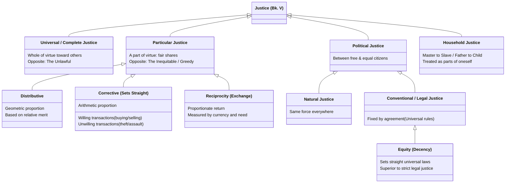

# Justice in the Nicomachean Ethics

Book V's treatment of justice, which Aristotle flags as unlike the other virtues discussed so far because the word is used in more than one sense — general (justice as complete virtue toward others) and particular (justice as one virtue among others, concerned specifically with fair shares).

## Diagram

This hierarchy captures the comprehensive divisions of justice in Book V. "Justice" broadly divides into Universal (complete virtue toward others) and Particular (the specific virtue of fair shares). Particular justice encompasses Distributive, Corrective, and Reciprocal exchange. Another crucial axis contrasts Political Justice (governing free and equal citizens) with Household Justice (master/slave or father/child). Political justice further divides into Natural (holding force everywhere) and Conventional (established by human agreement), with Equity serving as the ultimate corrective to the inevitable rigidity of conventional laws.



## Key Ideas

- **General/"complete" justice** is "not a part of virtue but the whole of virtue... in relation to someone else" — the same active condition as virtue as such, but named justice insofar as it is exercised toward other people. This is why justice "often seems to be the greatest of the virtues" and why "ruling will reveal a man" (Bias's saying) — virtue exercised only toward oneself or friends is easy compared to virtue exercised toward the political community generally. ^[extracted]
- **Particular justice** — justice as one virtue among others, "a part of virtue" rather than the whole of it — splits into two discrete species, each with its own Greek name, its own type of proportion, and its own domain:
  - [[concepts/distributive-justice|Distributive justice]] (*to dianemetikon dikaion*) — shares of honor, money, and divisible common goods, structured as a **geometric** proportion.
  - [[concepts/corrective-justice|Corrective (rectificatory) justice]] (*to diorthotikon dikaion*) — transactions, willing and unwilling, structured as an **arithmetic** proportion, and including Aristotle's treatment of reciprocity and currency.
  
  See those two pages for the full working-out of each; this page covers what applies to justice at the general level, above that split. ^[extracted]
- **Justice, as a mean, is a distinct case of the [[concepts/doctrine-of-the-mean|mean doctrine]]**: unlike courage or temperance, justice's mean is "not in the same way" — it is concerned with a mean *quantity* between having more (doing injustice) and having less (suffering injustice), rather than with a mean disposition toward feelings. This applies to both species of particular justice, each in its own way (see their pages for specifics). ^[extracted]
- **Can one do injustice to oneself?** Aristotle argues no, in the strict political sense — injustice requires two distinct parties and a proportion violated between them — though he allows a metaphorical sense in which the rational and irrational parts of one's own soul can stand toward each other as ruler and ruled, admitting an analogous "justice" within a single self. Suicide from passion is classed as an injustice done to the city, not to oneself. ^[extracted]
- **Political justice vs. household "justice" (Bk. V, ch. 6)** — strict/political justice presupposes "an equality of ruling and being ruled" between free, self-sufficient people; household relations only approximate this, and Aristotle explicitly grades how closely, using the same "two distinct parties" logic as the point above. A slave or piece of property, *insofar as* it is a slave or property, is "just like a part of oneself" — legally an extension of the master's own person, not a second party — so there is almost no room for injustice in the strict sense (though justice does apply to a slave *insofar as he is human*). A child gets the identical description ("just like a part of oneself"), but with an explicit expiration date — "until it is of a certain age and independent" — making it a transitional case, not a permanent one. A wife is never described this way; she has her own domain ("as many things as are suited to a woman, he turns over to her," Bk. VIII, ch. 10), so real justice — "the justice that belongs to household management" — applies to her, even though Aristotle is careful to add it is still "different from the political sort." The ranking (wife ```ngloss
\ex child > slave/property) tracks degree of recognized separate personhood, not degree of moral consideration. ^[extracted]
- **Natural vs. conventional justice**: some just things hold "the same power everywhere" (naturally just), while others make no difference until a community fixes them by agreement (e.g. a specific ransom amount) — Aristotle rejects the inference (drawn by some of his contemporaries) that because conventional justice varies, *all* justice must be conventional; both kinds are, in different ways, changeable in application even though one has a fixed natural basis. ^[extracted]
- **Equity (*epieikeia*, "the decent")** corrects law's inherent limitation: law must speak universally, but "there are some things about which it is not possible to speak rightly when speaking universally," so equity is "a setting straight of what is legally just" in the cases a well-intentioned lawmaker would have carved out if he could have foreseen them — equity is not a rival to justice but a *better form of justice* for particular cases, "not better than what is simply just, but better than the error that results from speaking simply." ^[extracted]
- Sachs's introduction argues Aristotle ultimately treats justice as **inherently incomplete on its own account**, since Book V never invokes [[concepts/to-kalon|the beautiful]] (unlike every other virtue discussed), and Aristotle notes that lawmakers "do not take justice as seriously as friendship" and "accord friendship a higher moral stature" — read by Sachs as Aristotle's signal that the discussion of [[concepts/philia|friendship]] in Books VIII-IX effectively supersedes and completes what justice alone cannot achieve. This is an interpretive claim, not a thesis Aristotle states outright. ^[ambiguous]

## Greek Gloss

### Bk. V, ch. 1 (Bekker 1130a7–10)

```ngloss
> αὕτη μὲν οὖν ἡ δικαιοσύνη οὐ μέρος ἀρετῆς ἀλλʼ ὅλη ἀρετή ἐστιν, οὐδʼ ἡ ἐναντία ἀδικία μέρος κακίας ἀλλʼ ὅλη κακία.
\gl αὕτη [hautē] [this]
    μὲν [men] [PTCL]
    οὖν [oun] [so]
    ἡ [hē] [the]
    δικαιοσύνη [dikaiosynē] [justice]
    οὐ [ou] [not]
    μέρος [meros] [part]
    ἀρετῆς [aretēs] [virtue.GEN]
    ἀλλʼ [all'] [but]
    ὅλη [holē] [whole]
    ἀρετή [aretē] [virtue]
    ἐστιν, [estin,] [is]
    οὐδʼ [oud'] [nor]
    ἡ [hē] [the]
    ἐναντία [enantia] [opposite]
    ἀδικία [adikia] [injustice]
    μέρος [meros] [part]
    κακίας [kakias] [vice.GEN]
    ἀλλʼ [all'] [but]
    ὅλη [holē] [whole]
    κακία. [kakia.] [vice]
\ft This, then, is justice: not a part of virtue but the whole of virtue — and its opposite, injustice, is not a part of vice but the whole of vice.
```

 This is the sentence the page's first bullet quotes directly, and δικαιοσύνη itself carries the argument in its bones: δικ- (root of δίκη, "what is due") + -αιο- (adjectival, as in δίκαιος, "just") + -σύνη (abstract-noun suffix marking a whole settled condition) — a compound built to name a settled state of character, which is exactly why Aristotle can say here it is ὅλη ἀρετή, "the whole of virtue," rather than a mere μέρος, "part," of it.

### Bk. V, ch. 2 (Bekker 1130b30–1131a1)

```ngloss
\ex τῆς δὲ κατὰ μέρος δικαιοσύνης καὶ τοῦ κατʼ αὐτὴν δικαίου ἓν μέν ἐστιν εἶδος τὸ ἐν ταῖς διανομαῖς τιμῆς ἢ χρημάτων ἢ τῶν ἄλλων ὅσα μεριστὰ τοῖς κοινωνοῦσι τῆς πολιτείας (ἐν τούτοις γὰρ ἔστι καὶ ἄνισον ἔχειν καὶ ἴσον ἕτερον ἑτέρου), ἓν δὲ τὸ ἐν τοῖς συναλλάγμασι διορθωτικόν.
\gl τῆς [tēs] [the.GEN]
    δὲ [de] [and]
    κατὰ [kata] [according-to]
    μέρος [meros] [part.ACC]
    δικαιοσύνης [dikaiosynēs] [justice.GEN]
    καὶ [kai] [and]
    τοῦ [tou] [the.GEN]
    κατʼ [kat'] [according-to]
    αὐτὴν [autēn] [it.ACC]
    δικαίου [dikaiou] [just.GEN]
    ἓν [hen] [one]
    μέν [men] [PTCL]
    ἐστιν [estin] [is]
    εἶδος [eidos] [species]
    τὸ [to] [the]
    ἐν [en] [in]
    ταῖς [tais] [the.DAT.PL]
    διανομαῖς [dianomais] [distributions]
    τιμῆς [timēs] [honor.GEN]
    ἢ [ē] [or]
    χρημάτων [chrēmatōn] [money.GEN]
    ἢ [ē] [or]
    τῶν [tōn] [the.GEN.PL]
    ἄλλων [allōn] [other.GEN]
    ὅσα [hosa] [as-many-as]
    μεριστὰ [merista] [divisible]
    τοῖς [tois] [the.DAT.PL]
    κοινωνοῦσι [koinōnousi] [share.PTCP.DAT]
    τῆς [tēs] [the.GEN]
    πολιτείας [politeias] [constitution.GEN]
    (ἐν [(en] [in]
    τούτοις [toutois] [these.DAT]
    γὰρ [gar] [for]
    ἔστι [esti] [is-possible]
    καὶ [kai] [both]
    ἄνισον [anison] [unequal.ACC]
    ἔχειν [echein] [to-have]
    καὶ [kai] [and]
    ἴσον [ison] [equal.ACC]
    ἕτερον [heteron] [one.ACC]
    ἑτέρου), [heterou),] [than-other.GEN]
    ἓν [hen] [one]
    δὲ [de] [and]
    τὸ [to] [the]
    ἐν [en] [in]
    τοῖς [tois] [the.DAT.PL]
    συναλλάγμασι [synallagmasi] [transactions.DAT]
    διορθωτικόν. [diorthōtikon.] [corrective]
\ft Of particular justice, and of the just as it belongs to it, one species has to do with distributions of honor or money or the other divisible things shared by members of the constitution (for in these it is possible for one person to have an unequal or an equal share relative to another), and another species is corrective, operating in transactions.
```
 This is the sentence where Aristotle actually performs the split named in Key Ideas, and the word doing the dividing work is εἶδος — built from the same root as ἰδεῖν/οἶδα, "to see" (εἰδ-) plus a bare neuter ending (-ος), so a "species" is literally "the shape a thing is seen to have": one εἶδος in distributions, a second (διορθωτικόν) in transactions.

### Bk. V, ch. 11 (Bekker 1138a10–13)

```ngloss
\ex διὸ καὶ ἡ πόλις ζημιοῖ, καί τις ἀτιμία πρόσεστι τῷ ἑαυτὸν διαφθείραντι ὡς τὴν πόλιν ἀδικοῦντι.
\gl διὸ [dio] [therefore]
    καὶ [kai] [also]
    ἡ [hē] [the]
    πόλις [polis] [city]
    ζημιοῖ, [zēmioi,] [penalizes]
    καί [kai] [and]
    τις [tis] [a-certain]
    ἀτιμία [atimia] [dishonor]
    πρόσεστι [prosesti] [attaches]
    τῷ [tō] [the.DAT]
    ἑαυτὸν [heauton] [himself.ACC]
    διαφθείραντι [diaphtheiranti] [destroy.PTCP.DAT]
    ὡς [hōs] [as]
    τὴν [tēn] [the.ACC]
    πόλιν [polin] [city.ACC]
    ἀδικοῦντι. [adikounti.] [wrong.PTCP.DAT]
\ft That is why the city imposes a penalty, and a kind of dishonor attaches to the man who destroys himself, on the ground that he is doing wrong to the city.
```
 The penalty Aristotle names is ἀτιμία — ἀ-, the privative prefix "not, without," plus τιμ-, the root of τιμή, "honor, worth, price," plus -ία, the abstract-noun suffix — so the word itself locates the loss in a person's public standing rather than in any private harm, matching the grammar of the sentence: the participle ἀδικοῦντι governs τὴν πόλιν, "the city," as the wronged party, never ἑαυτόν, "himself."

### Bk. V, ch. 7 (Bekker 1134b18–24)

```ngloss
\ex τοῦ δὲ πολιτικοῦ δικαίου τὸ μὲν φυσικόν ἐστι τὸ δὲ νομικόν, φυσικὸν μὲν τὸ πανταχοῦ τὴν αὐτὴν ἔχον δύναμιν, καὶ οὐ τῷ δοκεῖν ἢ μή, νομικὸν δὲ ὃ ἐξ ἀρχῆς μὲν οὐδὲν διαφέρει οὕτως ἢ ἄλλως, ὅταν δὲ θῶνται, διαφέρει.
\gl τοῦ [tou] [the.GEN]
    δὲ [de] [and]
    πολιτικοῦ [politikou] [political.GEN]
    δικαίου [dikaiou] [just.GEN]
    τὸ [to] [the]
    μὲν [men] [PTCL]
    φυσικόν [physikon] [natural]
    ἐστι [esti] [is]
    τὸ [to] [the]
    δὲ [de] [and]
    νομικόν, [nomikon,] [conventional]
    φυσικὸν [physikon] [natural]
    μὲν [men] [PTCL]
    τὸ [to] [the]
    πανταχοῦ [pantachou] [everywhere]
    τὴν [tēn] [the.ACC]
    αὐτὴν [autēn] [same.ACC]
    ἔχον [echon] [having.PTCP]
    δύναμιν, [dynamin,] [power.ACC]
    καὶ [kai] [and]
    οὐ [ou] [not]
    τῷ [tō] [the.DAT]
    δοκεῖν [dokein] [seeming]
    ἢ [ē] [or]
    μή, [mē,] [not]
    νομικὸν [nomikon] [conventional]
    δὲ [de] [and]
    ὃ [ho] [which]
    ἐξ [ex] [from]
    ἀρχῆς [archēs] [beginning.GEN]
    μὲν [men] [PTCL]
    οὐδὲν [ouden] [nothing]
    διαφέρει [diapherei] [differs]
    οὕτως [houtōs] [thus]
    ἢ [ē] [or]
    ἄλλως, [allōs,] [otherwise]
    ὅταν [hotan] [whenever]
    δὲ [de] [and]
    θῶνται, [thōntai,] [they-establish]
    διαφέρει. [diapherei.] [it-differs]
\ft Of political justice, part is natural and part conventional: natural, whatever has the same force everywhere and does not depend on people's thinking it so or not; conventional, whatever makes no difference either way at the start, but once people have laid it down, does make a difference.
```
 νομικόν's root sense is precisely why this holds together: νομ- is the root of νόμος, "law, custom" (itself from νέμω, "to distribute, allot"), plus -ικόν, the adjectival suffix "pertaining to" — conventional justice is what is fixed by an act of communal allotment, so its variability by agreement never infects φυσικόν, the naturally fixed kind standing beside it in the sentence's own μὲν...δὲ division.

### Bk. V, ch. 10 (Bekker 1137b25–27)

```ngloss
\ex καὶ ἔστιν αὕτη ἡ φύσις ἡ τοῦ ἐπιεικοῦς, ἐπανόρθωμα νόμου, ᾗ ἐλλείπει διὰ τὸ καθόλου.
\gl καὶ [kai] [and]
    ἔστιν [estin] [is]
    αὕτη [hautē] [this]
    ἡ [hē] [the]
    φύσις [physis] [nature]
    ἡ [hē] [the]
    τοῦ [tou] [the.GEN]
    ἐπιεικοῦς, [epieikous,] [decent.GEN]
    ἐπανόρθωμα [epanorthōma] [correction]
    νόμου, [nomou,] [law.GEN]
    ᾗ [hēi] [in-which]
    ἐλλείπει [elleipei] [falls-short]
    διὰ [dia] [because-of]
    τὸ [to] [the]
    καθόλου. [katholou.] [universal]
\ft And this is the nature of the decent: a correction of law, where law falls short because of its universality.
```
 This is the line Sachs's "setting straight" language traces back to, and the word carrying the whole definition is ἐπανόρθωμα — ἐπί, "upon," fused with ἀνά, "back, again" (together, "a further correction to"), plus ὀρθ-, the root of ὀρθός, "straight, right," plus -μα, the result-noun suffix naming the thing done: equity is defined here, in one compound, as a correction supplied exactly where law's universal wording runs short.

## Related

- [[concepts/distributive-justice]] — the geometric-proportion species of particular justice
- [[concepts/corrective-justice]] — the arithmetic-proportion species of particular justice, transactions and reciprocity
- [[concepts/doctrine-of-the-mean]] — justice as a distinctively quantitative/proportional case of the mean
- [[concepts/philia]] — friendship and justice are said to "concern the same things and be present in the same things," but per Sachs's reading, friendship completes what justice leaves incomplete
- [[concepts/prohairesis]] — Aristotle's account of voluntary/involuntary action is directly reapplied to distinguish acts of injustice from merely unjust outcomes
- [[synthesis/virtue-taxonomy]] — treemap showing justice as a 2-leaf exception even within virtue of character's otherwise-uniform triads
- [[synthesis/justice-taxonomy]] — full treemap of every classificatory axis this page and its two children cover, plus natural/conventional, political/household, and equity
- [[synthesis/household-justice-inheritance]] — inheritance diagram of the three cumulative properties (separate personhood, own domain, full equality) behind the wife > child > slave/property ranking
- [[synthesis/constitutions-and-households]] — a second, distinct household classification: the same relations mapped onto constitutional forms (kingship/tyranny, aristocracy/oligarchy, timocracy/democracy) rather than graded by justice
- [[synthesis/crown-of-virtue]] — Sachs's editorial claim that justice is the second of four successive candidates for what organizes all the virtues
- [[concepts/decency-epieikeia]] — decency, the correction internal to justice for what a universal law leaves out in a particular case
- [[references/nicomachean-ethics]] — source text (Book V)
