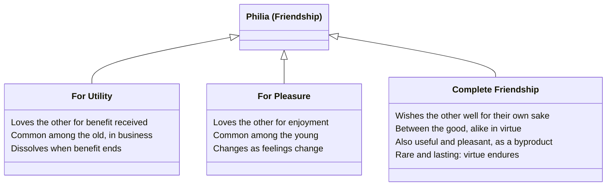

# Philia (Friendship)

Books VIII-IX form the Ethics' longest sustained discussion of a single topic — friendship (*philia*, a broader term than the English "friendship," covering family bonds, political alliance, and business partnership as well as intimate friendship). Aristotle calls it "a certain kind of virtue, or goes with virtue, and is also most necessary for life."

## Diagram

A direct is-a hierarchy: Aristotle names three species of friendship, each defined by a different one of the three loveable things (the useful, the pleasant, the good). No scores or rankings are invented here — the classes state only what each species actually is, per the text.



## Key Ideas

- **Three species of friendship**, corresponding to the three things that are loveable — the good, the pleasant, and the useful:
  - **Friendship for utility**: each loves the other for benefit received, not for who the other person is; common among the old and in business. Easily dissolved when the benefit ends.
  - **Friendship for pleasure**: common among the young, who "live in accord with feeling"; changes as quickly as what is found pleasant changes.
  - **Complete friendship** (friendship "in the primary and governing sense"), between people who are good and alike in virtue: each wishes the other well *for the other's own sake*, not incidentally — and since both are good, this friendship is simultaneously useful, pleasant, and lasting, "since virtue is enduring." This kind is necessarily rare, since it requires extended time and trust ("it is not possible for people to know one another until they use up the proverbial amount of salt together"). ^[extracted]
- **Friendship requires mutual, known goodwill** — loving inanimate things (like wine) is not friendship, since there is no reciprocity; nor is unrequited or unrecognized goodwill toward a stranger. Goodwill is "friendship out-of-work" — a beginning, not yet the thing itself. ^[extracted]
- **Friendship and justice track each other**: "to whatever extent people share something in common, to that extent is there a friendship, since that too is the extent to which there is something just" — and the things owed vary by relationship (parent/child, comrades, fellow citizens), so what is unjust also scales with the closeness of the relationship (cheating a comrade is worse than cheating a stranger). Political constitutions (kingship, aristocracy, timocracy, and their corruptions into tyranny, oligarchy, democracy) each have an analogous friendship, weakest or absent in the worst regimes — "in a tyranny there is little or no friendship," since there is nothing shared between ruler and ruled. See [[concepts/justice-nicomachean]]. ^[extracted]
- **Friendships of superiority** (parent-child, older-younger, husband-wife, ruler-ruled) require *proportional*, not equal, exchange — the superior party should be loved more than they love, and honor/gratitude compensate for what cannot be materially repaid (a child, Aristotle says, can never fully repay a parent, which is why a father may disown a son but not vice versa). ^[extracted]
- **A friend is "another self" (*allos autos*)**: the qualities that make a decent person a friend to himself — wishing his own good, wanting his own existence and flourishing, taking pleasure in his own company, agreeing with himself — extend to a friend, treated as an extension of oneself. Correspondingly, a corrupt person is shown to have no real friendship even with himself, being "at civil war" internally, unable to bear his own company, and so incapable of friendship with others either. This underwrites Aristotle's resolution of the puzzle of legitimate **self-love**: most people rightly condemn self-love aimed at money, honor, and bodily pleasure, but a decent person who "loves himself" by always claiming the most beautiful actions for himself is a lover of self in the best sense, and such a person will still sacrifice money, honor, and even life for friends, "since he would choose an intense pleasure for a short time rather than a mild one for a long time... and one great and beautiful action rather than many small ones." ^[extracted]
- **Does the happy person need friends?** Against the view that a self-sufficient, blessed person needs nothing external, Aristotle argues yes: happiness is a being-at-work ([[concepts/energeia]]), and "it is easier to be [continuously at work] among and in relation to others" than alone; moreover we can contemplate a friend's virtuous actions more easily than our own, and a friend's activity is pleasant to observe in the same way one's own is. Since "being aware that one is" is itself pleasant to a good person, and a friend is another self, one ought to want to share a friend's awareness of his own being — which happens through living together and shared conversation, "not feeding in the same place like fatted cattle." ^[extracted]
- **The number of friends is naturally limited**: complete friendship cannot be extended to many people at once ("it is impossible to share a life with many people and spread oneself out among them"), any more than one can be intensely in love with many people simultaneously — a claim that also draws an analogy to a city's natural size limits. ^[extracted]
- **Friends in good and bad fortune**: friends are more *necessary* in misfortune (practical help) but more *beautiful* to have in good fortune (people to do good for); presence of friends is a "mixed blessing" in misfortune, since seeing a friend pained by one's troubles is itself painful — Aristotle recommends inviting friends readily into good fortune but being slow to burden them with bad fortune, and (conversely) going to a friend in misfortune uninvited. ^[extracted]

## Greek Gloss

### Bk. VIII, ch. 3 (Bekker 1156a26-30)

> ἔτι δὲ προσδεῖται χρόνου καὶ συνηθείας· κατὰ τὴν παροιμίαν γὰρ οὐκ ἔστιν εἰδῆσαι ἀλλήλους πρὶν τοὺς λεγομένους ἅλας συναναλῶσαι· οὐδʼ ἀποδέξασθαι δὴ πρότερον οὐδʼ εἶναι φίλους, πρὶν ἂν ἑκάτερος ἑκατέρῳ φανῇ φιλητὸς καὶ πιστευθῇ.

```
ἔτι   δὲ    προσδεῖται  χρόνου    καὶ  συνηθείας     κατὰ          τὴν      παροιμίαν    γὰρ  οὐκ  ἔστιν        εἰδῆσαι  ἀλλήλους         πρὶν    τοὺς        λεγομένους      ἅλας      συναναλῶσαι         οὐδʼ  ἀποδέξασθαι   δὴ    πρότερον    οὐδʼ  εἶναι  φίλους       πρὶν    ἂν    ἑκάτερος   ἑκατέρῳ   φανῇ     φιλητὸς   καὶ  πιστευθῇ
eti   de    prosdeitai  chronou   kai  synētheias    kata          tēn      paroimian    gar  ouk  estin        eidēsai  allēlous         prin    tous        legomenous      halas     synanalōsai         oud'  apodexasthai  dē    proteron    oud'  einai  philous      prin    an    hekateros  hekaterō  phanē    philētos  kai  pisteuthē
also  PTCL  requires    time.GEN  and  intimacy.GEN  according-to  the.ACC  proverb.ACC  for  not  is-possible  to-know  one-another.ACC  before  the.ACC.PL  so-called.PTCP  salt.ACC  to-use-up-together  nor   to-accept     PTCL  beforehand  nor   to-be  friends.ACC  before  PTCL  each.NOM   each.DAT  appears  lovable   and  is-trusted
```

*"Besides, it also needs time and familiarity; as the proverb says, people cannot know each other before they have used up the proverbial quantity of salt together, nor can they accept each other or be friends until each has appeared lovable to the other and been trusted."* This is the textual source behind the page's claim that complete friendship "requires extended time and trust" and "is not possible... until people use up the proverbial amount of salt together": *synētheia* (σύν- "together" + *ēthos*, "custom, character" — the same root that gives *ēthikē*, "ethics" — plus the abstract-noun suffix *-eia*) names the slow-built shared disposition that alone breeds the mutual trust Aristotle says friendship of the complete kind cannot do without.

### Bk. IX, ch. 5 (Bekker 1167a10-14)

> διὸ μεταφέρων φαίη τις ἂν αὐτὴν ἀργὴν εἶναι φιλίαν, χρονιζομένην δὲ καὶ εἰς συνήθειαν ἀφικνουμένην γίνεσθαι φιλίαν, οὐ τὴν διὰ τὸ χρήσιμον οὐδὲ τὴν διὰ τὸ ἡδύ· οὐδὲ γὰρ εὔνοια ἐπὶ τούτοις γίνεται.

```
διὸ        μεταφέρων            φαίη       τις      ἂν    αὐτὴν   ἀργὴν     εἶναι  φιλίαν          χρονιζομένην    δὲ    καὶ  εἰς   συνήθειαν     ἀφικνουμένην   γίνεσθαι   φιλίαν          οὐ   τὴν      διὰ      τὸ       χρήσιμον   οὐδὲ  τὴν      διὰ      τὸ       ἡδύ       οὐδὲ  γὰρ  εὔνοια    ἐπὶ     τούτοις    γίνεται
dio        metapherōn           phaiē      tis      an    autēn   argēn     einai  philian         chronizomenēn   de    kai  eis   synētheian    aphiknoumenēn  ginesthai  philian         ou   tēn      dia      to       chrēsimon  oude  tēn      dia      to       hēdy      oude  gar  eunoia    epi     toutois    ginetai
therefore  using-metaphor.PTCP  might-say  someone  PTCL  it.ACC  idle.ACC  to-be  friendship.ACC  lingering.PTCP  PTCL  and  into  intimacy.ACC  arriving.PTCP  becomes    friendship.ACC  not  the.ACC  through  the.ACC  useful     nor   the.ACC  through  the.ACC  pleasant  nor   for  goodwill  toward  these.DAT  arises
```

*"So someone speaking by transference might call it an idle friendship — one that, lingering on and arriving at familiarity, becomes friendship, though not the friendship based on utility or on pleasure, since goodwill does not arise from those either."* This is the line behind the page's claim that goodwill is "friendship out-of-work": *argēn* (privative *a-* "not, without" + *erg-*, the root of *ergon*, "work, deed" + the adjectival suffix *-os*) is built from the very same *erg-* root as [[concepts/energeia]] but negated — goodwill is friendship that has not yet become a being-at-work.

### Bk. VIII, ch. 11 (Bekker 1161a30-34)

> ἐν δὲ ταῖς παρεκβάσεσιν, ὥσπερ καὶ τὸ δίκαιον ἐπὶ μικρόν ἐστιν, οὕτω καὶ ἡ φιλία, καὶ ἥκιστα ἐν τῇ χειρίστῃ· ἐν τυραννίδι γὰρ οὐδὲν ἢ μικρὸν φιλίας.

```
ἐν  δὲ    ταῖς        παρεκβάσεσιν       ὥσπερ    καὶ   τὸ   δίκαιον     ἐπὶ  μικρόν        ἐστιν  οὕτω   καὶ   ἡ    φιλία       καὶ  ἥκιστα   ἐν  τῇ       χειρίστῃ   ἐν  τυραννίδι    γὰρ  οὐδὲν    ἢ   μικρὸν  φιλίας
en  de    tais        parekbasesin       hōsper   kai   to   dikaion     epi  mikron        estin  houtō  kai   hē   philia      kai  hēkista  en  tē       cheiristē  en  tyrannidi    gar  ouden    ē   mikron  philias
in  PTCL  the.DAT.PL  deviant-forms.DAT  just-as  also  the  just-thing  to   small-extent  is     so     also  the  friendship  and  least    in  the.DAT  worst.DAT  in  tyranny.DAT  for  nothing  or  little  friendship.GEN
```

*"But among the deviant constitutions, just as the just is present only to a small extent, so too is friendship, and least of all in the worst one; for in a tyranny there is little or no friendship."* This is the textual basis for the page's claim that friendship and justice track each other across the constitutions: Aristotle says explicitly that as *dikaion* (δίκ-, the root of *dikē*, "custom, right, judgment" + the substantive-forming suffix *-aion*) shrinks in the deviant regimes, so does *philia*, vanishing almost entirely under tyranny — the two concepts scale together rather than merely resembling each other.

### Bk. IX, ch. 4 (Bekker 1166a30-33)

> τῷ δὴ πρὸς αὑτὸν ἕκαστα τούτων ὑπάρχειν τῷ ἐπιεικεῖ, πρὸς δὲ τὸν φίλον ἔχειν ὥσπερ πρὸς αὑτόν (ἔστι γὰρ ὁ φίλος ἄλλος αὐτός), καὶ ἡ φιλία τούτων εἶναί τι δοκεῖ, καὶ φίλοι οἷς ταῦθʼ ὑπάρχει.

```
τῷ       δὴ    πρὸς    αὑτὸν        ἕκαστα       τούτων        ὑπάρχειν    τῷ       ἐπιεικεῖ        πρὸς    δὲ    τὸν      φίλον       ἔχειν      ὥσπερ    πρὸς    αὑτόν        ἔστι  γὰρ  ὁ    φίλος   ἄλλος  αὐτός  καὶ  ἡ    φιλία       τούτων        εἶναί  τι         δοκεῖ  καὶ  φίλοι        οἷς          ταῦθʼ         ὑπάρχει
tō       dē    pros    hauton       hekasta      toutōn        hyparchein  tō       epieikei        pros    de    ton      philon      echein     hōsper   pros    hauton       esti  gar  ho   philos  allos  autos  kai  hē   philia      toutōn        einai  ti         dokei  kai  philoi       hois         tauth'        hyparchei
the.DAT  PTCL  toward  himself.ACC  each.ACC.PL  of-these.GEN  to-belong   the.DAT  decent-man.DAT  toward  PTCL  the.ACC  friend.ACC  to-relate  just-as  toward  himself.ACC  is    for  the  friend  other  self   and  the  friendship  of-these.GEN  to-be  something  seems  and  friends.NOM  to-whom.DAT  these-things  belong
```

*"Since each of these traits belongs to the decent person in relation to himself, and he relates to a friend just as to himself (for a friend is another self), friendship is thought to be something of this sort, and those to whom these things belong are friends."* Aristotle states outright here the formula the page's Key Ideas paraphrase as "a friend is another self": *allos* (the root *al-*, "other, different" — cognate with Latin *alius* — plus the adjective-forming suffix *-los*) marks the friend as a second instance of the same self rather than a wholly separate other.

## Related

- [[concepts/to-kalon]] — per Sachs, the fullest working-out of the beautiful's role in virtuous action occurs in the friendship books
- [[concepts/justice-nicomachean]] — friendship and justice track the same relationships, with friendship arguably completing what justice alone cannot
- [[concepts/eudaimonia]] — happiness is argued to require friends, against the view that a self-sufficient person needs no one
- [[synthesis/threefold-good]] — treemap of the same loveable-triad that grounds these three species, alongside the general theory of goods it's drawn from
- [[synthesis/constitutions-and-households]] — how friendship tracks justice differently across the constitutional analogues Aristotle finds within the household
- [[synthesis/crown-of-virtue]] — Sachs's editorial claim that friendship is the last and highest of four successive candidates for what organizes all the virtues
- [[concepts/self-love]] — the puzzle of whether "friend as another self" is coherent, resolved by distinguishing two senses of self-love
- [[references/nicomachean-ethics]] — source text (Books VIII-IX)
