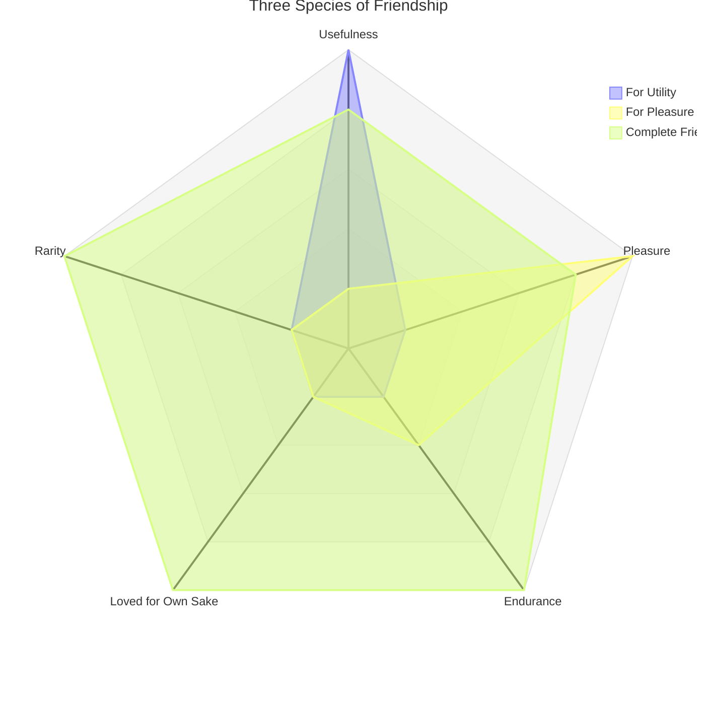

# Philia (Friendship)

Books VIII-IX form the Ethics' longest sustained discussion of a single topic — friendship (*philia*, a broader term than the English "friendship," covering family bonds, political alliance, and business partnership as well as intimate friendship). Aristotle calls it "a certain kind of virtue, or goes with virtue, and is also most necessary for life."

## Diagram

Each species scores differently across the qualities that make friendship what it is; complete friendship is distinctive for scoring high on every axis at once, which is exactly why Aristotle calls it rare.

## Key Ideas

- **Three species of friendship**, corresponding to the three things that are loveable — the good, the pleasant, and the useful:
  - **Friendship for utility**: each loves the other for benefit received, not for who the other person is; common among the old and in business. Easily dissolved when the benefit ends.
  - **Friendship for pleasure**: common among the young, who "live in accord with feeling"; changes as quickly as what is found pleasant changes.
  - **Complete friendship** (friendship "in the primary and governing sense"), between people who are good and alike in virtue: each wishes the other well *for the other's own sake*, not incidentally — and since both are good, this friendship is simultaneously useful, pleasant, and lasting, "since virtue is enduring." This kind is necessarily rare, since it requires extended time and trust ("it is not possible for people to know one another until they use up the proverbial amount of salt together"). ^[extracted]
- **Friendship requires mutual, known goodwill** — loving inanimate things (like wine) is not friendship, since there is no reciprocity; nor is unrequited or unrecognized goodwill toward a stranger. Goodwill is "friendship out-of-work" — a beginning, not yet the thing itself. ^[extracted]
- **Friendship and justice track each other**: "to whatever extent people share something in common, to that extent is there a friendship, since that too is the extent to which there is something just" — and the things owed vary by relationship (parent/child, comrades, fellow citizens), so what is unjust also scales with the closeness of the relationship (cheating a comrade is worse than cheating a stranger). Political constitutions (kingship, aristocracy, timocracy, and their corruptions into tyranny, oligarchy, democracy) each have an analogous friendship, weakest or absent in the worst regimes — "in a tyranny there is little or no friendship," since there is nothing shared between ruler and ruled. See [[concepts/justice-nicomachean]]. ^[extracted]
- **Friendships of superiority** (parent-child, older-younger, husband-wife, ruler-ruled) require *proportional*, not equal, exchange — the superior party should be loved more than they love, and honor/gratitude compensate for what cannot be materially repaid (a child, Aristotle says, can never fully repay a parent, which is why a father may disown a son but not vice versa). ^[extracted]
- **A friend is "another self" (*allos autos*)**: the qualities that make a decent person a friend to himself — wishing his own good, wanting his own existence and flourishing, taking pleasure in his own company, agreeing with himself — extend to a friend, treated as an extension of oneself. Correspondingly, a corrupt person is shown to have no real friendship even with himself, being "at civil war" internally, unable to bear his own company, and so incapable of friendship with others either. This underwrites Aristotle's resolution of the puzzle of legitimate **self-love**: most people rightly condemn self-love aimed at money, honor, and bodily pleasure, but a decent person who "loves himself" by always claiming the most beautiful actions for himself is a lover of self in the best sense, and such a person will still sacrifice money, honor, and even life for friends, "since he would choose an intense pleasure for a short time rather than a mild one for a long time... and one great and beautiful action rather than many small ones." ^[extracted]
- **Does the happy person need friends?** Against the view that a self-sufficient, blessed person needs nothing external, Aristotle argues yes: happiness is a being-at-work ([[concepts/energeia]]), and "it is easier to be [continuously at work] among and in relation to others" than alone; moreover we can contemplate a friend's virtuous actions more easily than our own, and a friend's activity is pleasant to observe in the same way one's own is. Since "being aware that one is" is itself pleasant to a good person, and a friend is another self, one ought to want to share a friend's awareness of his own being — which happens through living together and shared conversation, "not feeding in the same place like fatted cattle." ^[extracted]
- **The number of friends is naturally limited**: complete friendship cannot be extended to many people at once ("it is impossible to share a life with many people and spread oneself out among them"), any more than one can be intensely in love with many people simultaneously — a claim that also draws an analogy to a city's natural size limits. ^[extracted]
- **Friends in good and bad fortune**: friends are more *necessary* in misfortune (practical help) but more *beautiful* to have in good fortune (people to do good for); presence of friends is a "mixed blessing" in misfortune, since seeing a friend pained by one's troubles is itself painful — Aristotle recommends inviting friends readily into good fortune but being slow to burden them with bad fortune, and (conversely) going to a friend in misfortune uninvited. ^[extracted]

## Related

- [[concepts/to-kalon]] — per Sachs, the fullest working-out of the beautiful's role in virtuous action occurs in the friendship books
- [[concepts/justice-nicomachean]] — friendship and justice track the same relationships, with friendship arguably completing what justice alone cannot
- [[concepts/eudaimonia]] — happiness is argued to require friends, against the view that a self-sufficient person needs no one
- [[references/nicomachean-ethics]] — source text (Books VIII-IX)
