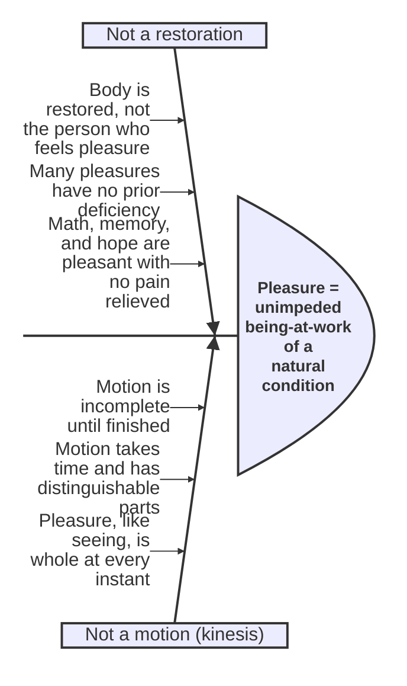

# Pleasure in the Nicomachean Ethics

Aristotle treats pleasure twice: a first pass in Book VII (chapters 11-14), reopened and completed in Book X (chapters 1-5), which he says is necessary because "it is thought to belong to one who engages in philosophic inquiry about politics to examine what concerns pleasure and pain," since virtue and vice of character are defined in terms of them.

## Diagram

Aristotle's positive definition of pleasure is reached by ruling out two rival candidate theories, each for its own distinct reason. Read this fishbone from the tines inward: each candidate's objections are the "causes" that eliminate it, leaving the definition at the head as what survives.

## Key Ideas

- **Three received opinions** Aristotle works through: (1) no pleasure is good, (2) some pleasures are good but most are bad, (3) even if all pleasures were good, pleasure could still not be the *best* thing. He credits **Eudoxus** (arguing all things, rational and irrational, aim at pleasure, and what all things aim at is good) and reports **Plato/Speusippus's** rebuttal (a pleasant life with intelligence is more choiceworthy than pleasure alone, so pleasure cannot be *the* good, since nothing can be added to make the good itself more choiceworthy). ^[extracted]
- **Pleasure is not a process of coming-into-being or a restoration**, against the view (associated with Plato's circle) that pleasure is simply the perceptible filling of a natural deficiency (eating restoring a hunger-deficit). Aristotle's objections: restoration happens *in the body*, but the body does not feel pleasure, the person does; and many pleasures involve no antecedent deficiency at all — the pleasures of mathematics, of smell, of much of what is seen and heard, and of memory and hope are not preceded by any pain to be relieved. ^[extracted]
- **Pleasure is not a motion (*kinesis*)** either, on the strength of the [[concepts/energeia|being-at-work]] distinction: every motion is incomplete until finished and takes time to unfold with distinguishable parts (housebuilding, walking a racetrack); one cannot "feel pleasure quickly," only "become pleased quickly," just as one cannot "see" fast or slow even though one can start seeing quickly — pleasure, like seeing, is complete at every instant it occurs, "something whole." Aristotle's positive definition: **pleasure is the unimpeded being-at-work of a natural condition** (correcting the received formula "a perceptible process of coming-into-being into a natural state" by dropping "process of coming-into-being" and "perceptible," substituting "unimpeded"). ^[extracted]
- **Each activity has its own proper pleasure**, which *completes* that activity (the way "the bloom of well-being" completes people at their physical peak) without being a component part of it — geometry-lovers who enjoy geometry become more precise geometers, since the proper pleasure intensifies and prolongs the very activity it accompanies, while a pleasure foreign to the activity (enjoying flute music while trying to follow an argument) actively disrupts it. Since activities differ in kind, so do their proper pleasures — sight's pleasure differs from hearing's, and both differ from the pleasures of thinking; correspondingly, "the measure of each thing is... a good person, insofar as he is good," so what is truly pleasant, in the governing sense, is what is pleasant to a person of serious moral stature, not what merely appears pleasant to the corrupted. ^[extracted]
- **All things desire pleasure because all things desire life**, and life is itself a form of being-at-work; pleasure "brings the activities to completion and hence brings living to completion" — Aristotle leaves open, as not needing an answer, whether we choose life for pleasure's sake or pleasure for life's sake, since "these appear to be joined together and incapable of separation." ^[extracted]
- **Resolution of the received objections**: pleasures that seem to impede judgment (like the pleasure of sex, which precludes thought) or that are called "shameful" involve pleasures foreign to the activity in question, or pleasures of a base kind bound up with a corrupt state — this does not show pleasure as such is bad, any more than some healthy things being financially ruinous shows health is bad. A temperate person does have (proper) pleasures; what he avoids is a specific class of *excessive* or *base* bodily pleasures, not pleasure as a genus. ^[extracted]
- **Bodily pleasures seem more urgent than they are** because they function as cures for pain and are pursued violently by people (the young, the excitable, those with corrupted natures) who lack access to purer pleasures — but a cure's intensity is not proof of superior value; per Aristotle, a god enjoys "a pleasure that is one and simple" continuously, since a simple, unchanging nature needs no variation, whereas human need for change reflects "some badness," i.e. our compound (partly perishable) nature. ^[extracted]
- Connects directly to [[concepts/eudaimonia|happiness]]: since a complete being-at-work is necessarily unimpeded, and happiness is among "complete" things, "happiness has need in addition of the goods of the body... in order that it not be impeded" — but Aristotle firmly denies that good fortune or pleasure alone constitutes happiness, and insists (against a strawman he explicitly rejects) that no one being tortured or in great misfortune should be called happy merely for being virtuous. ^[extracted]

## Related

- [[concepts/energeia]] — pleasure is argued to *be* a being-at-work, which grounds the whole account
- [[concepts/akrasia]] — Book VII's provisional pleasure theory is invoked to explain why bodily pleasure so easily overrides judgment
- [[concepts/eudaimonia]] — happiness requires pleasure to be unimpeded, though pleasure alone does not constitute it
- [[references/nicomachean-ethics]] — source text (Book VII, ch. 11-14; Book X, ch. 1-5)
