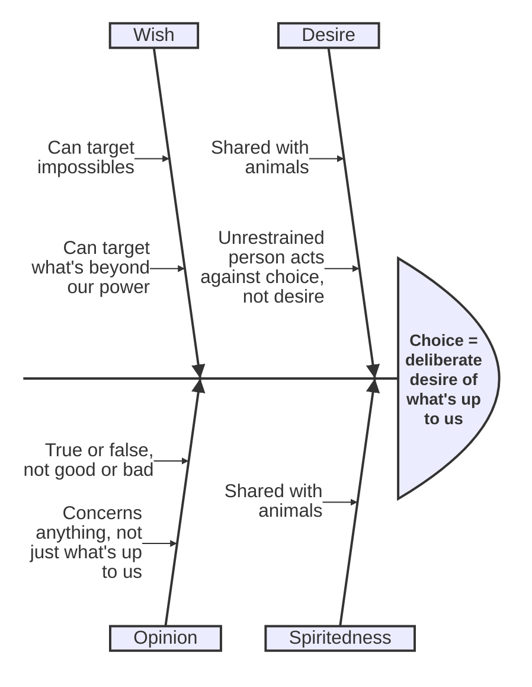

# Prohairesis (Choice) and Voluntary Action

Book III opens the detailed study of virtue of character by asking what makes an action praiseworthy or blameworthy at all — the analysis of voluntary/involuntary action and choice (*prohairesis*) that underwrites Aristotle's account of moral responsibility.

## Diagram

Aristotle arrives at choice the way a fishbone diagram works backward from an effect: each rival candidate is traced out to the specific flaw that disqualifies it, leaving the definition at the head as what survives.

*How to read it*: each spine is a candidate Aristotle considers and rejects for choice; the sub-branches are the specific reasons it fails. What is left standing at the head — reasoned desire, fused — is the actual definition.

## Key Ideas

- **Involuntary acts** are those done by force (source external, agent contributes nothing — e.g. being physically carried by wind) or through ignorance. Acts done from fear of a greater evil (e.g. a tyrant's threat, or throwing cargo overboard in a storm) are "mixed" but classified as more like voluntary, since "the source of the moving of the parts that are instrumental in such actions is in oneself" — though Aristotle allows some such acts, if extreme enough, deserve forgiveness rather than praise or blame. Some things (Aristotle's example: matricide) admit no excuse regardless of the threat. ^[extracted]
- **Ignorance vs. acting while ignorant**: only ignorance of the particulars of the action (who, what, with what instrument, for what end, in what manner) makes an act involuntary — general ignorance of what one ought to do (moral ignorance) does not excuse, since "every bad person is ignorant of what one ought to do." A key marker: the truly ignorant agent regrets the act once informed; one who feels no regret was not ignorant in the relevant sense but merely indifferent. Acting from anger or drunkenness is acting *while* ignorant, not *on account of* ignorance, and does not excuse (drunkenness could even double the penalty, since staying sober was up to the agent). ^[extracted]
- **Choice (*prohairesis*) is not**: desire (choice is not shared with animals, which have desire; a self-restrained person acts against desire, an unrestrained person acts against choice), spiritedness, wish (wishing can target impossibilities or things outside one's power, like wanting an actor to win an award; choice cannot), or opinion (opinion is true/false, choice is good/bad; opinion concerns anything at all, choice only what is "up to us"). Choice is **deliberate desire of things that are up to us** — reasoned desire, or desiring reason, fused together, "and such a source is a human being." ^[extracted]
- **Deliberation** is only about things that are (a) up to us and (b) variable — not about eternal or necessary things (mathematics, the heavens), not about what is always the same by nature, not about chance, and not about ends themselves (a doctor does not deliberate whether to cure, only how) — only about the means to an end one has already fixed, working backward like a geometric analysis until one reaches the first actionable step. ^[extracted]
- **Virtue and vice are both voluntary**, and therefore both "up to us": if acting is up to us, so is not acting, so both doing beautiful and doing shameful things are up to us — hence being decent or base is up to us. Aristotle meets the objection that a bad person cannot simply choose to stop being bad (just as a sick person cannot simply choose health) by distinguishing the *origin* of a state from its *current reversibility*: it was up to the person, at the outset, not to become unjust or [[concepts/akolasia|dissipated]] — "it was in the power of an unjust or dissipated person at the beginning not to have come to be that way... but once they have become so it is no longer possible not to be so" — just as it was up to someone not to throw a stone, even though the stone cannot be recalled once thrown. ^[extracted]
- This grounds why lawmakers **punish for ignorance itself** when the agent is responsible for the ignorance (e.g. through carelessness, or getting drunk), and why we hold people responsible for bodily corruptions (like health lost through self-indulgence) but not for congenital ones. ^[extracted]

## Related

- [[concepts/hexis]] — the active conditions (virtue/vice) that choice and voluntary action, repeated over time, produce
- [[concepts/phronesis]] — practical judgment is what makes deliberation and choice good rather than merely present
- [[concepts/akrasia]] — the unrestrained person acts against choice, which is what distinguishes lack of self-restraint from vice (which acts *from* choice)
- [[references/nicomachean-ethics]] — source text (Book III)
