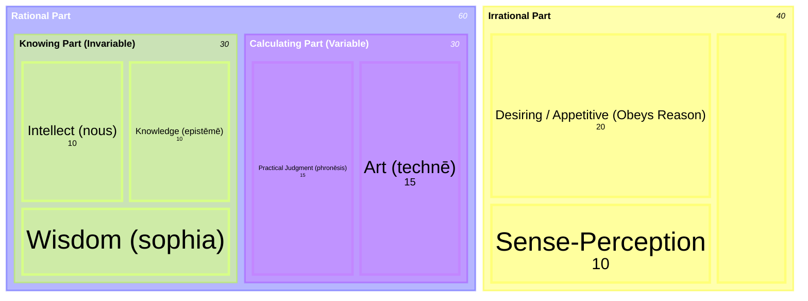

# Soul (Psychē)

In Aristotle's [[references/nicomachean-ethics]], the soul (*psychē*) is the central locus of human character, virtue, and happiness. Achieving character is described as a process of clearing away obstacles to the full efficacy of the soul, allowing all its powers to be at work together. ^[extracted]

## Diagram

## Key Ideas

- **Tripartite Contents**: In Book II, Chapter 5, Aristotle systematically divides the things that come to be present in the soul into three categories:
  1. **[[concepts/feeling|Feelings]]** (*pathē*): The passive emotions and experiences we undergo.
  2. **[[concepts/predisposition|Predispositions]]** (*dynameis*): Our innate, natural capacities to experience these feelings.
  3. **[[concepts/hexis|Active Conditions]]** (*hexeis*): The settled, chosen way we bear ourselves toward our feelings. Aristotle identifies virtue as belonging to this category. ^[extracted]
- **Happiness and the Soul**: Book I defines [[concepts/eudaimonia|happiness]] as the being-at-work ([[concepts/energeia]]) of the soul in accordance with virtue. The true mean of temperance or courage is not measured externally, but is a qualitative condition strictly within the soul. ^[extracted]
- **Divisions of the Soul**: The soul is fundamentally divided into a **[[concepts/soul/rational-part|rational part]]** and an **[[concepts/soul/irrational-part|irrational part]]**. In a person lacking self-restraint ([[concepts/akrasia]]), these parts are in conflict, whereas in a fully virtuous soul, they are blended harmoniously. In Book VI, Chapter 1, Aristotle further divides the rational part into two distinct faculties based on their objects of contemplation:
  1. The **[[concepts/soul/knowing-part|Knowing Part]]**: Contemplates things whose governing principles are incapable of being otherwise (the eternal and necessary). ^[extracted]
  2. The **[[concepts/soul/calculating-part|Calculating Part]]**: Contemplates things capable of being otherwise (the variable and contingent), which is the domain of deliberation and choice ([[concepts/prohairesis]]). ^[extracted]
- **Powers of the Soul**: In Book VI, Chapters 2 and 3, Aristotle identifies the specific capacities of the soul that govern action and truth:
  - Three powers govern action and truth: **[[concepts/soul/sense-perception|sense-perception]]** (which originates no action, as animals perceive but do not act), **intellect**, and **[[concepts/soul/appetitive-part|desire]]** (which drives choice). ^[extracted]
  - Five powers by which the soul discloses truth through affirmation and denial: **art** (*technē*), **knowledge** (*epistēmē*), **practical judgment** ([[concepts/phronesis|*phronēsis*]]), **wisdom** ([[concepts/sophia|*sophia*]]), and **intellect** ([[concepts/nous|*nous*]]). ^[extracted]
- **Goods of the Soul**: In dividing goods into three kinds—external goods, goods of the body, and [[concepts/goods-of-the-soul|goods of the soul]]—Aristotle places happiness firmly among the goods of the soul, as the highest end. ^[extracted]
