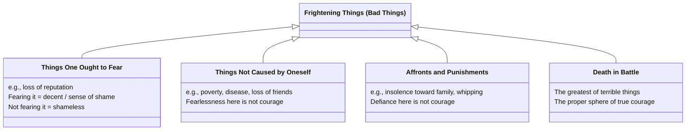
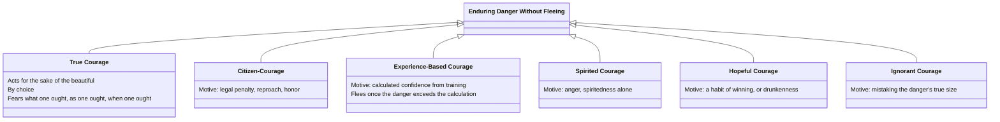

# Andreia

**Deficiency:** Cowardice (Deilia)
**Excess:** Rashness (Thrasutēs)

Bk. III, ch. 6-9 gives courage the first full worked-out treatment of the mean-doctrine's structure — the model case [[concepts/doctrine-of-the-mean|the mean table]] later summarizes in outline. Courage is the mean concerning fear and confidence, but not with respect to every frightening thing: it is narrowed specifically to fear of death "of the most beautiful sort," in battle. Fearing poverty, disease, or the loss of reputation may be reasonable or even praiseworthy, but has nothing to do with courage proper — a person unafraid of those things is called courageous only "by a likeness."

## Key Ideas

- **True courage acts "for the sake of the beautiful."** The courageous person "is as undaunted as a human being can be," yet still feels fear at things genuinely terrible — courage isn't fearlessness, but enduring and fearing "what one ought, for the reason one ought, as one ought, when one ought." Since "the end of any way of being at work is what corresponds to the active condition it comes from," and courage's end is [[concepts/to-kalon|the beautiful]], the courageous person endures fear specifically because doing so is beautiful, not from lack of feeling. ^[extracted]
- **Courage is concerned more with enduring fear than with confidence** — Aristotle notes it's harder to endure painful things than to abstain from pleasant ones, which is why courage is itself painful even though its end (like an athlete's) is genuinely pleasant, just "blocked from sight by the things that encircle it." ^[extracted]
- **Five named look-alikes resemble true courage without being it** — each substitutes some other motive for "acting on account of the beautiful": ^[extracted]
  - *Citizen-courage*: enduring danger from fear of legal penalty and reproach, or desire for honor — closest to the real thing, since shame and love of honor are at least *virtue-adjacent* motives.
  - *Experience-based courage*: professional soldiers, confident from knowing "many empty threats" — but they flee "the very moment" the danger exceeds their calculated advantage, unlike citizen-soldiers who die holding their ground.
  - *Spirited courage*: courage that is really just anger or spiritedness "carried away" like a wounded animal — natural and courage's nearest neighbor, but not courage unless choice and a beautiful end are added to it.
  - *Hopeful courage*: confidence from a habit of winning (or from drunkenness) — collapses the moment events depart from expectation.
  - *Ignorant courage*: mistaking the danger for something smaller than it is — the weakest imitation, since "they have nothing they consider worth facing" once they realize their error.
- **The upshot is a warning against confusing the appearance of fearlessness with virtue** — several of the look-alikes (professional soldiers, angry men, the falsely confident, the ignorant) can be just as *effective* in battle as the truly courageous person, sometimes more so, but effectiveness is not what makes an act courageous; only acting for the beautiful, by choice, does. ^[inferred]

## Diagrams

### The Objects of Fear (Bk. III, ch. 6)

An elimination argument: Aristotle lists types of bad/frightening things to cross them off and isolate the specific sphere of true courage.



### The Look-Alikes of Courage (Bk. III, ch. 8)

A direct classification, not a metaphor: Aristotle names true courage and five distinct look-alikes, each defined by what it substitutes for acting-for-the-beautiful.



## Greek Gloss

### Bk. III, ch. 7 (Bekker 1115b23-24)

```ngloss
\ex καλοῦ δὴ ἕνεκα ὁ ἀνδρεῖος ὑπομένει καὶ πράττει τὰ κατὰ τὴν ἀνδρείαν.
\gl καλοῦ [kalou] [beautiful.GEN]
    δὴ [dē] [PTCL]
    ἕνεκα [heneka] [for-sake-of]
    ὁ [ho] [the]
    ἀνδρεῖος [andreios] [courageous-one]
    ὑπομένει [hypomenei] [endures]
    καὶ [kai] [and]
    πράττει [prattei] [does]
    τὰ [ta] [the.ACC.PL]
    κατὰ [kata] [according-to]
    τὴν [tēn] [the.ACC]
    ἀνδρείαν. [andreian] [courage.ACC]
\ft So for the sake of the beautiful the courageous person endures and does what accords with courage.
```

This is the sentence the page's first bullet paraphrases as "acts for the sake of the beautiful": it directly follows the immediately preceding line that every being-at-work's end (τέλος) matches the settled disposition (ἕξις) it flows from, so the conclusion here is a logical consequence rather than an added motive — and note that *andreios* and *andreian* both carry the ἀνδρ- root of *anēr*, "man, adult male," courage cast grammatically as the virtue proper to manhood.

### Bk. III, ch. 8 (Bekker 1116a15-17)

```ngloss
\ex ἔστι μὲν οὖν ἡ ἀνδρεία τοιοῦτόν τι, λέγονται δὲ καὶ ἕτεραι κατὰ πέντε τρόπους· πρῶτον μὲν ἡ πολιτική· μάλιστα γὰρ ἔοικεν.
\gl ἔστι [esti] [is]
    μὲν [men] [PTCL]
    οὖν [oun] [then]
    ἡ [hē] [the]
    ἀνδρεία [andreia] [courage]
    τοιοῦτόν [toiouton] [such]
    τι, [ti] [a-thing]
    λέγονται [legontai] [are-called]
    δὲ [de] [and]
    καὶ [kai] [also]
    ἕτεραι [heterai] [other]
    κατὰ [kata] [according-to]
    πέντε [pente] [five]
    τρόπους· [tropous] [ways.ACC]
    πρῶτον [prōton] [first]
    μὲν [men] [PTCL]
    ἡ [hē] [the]
    πολιτική· [politikē] [citizen-kind]
    μάλιστα [malista] [most-of-all]
    γὰρ [gar] [for]
    ἔοικεν. [eoiken] [it-seems]
\ft Courage, then, is a thing of this sort, but there are also others called courage in five ways; first the citizen-kind, for it seems closest.
```

This opens the exact five-fold list the page's third bullet reproduces almost item for item, starting with citizen-courage; each is literally a *tropos* — from *trepein*, "to turn" — a "turning" away from true courage that still keeps its outward shape.

### Bk. III, ch. 8 (Bekker 1116a25-29)

```ngloss
\ex ὡμοίωται δʼ αὕτη μάλιστα τῇ πρότερον εἰρημένῃ, ὅτι διʼ ἀρετὴν γίνεται· διʼ αἰδῶ γὰρ καὶ διὰ καλοῦ ὄρεξιν (τιμῆς γάρ) καὶ φυγὴν ὀνείδους, αἰσχροῦ ὄντος.
\gl ὡμοίωται [hōmoiōtai] [it-is-likened]
    δʼ [d'] [PTCL]
    αὕτη [hautē] [this-one]
    μάλιστα [malista] [most-of-all]
    τῇ [tēi] [the.DAT]
    πρότερον [proteron] [previously]
    εἰρημένῃ, [eirēmenēi] [mentioned.PTCP.DAT]
    ὅτι [hoti] [because]
    διʼ [di'] [through]
    ἀρετὴν [aretēn] [virtue.ACC]
    γίνεται· [ginetai] [it-comes-to-be]
    διʼ [di'] [through]
    αἰδῶ [aidō] [shame.ACC]
    γὰρ [gar] [for]
    καὶ [kai] [and]
    διὰ [dia] [through]
    καλοῦ [kalou] [beautiful.GEN]
    ὄρεξιν [orexin] [desire.ACC]
    (τιμῆς [(timēs] [(honor.GEN]
    γάρ) [gar)] [for)]
    καὶ [kai] [and]
    φυγὴν [phygēn] [flight.ACC]
    ὀνείδους, [oneidous] [reproach.GEN]
    αἰσχροῦ [aischrou] [shameful.GEN]
    ὄντος. [ontos] [being.PTCP.GEN]
\ft This kind is likened most of all to the one spoken of before, because it comes about through virtue — through shame, and desire of the beautiful (for honor), and flight from reproach, since that is shameful.
```

This names exactly what the page calls citizen-courage's "virtue-adjacent" motive: not virtue itself but *aidōs* — built on the root of *aidesthai*, "to feel shame or reverence before another" — paired with desire for honor and flight from reproach.

### Bk. III, ch. 8 (Bekker 1117a3-6)

```ngloss
\ex φυσικωτάτη δʼ ἔοικεν ἡ διὰ τὸν θυμὸν εἶναι, καὶ προσλαβοῦσα προαίρεσιν καὶ τὸ οὗ ἕνεκα ἀνδρεία εἶναι.
\gl φυσικωτάτη [physikōtatē] [most-natural]
    δʼ [d'] [PTCL]
    ἔοικεν [eoiken] [it-seems]
    ἡ [hē] [the-one]
    διὰ [dia] [through]
    τὸν [ton] [the.ACC]
    θυμὸν [thymon] [spirit.ACC]
    εἶναι, [einai] [to-be]
    καὶ [kai] [and]
    προσλαβοῦσα [proslabousa] [having-added.PTCP]
    προαίρεσιν [proairesin] [choice.ACC]
    καὶ [kai] [and]
    τὸ [to] [the.ACC]
    οὗ [hou] [which.GEN]
    ἕνεκα [heneka] [for-sake-of]
    ἀνδρεία [andreia] [courage]
    εἶναι. [einai] [to-be]
\ft The most natural kind seems to be the one through spirit, and once it has taken on choice and the end for whose sake, it is courage.
```

Aristotle calls *thymos*-courage the most natural of the look-alikes and says outright it becomes courage only once choice and the beautiful end are added onto it — precisely the page's account of spirited courage as "courage's nearest neighbor"; *thymos* itself names the spirited passion or seat of felt urgency, the surge Homer calls into a warrior's chest.

### Bk. III, ch. 9 (Bekker 1117b1-4)

```ngloss
\ex οὐ μὴν ἀλλὰ δόξειεν ἂν εἶναι τὸ κατὰ τὴν ἀνδρείαν τέλος ἡδύ, ὑπὸ τῶν κύκλῳ δʼ ἀφανίζεσθαι, οἷον κἀν τοῖς γυμνικοῖς ἀγῶσι γίνεται.
\gl οὐ [ou] [not]
    μὴν [mēn] [PTCL]
    ἀλλὰ [alla] [but]
    δόξειεν [doxeien] [it-would-seem]
    ἂν [an] [PTCL]
    εἶναι [einai] [to-be]
    τὸ [to] [the]
    κατὰ [kata] [concerning]
    τὴν [tēn] [the.ACC]
    ἀνδρείαν [andreian] [courage.ACC]
    τέλος [telos] [end]
    ἡδύ, [hēdy] [pleasant]
    ὑπὸ [hypo] [by]
    τῶν [tōn] [the.GEN.PL]
    κύκλῳ [kyklōi] [encircling.DAT]
    δʼ [d'] [PTCL]
    ἀφανίζεσθαι, [aphanizesthai] [to-be-hidden]
    οἷον [hoion] [just-as]
    κἀν [kan] [even-in]
    τοῖς [tois] [the.DAT.PL]
    γυμνικοῖς [gymnikois] [gymnastic.DAT]
    ἀγῶσι [agōsi] [contests.DAT]
    γίνεται. [ginetai] [it-happens]
\ft Nevertheless the end that belongs to courage would seem to be pleasant, but hidden by the things that surround it, as also happens in athletic contests.
```

The image behind the page's second bullet — that courage's pleasant end is "blocked from sight by the things that encircle it" — is literally this dative, κύκλῳ, "in a circle" or "encircling": the painful blows ringed around the end hide it the way a boxer's punishment hides the wreath waiting past it.

## Related

- [[concepts/doctrine-of-the-mean]] — courage as the mean's first fully worked example, concerning fear and confidence
- [[concepts/to-kalon]] — the beautiful, the end that distinguishes true courage from all five look-alikes
- [[concepts/voluntary-involuntary]] — courage is exercised precisely in facing what is fearsome by choice, not merely willingly
- [[concepts/akolasia]] — temperance and dissipation, the mean and vice Bk. III, ch. 10-12 treats immediately after courage
- [[references/nicomachean-ethics]] — source text (Book III, ch. 6-9)
