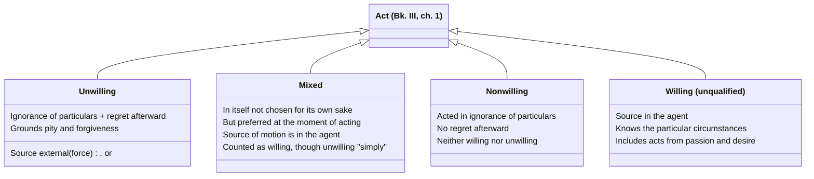

# Willing, Unwilling, Mixed, and Nonwilling Acts

Bk. III, ch. 1 opens Aristotle's account of responsibility with the distinction underlying [[concepts/prohairesis|choice]] itself: "praise and blame come about for willing actions, but for unwilling actions there is forgiveness and sometimes even pity." Since choice is a *species* of willing action (not every willing act is chosen — children and animals act willingly without choosing), this chapter is logically prior to the choice discussion, even though it's easy to conflate the two.

## Key Ideas

- **Two roots of unwillingness: force and ignorance.** A forced act is one "of which the source is external, and an act is of this sort in which the person acting... contributes nothing" — a wind carrying someone off, or someone physically overpowered. An act done through ignorance is unwilling only if it is also regretted: someone who acts in ignorance and feels no distress afterward has acted neither willingly nor unwillingly, but *nonwillingly* — Aristotle introduces this third label because "it is better for one who differs to have a special name." ^[extracted]
- **Mixed acts are willing, though "unwilling in an unqualified sense."** Aristotle's examples: throwing cargo overboard in a storm to save the ship, or a tyrant coercing a shameful act by threatening one's family. No one would choose these for their own sake, yet "at the time when they are done they are preferred" and "the source of the moving of the parts... is in oneself" — so they count as willing, since what's willing or unwilling must be judged at the moment of acting, not by what one would prefer in the abstract. ^[extracted]
- **Not all ignorance excuses.** Aristotle distinguishes acting *on account of* ignorance (not knowing a relevant particular circumstance — whom one hits, with what, for what end) from acting *while* ignorant in a more general way, such as a bad person's ignorance of what one ought to do — "every bad person is ignorant of what one ought to do," but this general ignorance of what's advantageous is the *cause* of vice, not an excuse for it. He also separates ignorance from the confused states of a drunk or angry person, who "does not seem to act on account of ignorance" but from passion, "not knowing but being ignorant." Only ignorance of the *particular circumstances* of an act — who, what, with what, for the sake of what, in what manner — grounds pity and forgiveness. ^[extracted]
- **Acts from spiritedness or desire are willing, against a tempting objection.** One might think an act done in a fit of anger or appetite isn't really "up to" the agent, but Aristotle rejects this: if it were true, "none of the other animals would any longer do anything willingly, nor would children," and it would be absurd to call the beautiful things we do from desire willing but the shameful ones unwilling, "when one thing is responsible for them." Passion is as human as reasoning, so acting from passion doesn't by itself make an act unwilling. ^[extracted]
- **This machinery becomes load-bearing well beyond Book III.** [[concepts/corrective-justice|Corrective justice]] (Bk. V, ch. 8) redeploys the willing/unwilling distinction directly to separate "doing injustice" from merely "doing an unjust thing," and further grades unwilling harm into [[synthesis/culpability-scale|accident and negligence]] based on exactly this apparatus (source of ignorance external vs. internal, contrary to reasonable expectation or not). ^[extracted]

## Diagram

A direct classification stated in the chapter itself, not a metaphor: every act sorts into exactly one of these four categories based on force, ignorance, and regret.

## Related

- [[concepts/prohairesis]] — choice, the narrower category of willing acts that are also deliberated and decided
- [[concepts/corrective-justice]] — reapplies this exact machinery to distinguish acts of injustice from merely unjust outcomes
- [[synthesis/culpability-scale]] — the four-stage grading of harm built directly on top of this chapter's ignorance/force distinctions
- [[references/nicomachean-ethics]] — source text (Book III, ch. 1)
