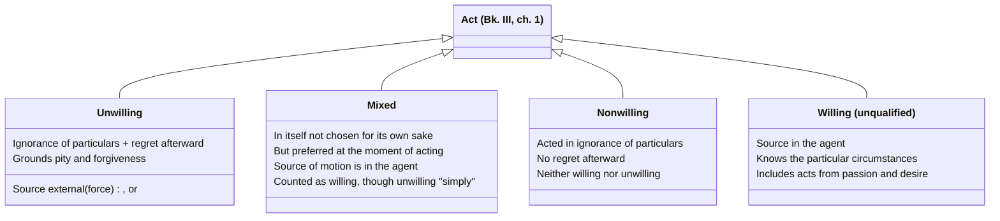

# Willing, Unwilling, Mixed, and Nonwilling Acts

Bk. III, ch. 1 opens Aristotle's account of responsibility with the distinction underlying [[concepts/prohairesis|choice]] itself: "praise and blame come about for willing actions, but for unwilling actions there is forgiveness and sometimes even pity." Since choice is a *species* of willing action (not every willing act is chosen — children and animals act willingly without choosing), this chapter is logically prior to the choice discussion, even though it's easy to conflate the two.

## Key Ideas

- **Two roots of unwillingness: force and ignorance.** A forced act is one "of which the source is external, and an act is of this sort in which the person acting... contributes nothing" — a wind carrying someone off, or someone physically overpowered. An act done through ignorance is unwilling only if it is also regretted: someone who acts in ignorance and feels no distress afterward has acted neither willingly nor unwillingly, but *nonwillingly* — Aristotle introduces this third label because "it is better for one who differs to have a special name." ^[extracted]
- **Mixed acts are willing, though "unwilling in an unqualified sense."** Aristotle's examples: throwing cargo overboard in a storm to save the ship, or a tyrant coercing a shameful act by threatening one's family. No one would choose these for their own sake, yet "at the time when they are done they are preferred" and "the source of the moving of the parts... is in oneself" — so they count as willing, since what's willing or unwilling must be judged at the moment of acting, not by what one would prefer in the abstract. ^[extracted]
- **Not all ignorance excuses.** Aristotle distinguishes acting *on account of* ignorance (not knowing a relevant particular circumstance — whom one hits, with what, for what end) from acting *while* ignorant in a more general way, such as a bad person's ignorance of what one ought to do — "every bad person is ignorant of what one ought to do," but this general ignorance of what's advantageous is the *cause* of vice, not an excuse for it. He also separates ignorance from the confused states of a drunk or angry person, who "does not seem to act on account of ignorance" but from passion, "not knowing but being ignorant." Only ignorance of the *particular circumstances* of an act — who, what, with what, for the sake of what, in what manner — grounds pity and forgiveness. ^[extracted]
- **Acts from spiritedness or desire are willing, against a tempting objection.** One might think an act done in a fit of anger or appetite isn't really "up to" the agent, but Aristotle rejects this: if it were true, "none of the other animals would any longer do anything willingly, nor would children," and it would be absurd to call the beautiful things we do from desire willing but the shameful ones unwilling, "when one thing is responsible for them." Passion is as human as reasoning, so acting from passion doesn't by itself make an act unwilling. ^[extracted]
- **This machinery becomes load-bearing well beyond Book III.** [[concepts/corrective-justice|Corrective justice]] (Bk. V, ch. 8) redeploys the willing/unwilling distinction directly to separate "doing injustice" from merely "doing an unjust thing," and further grades unwilling harm into [[synthesis/culpability-scale|accident and negligence]] based on exactly this apparatus (source of ignorance external vs. internal, contrary to reasonable expectation or not). ^[extracted]

## Diagram

A direct classification stated in the chapter itself, not a metaphor: every act sorts into exactly one of these four categories based on force, ignorance, and regret.



## Greek Gloss

### Bk. III, ch. 1 (Bekker 1110a1-4)

> βίαιον δὲ οὗ ἡ ἀρχὴ ἔξωθεν, τοιαύτη οὖσα ἐν ᾗ μηδὲν συμβάλλεται ὁ πράττων ἢ ὁ πάσχων, οἷον εἰ πνεῦμα κομίσαι ποι ἢ ἄνθρωποι κύριοι ὄντες.

```
βίαιον  δὲ    οὗ        ἡ    ἀρχὴ    ἔξωθεν        τοιαύτη  οὖσα   ἐν  ᾗ      μηδὲν    συμβάλλεται  ὁ    πράττων     ἢ   ὁ    πάσχων         οἷον     εἰ  πνεῦμα  κομίσαι    ποι        ἢ   ἄνθρωποι   κύριοι      ὄντες
biaion  de    hou       hē   archē   exōthen       toiautē  ousa   en  hēi    mēden    symballetai  ho   prattōn     ē   ho   paschōn        hoion    ei  pneuma  komisai    poi        ē   anthrōpoi  kyrioi      ontes
forced  PTCL  of-which  the  source  from-outside  such     being  in  which  nothing  contributes  the  one-acting  or  the  one-suffering  as-when  if  wind    carry-off  somewhere  or  people     in-control  being
```

*"Forced is that whose source is from outside, being of a sort in which the one acting or being acted upon contributes nothing — as if a wind should carry someone off somewhere, or people who have one in their power."* This is the definition behind the page's first root of unwillingness: *archē* (ἀρχή, "starting-point, source" — the same root that gives *archein*, "to rule" or "begin") is located *exōthen*, "from outside," which is exactly why the wind-blown or physically overpowered agent contributes nothing to the act.

### Bk. III, ch. 1 (Bekker 1110a11-13)

> μικταὶ μὲν οὖν εἰσιν αἱ τοιαῦται πράξεις, ἐοίκασι δὲ μᾶλλον ἑκουσίοις· αἱρεταὶ γάρ εἰσι τότε ὅτε πράττονται.

```
μικταὶ  μὲν   οὖν   εἰσιν  αἱ   τοιαῦται  πράξεις  ἐοίκασι    δὲ   μᾶλλον  ἑκουσίοις     αἱρεταὶ       γάρ  εἰσι  τότε          ὅτε   πράττονται
miktai  men   oun   eisin  hai  toiautai  praxeis  eoikasi    de   mallon  hekousiois    hairetai      gar  eisi  tote          hote  prattontai
mixed   PTCL  then  are    the  such      actions  they-seem  but  more    willing-ones  choiceworthy  for  are   at-that-time  when  they-are-done
```

*"Such actions, then, are mixed, but they resemble willing ones more, since they are choiceworthy at the time when they are done."* The word *miktai* itself (from the root of *meignymi*, "to mix," plus the verbal-adjective ending *-tos* marking a completed passive state) enacts the blend the page describes — not a third category but a mixture — and *hairetai...tote hote prattontai*, "choiceworthy at the very time they are done," is the textual basis for the diagram's claim that mixed acts are judged at the moment of acting rather than by what one would prefer in the abstract.

### Bk. III, ch. 1 (Bekker 1110b18-24)

> τὸ δὲ διʼ ἄγνοιαν οὐχ ἑκούσιον μὲν ἅπαν ἐστίν, ἀκούσιον δὲ τὸ ἐπίλυπον καὶ ἐν μεταμελείᾳ· ὁ γὰρ διʼ ἄγνοιαν πράξας ὁτιοῦν, μηδέν τι δυσχεραίνων ἐπὶ τῇ πράξει, ἑκὼν μὲν οὐ πέπραχεν, ὅ γε μὴ ᾔδει, οὐδʼ αὖ ἄκων, μὴ λυπούμενός γε.

```
τὸ   δὲ   διʼ      ἄγνοιαν    οὐχ   ἑκούσιον   μὲν   ἅπαν   ἐστίν  ἀκούσιον   δὲ   τὸ   ἐπίλυπον     καὶ  ἐν  μεταμελείᾳ   ὁ    γὰρ  διʼ      ἄγνοιαν    πράξας       ὁτιοῦν    μηδέν       τι    δυσχεραίνων   ἐπὶ  τῇ   πράξει  ἑκὼν     μὲν   οὐ   πέπραχεν   ὅ     γε    μὴ   ᾔδει     οὐδʼ  αὖ     ἄκων       μὴ   λυπούμενός    γε
to   de   di'      agnoian    ouch  hekousion  men   hapan  estin  akousion   de   to   epilypon     kai  en  metameleiai  ho   gar  di'      agnoian    praxas       hotioun   mēden       ti    dyscherainōn  epi  tēi  praxei  hekōn    men   ou   peprachen  ho    ge    mē   ēidei    oud'  au     akōn       mē   lypoumenos    ge
the  but  through  ignorance  not   willing    PTCL  all    is     unwilling  but  the  distressing  and  in  regret       the  for  through  ignorance  having-done  whatever  not-at-all  PTCL  distressed    at   the  deed    willing  PTCL  not  has-done   what  PTCL  not  he-knew  nor   again  unwilling  not  being-pained  PTCL
```

*"What is through ignorance is not in every case unwilling, but unwilling is what is distressing and accompanied by regret; for the one who has done anything whatever through ignorance, feeling no vexation at the deed, has not acted willingly, since he did not know what he was doing, but neither has he acted unwillingly, since he is not pained."* Aristotle builds the nonwilling category directly out of *metameleia* (μετά, "after," + the root of *melei*, "it is a care to," + the abstract-noun ending *-eia*, literally "an after-caring"): acting through ignorance is unwilling only *en metameleiai*, "in a state of regret" — without that after-caring, the act is neither willing nor unwilling, exactly the third label the page's diagram tracks.

### Bk. III, ch. 1 (Bekker 1110b25-30)

> ὁ γὰρ μεθύων ἢ ὀργιζόμενος οὐ δοκεῖ διʼ ἄγνοιαν πράττειν ἀλλὰ διά τι τῶν εἰρημένων, οὐκ εἰδὼς δὲ ἀλλʼ ἀγνοῶν. ἀγνοεῖ μὲν οὖν πᾶς ὁ μοχθηρὸς ἃ δεῖ πράττειν καὶ ὧν ἀφεκτέον, καὶ διὰ τὴν τοιαύτην ἁμαρτίαν ἄδικοι καὶ ὅλως κακοὶ γίνονται.

```
ὁ    γὰρ  μεθύων     ἢ   ὀργιζόμενος  οὐ   δοκεῖ  διʼ      ἄγνοιαν    πράττειν  ἀλλὰ  διά      τι         τῶν     εἰρημένων    οὐκ  εἰδὼς    δὲ   ἀλλʼ  ἀγνοῶν          ἀγνοεῖ       μὲν   οὖν   πᾶς    ὁ    μοχθηρὸς    ἃ     δεῖ       πράττειν  καὶ  ὧν        ἀφεκτέον   καὶ  διὰ         τὴν  τοιαύτην  ἁμαρτίαν   ἄδικοι  καὶ  ὅλως      κακοὶ  γίνονται
ho   gar  methyōn    ē   orgizomenos  ou   dokei  di'      agnoian    prattein  alla  dia      ti         tōn     eirēmenōn    ouk  eidōs    de   all'  agnoōn          agnoei       men   oun   pas    ho   mochthēros  ha    dei       prattein  kai  hōn       aphekteon  kai  dia         tēn  toiautēn  hamartian  adikoi  kai  holōs     kakoi  ginontai
the  for  drunk-one  or  angry-one    not  seems  through  ignorance  to-act    but   through  something  of-the  things-said  not  knowing  but  but   being-ignorant  is-ignorant  PTCL  then  every  the  bad-person  what  one-must  do        and  of-which  abstain    and  because-of  the  such      error      unjust  and  entirely  bad    become
```

*"For the drunk or angry man does not seem to act through ignorance but through one of the things just mentioned, not knowing but being ignorant. Every base person, then, is ignorant of what one ought to do and what one ought to abstain from, and it is through this sort of error that people become unjust, and bad in general."* The drunk or angry man is said *ouk eidōs...all' agnoōn*, "not knowing, but ignorant" (from the privative *a-* plus the root of *gignōskō*, "to know," plus the infinitive-forming *-ein*) — a settled state, not a momentary lapse — which is precisely why the page distinguishes acting *because of* ignorance of particulars, which excuses, from a bad person's standing *agnoein* of what he ought to do, which does not.

### Bk. III, ch. 1 (Bekker 1111a24-26)

> ἴσως γὰρ οὐ καλῶς λέγεται ἀκούσια εἶναι τὰ διὰ θυμὸν ἢ ἐπιθυμίαν. πρῶτον μὲν γὰρ οὐδὲν ἔτι τῶν ἄλλων ζῴων ἑκουσίως πράξει, οὐδʼ οἱ παῖδες.

```
ἴσως     γὰρ  οὐ   καλῶς    λέγεται     ἀκούσια    εἶναι  τὰ   διὰ         θυμὸν         ἢ   ἐπιθυμίαν   πρῶτον  μὲν   γὰρ  οὐδὲν       ἔτι         τῶν     ἄλλων  ζῴων     ἑκουσίως   πράξει   οὐδʼ  οἱ   παῖδες
isōs     gar  ou   kalōs    legetai     akousia    einai  ta   dia         thymon        ē   epithymian  prōton  men   gar  ouden       eti         tōn     allōn  zōiōn    hekousiōs  praxei   oud'  hoi  paides
perhaps  for  not  rightly  it-is-said  unwilling  to-be  the  because-of  spiritedness  or  appetite    first   PTCL  for  not-at-all  any-longer  of-the  other  animals  willingly  will-do  nor   the  children
```

*"Perhaps it is not rightly said that the things done because of spiritedness or appetite are unwilling. For in the first place, none of the other animals will any longer do anything willingly, nor will children."* Aristotle's point rests on *thymon* and *epithymian* — spiritedness and appetite, the *aloga pathē* or "passions without reason" (from privative *a-* + the root of *logos*, "reason," + neuter-plural *-a*) — belonging to animals and children as much as to grown human beings; this is the textual ground for the page's claim that acting from passion doesn't by itself make an act unwilling, since passion is as human as reasoning.

### Bk. V, ch. 8 (Bekker 1135a19-24)

> ἀδίκημα δὲ καὶ δικαιοπράγημα ὥρισται τῷ ἑκουσίῳ καὶ ἀκουσίῳ· ὅταν γὰρ ἑκούσιον ᾖ, ψέγεται, ἅμα δὲ καὶ ἀδίκημα τότʼ ἐστίν· ὥστʼ ἔσται τι ἄδικον μὲν ἀδίκημα δʼ οὔπω, ἂν μὴ τὸ ἑκούσιον προσῇ.

```
ἀδίκημα        δὲ   καὶ  δικαιοπράγημα  ὥρισται     τῷ      ἑκουσίῳ    καὶ  ἀκουσίῳ    ὅταν      γὰρ  ἑκούσιον   ᾖ      ψέγεται    ἅμα      δὲ   καὶ   ἀδίκημα        τότʼ  ἐστίν  ὥστʼ     ἔσται    τι         ἄδικον        μὲν   ἀδίκημα        δʼ   οὔπω     ἂν   μὴ   τὸ   ἑκούσιον   προσῇ
adikēma        de   kai  dikaiopragēma  hōristai    tōi     hekousiōi  kai  akousiōi   hotan     gar  hekousion  ēi     psegetai   hama     de   kai   adikēma        tot'  estin  hōst'    estai    ti         adikon        men   adikēma        d'   oupō     an   mē   to   hekousion  prosēi
injustice-act  and  and  justice-act    is-defined  by-the  willing    and  unwilling  whenever  for  willing    it-is  is-blamed  at-once  and  also  injustice-act  then  it-is  so-that  will-be  something  unjust-thing  PTCL  injustice-act  but  not-yet  MOD  not  the  willing    be-added
```

*"An act of injustice and an act of justice are defined by the willing and the unwilling; for whenever it is willing, it is blamed, and at the same time it is then an act of injustice; so that there will be something unjust but not yet an act of injustice, if the willing is not added to it."* This is the exact sentence [[concepts/corrective-justice|corrective justice]] redeploys: *adikēma* (from privative-turned-root *dik-*, the stem of *dikē*, "right, judgment," plus the result-noun suffix *-ēma*) names a culpable act of injustice as against merely *to adikon*, "the unjust thing" — and the line here states outright that the difference between them is *tōi hekousiōi kai akousiōi*, "by the willing and the unwilling," the very machinery Bk. III built.

## Related

- [[concepts/prohairesis]] — choice, the narrower category of willing acts that are also deliberated and decided
- [[concepts/corrective-justice]] — reapplies this exact machinery to distinguish acts of injustice from merely unjust outcomes
- [[synthesis/culpability-scale]] — the four-stage grading of harm built directly on top of this chapter's ignorance/force distinctions
- [[references/nicomachean-ethics]] — source text (Book III, ch. 1)
