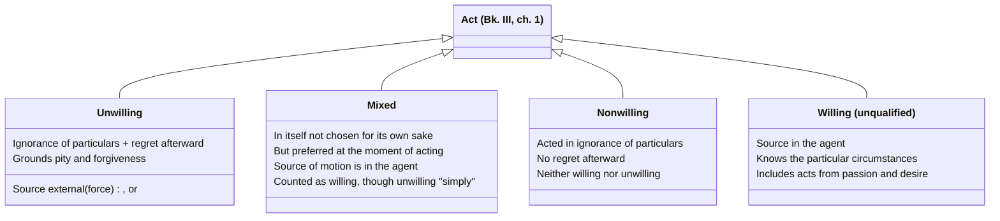

# Willing, Unwilling, Mixed, and Nonwilling Acts

Bk. III, ch. 1 opens Aristotle's account of responsibility with the distinction underlying [[concepts/prohairesis|choice]] itself: "praise and blame come about for willing actions, but for unwilling actions there is forgiveness and sometimes even pity." Since choice is a *species* of willing action (not every willing act is chosen — children and animals act willingly without choosing), this chapter is logically prior to the choice discussion, even though it's easy to conflate the two.

## Key Ideas

- **Two roots of unwillingness: force and ignorance.** A forced act is one "of which the source is external, and an act is of this sort in which the person acting... contributes nothing" — a wind carrying someone off, or someone physically overpowered. An act done through ignorance is unwilling only if it is also regretted: someone who acts in ignorance and feels no distress afterward has acted neither willingly nor unwillingly, but *nonwillingly* — Aristotle introduces this third label because "it is better for one who differs to have a special name." ^[extracted]
- **Mixed acts are willing, though "unwilling in an unqualified sense."** Aristotle's examples: throwing cargo overboard in a storm to save the ship, or a tyrant coercing a shameful act by threatening one's family. No one would choose these for their own sake, yet "at the time when they are done they are preferred" and "the source of the moving of the parts... is in oneself" — so they count as willing, since what's willing or unwilling must be judged at the moment of acting, not by what one would prefer in the abstract. ^[extracted]
- **Not all ignorance excuses.** Aristotle distinguishes acting *on account of* ignorance (not knowing a relevant particular circumstance — whom one hits, with what, for what end) from acting *while* ignorant in a more general way, such as a bad person's ignorance of what one ought to do — "every bad person is ignorant of what one ought to do," but this general ignorance of what's advantageous is the *cause* of vice, not an excuse for it. He also separates ignorance from the confused states of a drunk or angry person, who "does not seem to act on account of ignorance" but from passion, "not knowing but being ignorant." Only ignorance of the *particular circumstances* of an act — who, what, with what, for the sake of what, in what manner — grounds pity and forgiveness. ^[extracted]
- **Acts from spiritedness or desire are willing, against a tempting objection.** One might think an act done in a fit of anger or appetite isn't really "up to" the agent, but Aristotle rejects this: if it were true, "none of the other animals would any longer do anything willingly, nor would children," and it would be absurd to call the beautiful things we do from desire willing but the shameful ones unwilling, "when one thing is responsible for them." Passion is as human as reasoning, so acting from passion doesn't by itself make an act unwilling. ^[extracted]
- **This machinery becomes load-bearing well beyond Book III.** [[concepts/corrective-justice|Corrective justice]] (Bk. V, ch. 8) redeploys the willing/unwilling distinction directly to separate "doing injustice" from merely "doing an unjust thing," and further grades unwilling harm into [[synthesis/culpability-scale|accident and negligence]] based on exactly this apparatus (source of ignorance external vs. internal, contrary to reasonable expectation or not). ^[extracted]

## Diagram

A direct classification stated in the chapter itself, not a metaphor: every act sorts into exactly one of these four categories based on force, ignorance, and regret.

## Greek Gloss

Source: Bk. III, ch. 1 (Bekker 1110a1-4).

> βίαιον δὲ οὗ ἡ ἀρχὴ ἔξωθεν, τοιαύτη οὖσα ἐν ᾗ μηδὲν συμβάλλεται ὁ πράττων ἢ ὁ πάσχων, οἷον εἰ πνεῦμα κομίσαι ποι ἢ ἄνθρωποι κύριοι ὄντες.

| βι- | -αιον |
|---|---|
| *bi-* | *-aion* |
| root of βία, "force, violence, bodily strength" | adjective-forming suffix, "characterized by, subject to" |
| → **βίαιον**, "the forced (act)," that whose source lies outside the agent | |

This is the definition of force behind the page's first root of unwillingness: βίαιον locates the ἀρχή ("starting-point") of the act entirely outside the person, which is exactly why a wind-blown or physically overpowered agent "contributes nothing."

Source: Bk. III, ch. 1 (Bekker 1110a11-13).

> μικταὶ μὲν οὖν εἰσιν αἱ τοιαῦται πράξεις, ἐοίκασι δὲ μᾶλλον ἑκουσίοις· αἱρεταὶ γάρ εἰσι τότε ὅτε πράττονται.

| μικ- | -τός |
|---|---|
| *mik-* | *-tos* |
| root of μείγνυμι/μίσγω, "to mix" | verbal-adjective suffix, "-ed," marking a completed passive state |
| → **μικτόν**, "a mixed (act)," one blended of willing and unwilling elements | |

The word itself enacts the blend the page describes: a μικτή πρᾶξις is not a third category but a mixture, and Aristotle's αἱρεταὶ...τότε ὅτε πράττονται ("preferred at the very time they are done") is the textual basis for the diagram's claim that mixed acts are judged at the moment of acting.

Source: Bk. III, ch. 1 (Bekker 1110b18-24).

> τὸ δὲ διʼ ἄγνοιαν οὐχ ἑκούσιον μὲν ἅπαν ἐστίν, ἀκούσιον δὲ τὸ ἐπίλυπον καὶ ἐν μεταμελείᾳ· ὁ γὰρ διʼ ἄγνοιαν πράξας ὁτιοῦν, μηδέν τι δυσχεραίνων ἐπὶ τῇ πράξει, ἑκὼν μὲν οὐ πέπραχεν, ὅ γε μὴ ᾔδει, οὐδʼ αὖ ἄκων, μὴ λυπούμενός γε.

| μετα- | -μελ- | -εια |
|---|---|---|
| *meta-* | *-mel-* | *-eia* |
| "after" | root of μέλει, "it is a care/concern to (someone)" | abstract-noun suffix |
| → **μεταμέλεια**, "an after-caring," i.e. regret or remorse | | |

Aristotle here builds the nonwilling category directly out of μεταμέλεια: acting through ignorance is unwilling only ἐν μεταμελείᾳ, "in a state of regret" — without that after-caring, the act is neither willing nor unwilling, exactly the third label the page's diagram tracks.

Source: Bk. III, ch. 1 (Bekker 1110b25-30).

> ὁ γὰρ μεθύων ἢ ὀργιζόμενος οὐ δοκεῖ διʼ ἄγνοιαν πράττειν ἀλλὰ διά τι τῶν εἰρημένων, οὐκ εἰδὼς δὲ ἀλλʼ ἀγνοῶν. ἀγνοεῖ μὲν οὖν πᾶς ὁ μοχθηρὸς ἃ δεῖ πράττειν καὶ ὧν ἀφεκτέον, καὶ διὰ τὴν τοιαύτην ἁμαρτίαν ἄδικοι καὶ ὅλως κακοὶ γίνονται.

| ἀ- | -γνο- | -εῖν |
|---|---|---|
| *a-* | *-gno-* | *-ein* |
| privative, "not" | root of γιγνώσκω, "to know" | infinitive-forming ending |
| → **ἀγνοεῖν**, "to not-know," to be in a state of ignorance | | |

The drunk or angry man is said οὐκ εἰδὼς...ἀλλʼ ἀγνοῶν, "not knowing, but ignorant" — a state, not a momentary lapse — which is precisely why the page distinguishes acting *because of* ignorance of particulars (excusing) from a bad person's standing ἀγνοεῖν of what he ought to do (not excusing).

Source: Bk. III, ch. 1 (Bekker 1111a24-26).

> ἴσως γὰρ οὐ καλῶς λέγεται ἀκούσια εἶναι τὰ διὰ θυμὸν ἢ ἐπιθυμίαν. πρῶτον μὲν γὰρ οὐδὲν ἔτι τῶν ἄλλων ζῴων ἑκουσίως πράξει, οὐδʼ οἱ παῖδες.

| ἀ- | -λογ- | -α |
|---|---|---|
| *a-* | *-log-* | *-a* |
| privative, "not" | root of λόγος, "reason, speech, account" | neuter plural ending |
| → **ἄλογα** (πάθη), "the passions without reason" | | |

Aristotle's point that even the ἄλογα πάθη ("irrational passions") of spiritedness and appetite belong to human beings as much as reasoning does is the textual ground for the page's claim that passion is as human as reasoning, so acting from it doesn't by itself make an act unwilling.

Source: Bk. V, ch. 8 (Bekker 1135a19-24).

> ἀδικεῖ μὲν καὶ δικαιοπραγεῖ ὅταν ἑκών τις αὐτὰ πράττῃ· ὅταν δʼ ἄκων, οὔτʼ ἀδικεῖ οὔτε δικαιοπραγεῖ ἀλλʼ ἢ κατὰ συμβεβηκός... ἀδίκημα δὲ καὶ δικαιοπράγημα ὥρισται τῷ ἑκουσίῳ καὶ ἀκουσίῳ· ὅταν γὰρ ἑκούσιον ᾖ, ψέγεται, ἅμα δὲ καὶ ἀδίκημα τότʼ ἐστίν· ὥστʼ ἔσται τι ἄδικον μὲν ἀδίκημα δʼ οὔπω, ἂν μὴ τὸ ἑκούσιον προσῇ.

| ἀ- | -δικ- | -ημα |
|---|---|---|
| *a-* | *-dik-* | *-ēma* |
| privative, "not" | root of δίκη, "right, justice, judgment" | noun suffix, "the result of an action" |
| → **ἀδίκημα**, "an act of injustice," as opposed to merely τὸ ἄδικον, "an unjust thing" | | |

This is the exact sentence [[concepts/corrective-justice|corrective justice]] redeploys: an ἄδικον only becomes an ἀδίκημα — culpable, blame-worthy injustice — when the willing/unwilling machinery from Bk. III is added, τῷ ἑκουσίῳ καὶ ἀκουσίῳ ὥρισται, "defined by the willing and the unwilling."

## Related

- [[concepts/prohairesis]] — choice, the narrower category of willing acts that are also deliberated and decided
- [[concepts/corrective-justice]] — reapplies this exact machinery to distinguish acts of injustice from merely unjust outcomes
- [[synthesis/culpability-scale]] — the four-stage grading of harm built directly on top of this chapter's ignorance/force distinctions
- [[references/nicomachean-ethics]] — source text (Book III, ch. 1)
