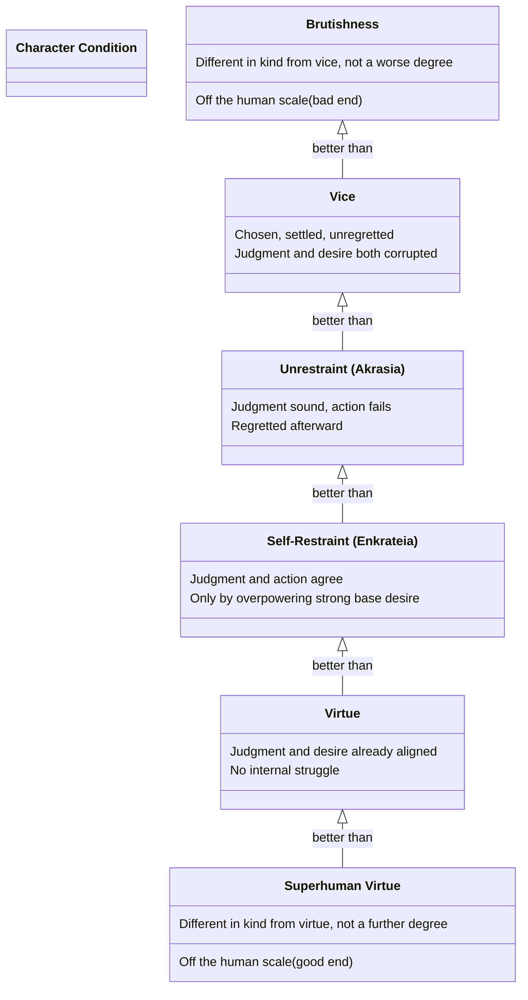

# The Six-Point Character Spectrum

Book VII's opening line names three things "to be avoided" (vice, unrestraint, an animal-like state) and, for two of them, their obvious opposites (virtue, self-restraint) — leaving the third opposite, superhuman virtue, to be worked out by analogy. **This page assembles those six terms into one ordered scale; Aristotle himself states them as three separate opposed pairs, not as a single ranked line** — the ordering from worst to best is this page's own synthesis, not a claim Aristotle makes in one place.

## Key Ideas

- **The three pairs, as Aristotle actually gives them**: vice / virtue, unrestraint / self-restraint, brutishness / superhuman virtue. Each pair concerns a different kind of failure or success — vice is a chosen, settled bad condition; unrestraint is an episodic failure to act on one's own better judgment; brutishness is off the human scale altogether, "of a different kind from vice" rather than a worse degree of it. ^[extracted]
- **Ordering the six by increasing soundness of character gives the spectrum below.** [[concepts/beasts-and-gods|Brutishness]] sits outside the human scale on the bad end, not merely below vice — but for the purpose of a single ordered line, it anchors the bottom, since it is "disparage[d]" as worse than ordinary human badness. Vice is a full, chosen, unregretted bad condition (see [[concepts/akolasia]]). [[concepts/akrasia|Unrestraint]] is better than vice because "the best thing in him, the source, is preserved" — the unrestrained person's judgment is sound even though his action isn't. [[concepts/continence|Self-restraint]] is better still: judgment *and* action agree, even though desire had to be overpowered to get there. Virtue is better yet: no internal struggle at all, because the person's desires are already aligned with reason. [[concepts/beasts-and-gods|Superhuman virtue]] anchors the top, again off the human scale, "more honorable than virtue" rather than merely more virtuous. ^[inferred]
- **The scale is not evenly spaced.** The gap between unrestraint and self-restraint (both still struggling against base desire, differing only in outcome) is much narrower than the gap between self-restraint and full virtue (a difference in the *presence* of internal conflict, not just its resolution) — and the gaps to brutishness and superhuman virtue at either end are categorical, not gradual, since Aristotle insists those two are different *in kind*, not merely in degree. ^[inferred]
- **This scale complements, rather than duplicates, [[synthesis/culpability-scale|the culpability scale]]**: that one grades *individual harmful acts* by the actor's knowledge and choice in the moment (Bk. V); this one grades *standing character* by the relationship between an agent's judgment and his desires over time (Bk. VII). ^[inferred]

## Diagram

An explicitly synthesized ordering, not a single passage's literal claim — the three pairs are Aristotle's; the single-line arrangement and the "categorical vs. gradual" gap sizes are this page's own reading, flagged here rather than presented as extracted fact.

## Related

- [[concepts/akrasia]] — unrestraint, the book's actual sustained subject
- [[concepts/continence]] — self-restraint, akrasia's positive counterpart
- [[concepts/beasts-and-gods]] — brutishness and superhuman virtue, the two categorical extremes bounding this scale
- [[synthesis/culpability-scale]] — the companion grading scale for individual acts rather than standing character
- [[references/nicomachean-ethics]] — source text (Book VII, ch. 1)
