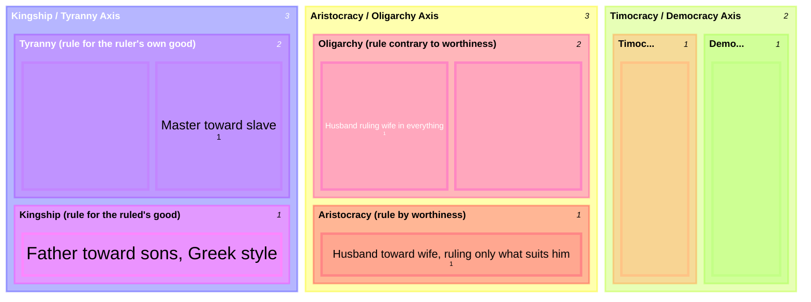

# Three Constitutions and Their Corruptions, Mapped onto the Household

Bk. VIII, ch. 10-11 finds "likenesses of them, and patterns of a sort" between the three correct forms of political constitution (each with its own corruption) and the relationships inside a household — and then tracks how friendship itself shows up differently in each. This is a distinct classification from [[synthesis/household-justice-inheritance|the household-justice ranking]] (wife > child > slave/property): that one grades relations by degree of shared justice; this one matches each relation to a *constitutional form*, correct or deviant.

## Key Ideas

- **Kingship / Tyranny — the father-child and master-slave axis.** A father's rule over sons "has the shape of kingship," since "the father's care is for his children." But "among the Persians, the rule of the father is tyrannical, since they treat their sons as slaves" — the same relation (father-son) can sit at either pole depending on whether it aims at the child's good or the ruler's own. The rule of a master over slaves, by contrast, has no non-tyrannical version at all: "it is the advantage of the master that is active in it." ^[extracted]
- **Aristocracy / Oligarchy — the husband-wife axis.** "The relationship of a husband to a wife seems aristocratic, since the man rules as a result of worthiness," turning over to the wife "as many things as are suited to a woman." It corrupts into oligarchy if "the husband is in charge of everything... contrary to worthiness," and likewise when "wives rule... their rule does not come from virtue, but from wealth and power, just as in oligarchies" (the heiress case). ^[extracted]
- **Timocracy / Democracy — the brothers axis.** "The relationship of brothers seems timocratic, for they are equal, except to the extent that they differ in age." Timocracy is explicitly "the worst" of the three correct constitutions, yet its corruption, democracy, is "the least bad" deviant form — "democracy is present most of all in households without masters (since there everyone is equal)... and there is license for everyone." ^[extracted]
- **Friendship tracks justice within each constitution, and shrinks toward the deviant pole.** Kingly and fatherly friendship rest on the superior's benefit-conferring; aristocratic (husband-wife) friendship is "in accord with virtue, with the greater good going to the better person"; timocratic (brotherly) friendship is between equals. But "in the deviant constitutions... friendship is of small extent... least in the worst," and in the limiting case of a master toward a slave *as* a slave, Aristotle says there is "no friendship... nor anything just," since "there is nothing in common" — a slave counts as "an ensouled tool." ^[extracted]
- **This cuts across [[concepts/justice-nicomachean|the earlier household-justice ranking]] rather than duplicating it**: that ranking (wife > child > slave/property) graded relations by how much recognized justice applies; this one classifies the same relations by which political constitution their authority-structure resembles, correct or corrupted. ^[inferred]

## Diagram

A direct classification, not a metaphor: Aristotle names these constitutional forms and then explicitly assigns each household relation to one.

## Related

- [[concepts/philia]] — the friendship-in-constitutions discussion this classification comes embedded in (Bk. VIII, ch. 11)
- [[synthesis/household-justice-inheritance]] — the companion household classification, graded by justice rather than by constitutional analogue
- [[concepts/justice-nicomachean]] — general vs. particular justice, and the political/household distinction this page's mapping presupposes
- [[references/nicomachean-ethics]] — source text (Book VIII, ch. 10-11)
