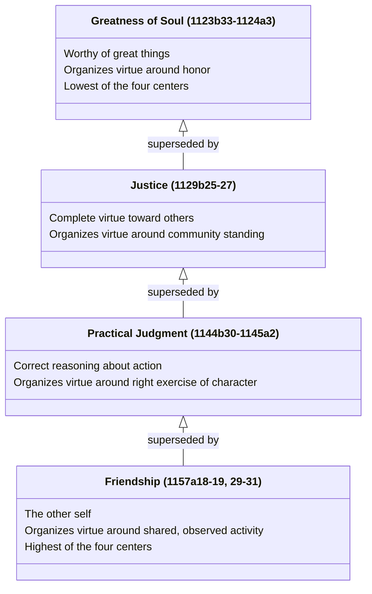

# Four Candidate Centers That Organize the Virtues

**This page documents an editorial claim, not a passage where Aristotle himself lays out a ranked progression.** In the glossary entry for "greatness of soul," translator Joe Sachs synthesizes four separate passages across the whole *Ethics* into a single claim: greatness of soul is "the lowest of four kinds of active lives that organize all the virtues around one center (1123b 33-1124a 3), superceded successively by justice (1129b 25-27), practical judgment (1144b 30-1145a 2), and friendship (1157a 18-19, 29-31)." No single passage states this four-stage ranking outright — it is Sachs's own synthesis of where each virtue sits in "the inquiry" as a whole, which is why this page is marked mostly `inferred` rather than `extracted`.

## Key Ideas

- **Greatness of soul (Bk. IV, ch. 3, 1123b33-1124a3)** — "the well-founded attitude that one is worthy of great things," organizing the virtues around worthiness of honor. Sachs elsewhere calls it a "fifth cardinal virtue" alongside courage, temperance, justice, and wisdom, but notes its position in the book makes it the *lowest* of the four organizing centers, not the last word. ^[extracted]
- **Justice (1129b25-27)** supersedes it — [[concepts/justice-nicomachean|justice as complete virtue toward others]] organizes the virtues around one's standing in a community, rather than around one's own worthiness of honor. ^[inferred]
- **Practical judgment / phronesis (1144b30-1145a2)** supersedes justice — [[concepts/phronesis|practical judgment]] organizes the virtues around correct reasoning about action as such, the capacity without which none of the virtues of character can be exercised rightly in the first place. ^[inferred]
- **Friendship (1157a18-19, 29-31)** is the last and highest of the four — [[concepts/philia|friendship]], and specifically complete friendship between good people, organizes the virtues around the "other self," since it is only through a friend that one's own virtuous activity can be observed and enjoyed as an object in the world. This matches the glossary's separate claim that friendship functions as "an expansion of the self, through which all one's powers can approach their highest development." ^[inferred]
- **"Superseded" does not mean "cancelled."** Each later center doesn't replace the one before it so much as encompass a wider organizing frame for the same virtues — greatness of soul's concern with worthiness of honor is still present within just, prudent, and friendly activity, not discarded by it. This mirrors how [[concepts/contemplative-life|Book X's claim that complete happiness is contemplation]] doesn't cancel Book I's broader "virtuous activity" account, but narrows and completes it. ^[inferred]

## Diagram

A direct supersession chain, exactly as Sachs states it — not a timeline (this is expository/interpretive ranking, not chronological order of composition or of a person's moral development).

## Related

- [[concepts/justice-nicomachean]] — the second candidate center
- [[concepts/phronesis]] — the third candidate center
- [[concepts/philia]] — the fourth and highest candidate center
- [[concepts/contemplative-life]] — a parallel case of a later book narrowing rather than cancelling an earlier claim
- [[references/nicomachean-ethics]] — source text (glossary entry "greatness of soul," citing Bks. IV, V, VI, VIII)
