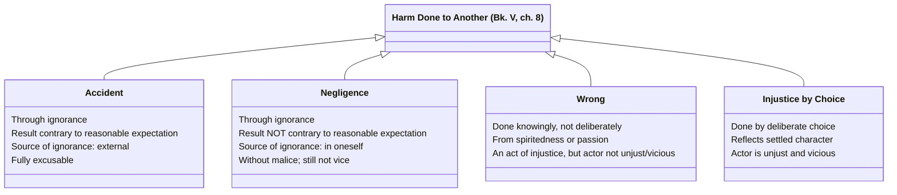

# The Four-Stage Culpability Scale for Harm

In Bk. V, ch. 8, Aristotle grades harm done to another person into stages of increasing responsibility, building directly on [[concepts/prohairesis|the voluntary/involuntary distinction]]. Each stage adds exactly one further condition beyond the one before it, so that culpability rises step by step rather than jumping straight from "blameless" to "blameworthy":

- **Accident** — harm caused through ignorance, where the result runs *contrary to* what one might reasonably expect, and the source of the ignorance is external to the actor: "when the source of responsibility... is external, one causes an accident." Fully excusable. ^[extracted]
- **Negligence** — harm caused through ignorance, but where the result does *not* run contrary to reasonable expectation and the source is in the actor himself, though without malice: "whenever the source of responsibility is in oneself, one commits an act of negligence." Still not vice, but one step more responsible than pure accident. ^[extracted]
- **Wrong** — harm done *knowingly* but not deliberately: acts "done out of spiritedness or all the other passions that are necessary or natural attributes of human beings." Aristotle is explicit that such a person "does injustice" and the deed is "an act of injustice," but the person is "not on that account unjust or vicious," since "the harm does not come from vice." ^[extracted]
- **Injustice by choice** — harm done *by deliberate choice* (*prohairesis*): "when it is from choice, the person is unjust and vicious." Only here does the harm reflect the actor's settled character rather than a passing passion or a failure of foresight. ^[extracted]

Aristotle closes the chapter by tying this scale to forgivability directly: unwilling acts done through ignorance *and as a result of* that ignorance are forgivable, but those done "as a result of a passion that is unnatural and inhuman" are not — the scale is not just descriptive but grounds which harms merit pardon. ^[extracted]

## Diagram

A literal cumulative scale: each stage is the prior stage plus exactly one added condition, stated directly in the class body, not implied by arrow direction.

## Related

- [[concepts/corrective-justice]] — the chapter (Bk. V, ch. 8) this scale belongs to, immediately following the arithmetic-proportion account of transactions
- [[concepts/prohairesis]] — the voluntary/involuntary/choice machinery this scale applies
- [[synthesis/household-justice-inheritance]] — another cumulative classDiagram built from a single source passage
- [[references/nicomachean-ethics]] — source text (Book V, ch. 8)
