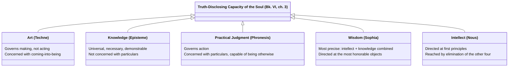

# Five Ways the Soul Discloses Truth

Book VI, ch. 3 sets down the full classification at once: "let those powers with which the soul discloses truth by affirming and denying be five in number, and these are art, knowledge, practical judgment, wisdom, and intellect." The chapters that follow (4-7, 11) define each largely *by elimination against the others* — art is ruled out of practical judgment's domain because making and acting differ in kind; wisdom and practical judgment are both ruled out of intellect's domain because both concern things "[[synthesis/necessity-and-contingency|capable of being otherwise]]," etc.

## Key Ideas

- **Art (*techne*)** — a true, reasoned active condition concerned with *making*, not acting: "all art is concerned with the process of coming into being," producing something whose source is in the maker, not in the thing made. Excluded from ethics proper because "action is not a kind of making." ^[extracted]
- **Knowledge (*episteme*)** — concerned with things that are universal, necessary, and demonstrable: "knowledge involves a demonstration of things the sources of which are incapable of being otherwise." Excluded from the practical domain because action always concerns particular, changeable things. ^[extracted]
- **[[concepts/phronesis|Practical judgment]] (*phronesis*)** — "a truth-disclosing active condition involving reason that governs action, concerned with what is good and bad for a human being." Neither knowledge nor art, since its object (action) is always capable of being otherwise, and "acting well is itself the end" rather than something produced beyond the activity. ^[extracted]
- **[[concepts/sophia|Wisdom]] (*sophia*)** — "knowledge and intellect of the things that are most honorable in their nature," combining intellect's grasp of first principles with the demonstrative structure of knowledge; the most precise of the five, but for that very reason not directed at action at all. ^[extracted]
- **[[concepts/nous|Intellect]] (*nous*)** — reached last, by elimination: since knowledge, practical judgment, and wisdom all in one way or another rest on or require prior sources they cannot themselves supply, "it remains for intellect to be directed at the sources" — the undemonstrable first principles a demonstration proceeds from. ^[extracted]
- **The five aren't a flat list of options — they cut two different axes at once**: making vs. acting vs. contemplating (art / phronesis / sophia), and universal-necessary vs. particular-changeable objects (episteme+sophia vs. techne+phronesis), with nous sitting underneath all of them as what grasps the undemonstrable starting points each of the other four ultimately depends on. ^[inferred]

## Diagram

A direct classification, stated as a five-item list in the source and then individually defined by elimination — not a metaphor.

## Related

- [[concepts/phronesis]] — practical judgment, defined in this chapter by elimination against art and knowledge
- [[concepts/nous]] — intellect, the last capacity reached, directed at undemonstrable first principles
- [[concepts/sophia]] — wisdom, combining nous and episteme, and Book X's candidate for complete happiness
- [[references/nicomachean-ethics]] — source text (Book VI, ch. 3-7, 11)
