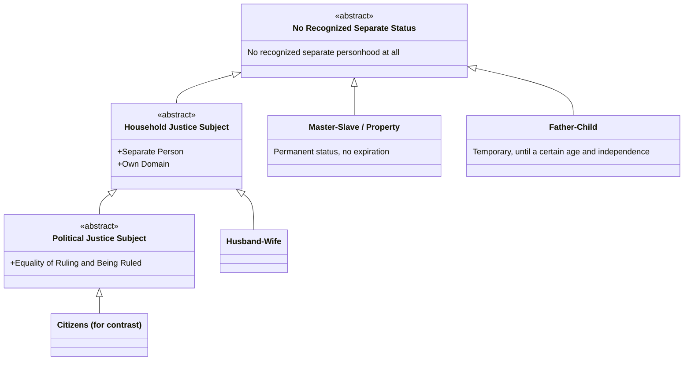

# Degrees of Justice in Household Relations

Book V, ch. 6 ranks household relations by how close they come to real (political) justice — closest for husband-wife, further for father-child, least of all for master-slave or bare property. An earlier version of this page tried to show that ranking as a Venn diagram (overlapping sets), and it didn't work: the ranking isn't partial overlap, it's strict accumulation — each step has everything the step before it has, plus one more property. That's a class-inheritance relationship, not a set-overlap one, so this page uses Mermaid's stable, non-beta `classDiagram` instead.

## Key Ideas

- **This is a deliberate analytical device, not Aristotle's own taxonomy.** The three-tier class hierarchy below (HouseholdDependent → HouseholdJusticeSubject → PoliticalJusticeSubject) encodes *which properties each relation cumulatively has* — it isn't a claim that Aristotle thinks citizenship is a specialized kind of household relation. His actual domain taxonomy keeps [[synthesis/justice-taxonomy|political and household justice as separate branches]]; this diagram exists purely to make the cumulative-properties logic visible. ^[inferred]
- **The three properties, each grounded directly in the text** (unchanged from the earlier attempt — the properties themselves were sound, only the diagram type was wrong):
  - **Separate Person** — not legally/practically treated as "a part of" the ruling party: "a piece of property, and a child... is just like a part of oneself" (Bk. V, ch. 6).
  - **Own Sphere of Authority** — has some domain the ruling party doesn't control: "as many things as are suited to a woman, he turns over to her" (Bk. VIII, ch. 10).
  - **Equality of Ruling and Being Ruled** — the turn-taking equality specific to political/citizen justice (Bk. V, ch. 7).
- **Master–slave/property and father–child are siblings at the base level, not chained to each other.** Both currently have zero of the three properties — but each box states the crucial asymmetry between them directly: a slave's (*qua* slave) status has no expiration, while a child's is explicitly temporary ("until it is of a certain age and independent"). Neither inherits from the other; they're two separate leaf classes hanging off the same base class. ^[extracted]
- **Husband–wife inherits the first two properties but stops there.** Aristotle is careful to say the relation, while real, is "different from the political sort" — genuine household-management justice, without full political equality. ^[extracted]
- **"Citizens" is included only as a ceiling**, inheriting one property further than husband-wife, to make visible that even the best household relation never reaches full political justice. ^[inferred]

## Related

- [[concepts/justice-nicomachean]] — the political-vs-household justice distinction this diagram expands
- [[synthesis/justice-taxonomy]] — the treemap's "Household 'Justice'" branch, shown here with the underlying cumulative properties that produce its ranking
- [[references/nicomachean-ethics]] — source text (Book V, ch. 6-7; Book VIII, ch. 10-11)
