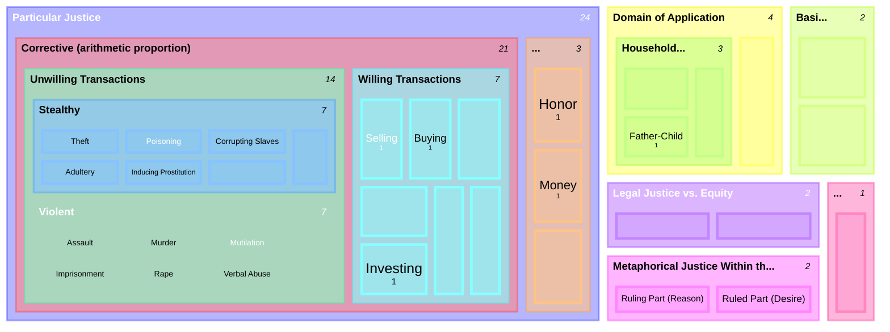

# The Full Taxonomy of Justice

Book V doesn't cut justice along one axis — it asks several genuinely different classificatory questions about "the just" (*to dikaion*) and answers each in turn: what species is it (distributive vs. corrective)? What basis does it rest on (natural vs. conventional)? What domain does it govern (political vs. household)? How does strict law relate to equity? And, in a deliberately flagged metaphor, can "justice" even apply within a single soul? This treemap renders each as its own branch rather than nesting them all under [[concepts/distributive-justice|distributive]]/[[concepts/corrective-justice|corrective]], since that binary only answers the first of these questions, not all five.

## Key Ideas

- **These are different axes, not one tree of nested species.** General/complete justice vs. particular justice; distributive vs. corrective (within particular justice); natural vs. conventional; political vs. household; strict legal justice vs. equity; and the metaphorical intra-soul case are each answers to a *different* question Aristotle asks about the just — not five further cuts of the same distinction. Forcing them into one taxonomic tree would misrepresent the text, which is why they sit as separate top-level branches below. ^[inferred]
- **The size gap between Distributive and Corrective is textually real, not an artifact of this diagram.** Aristotle names roughly twenty examples of transactions under corrective justice (seven willing, seven stealthy-unwilling, seven violent-unwilling — Bk. V, ch. 2) but only three under distributive justice (honor, money, "other divisible things"). The size difference reflects how much explicit cataloguing each domain gets in the text, not a claim that correction matters more than distribution. ^[extracted]
- **Household "justice" is graded, not uniform** — Aristotle explicitly ranks how close each domestic relation comes to real justice: closest for husband–wife ("this is the justice that belongs to household management"), further for father–child, and least of all for master–slave or bare property, where "there is no injustice in its simple sense toward things that are one's own." ^[extracted]
- **Natural vs. conventional is about the *basis* of a just rule, not a third species alongside distributive/corrective** — a rule can be naturally or conventionally grounded regardless of whether it happens to govern a distribution or a transaction (Bk. V, ch. 7). ^[extracted]
- **Equity is a correction of law's own universality, not a third form of particular justice** — "a setting straight of what is legally just," better than a certain kind of justice but not better than what is simply just (Bk. V, ch. 10). ^[extracted]
- **The intra-soul case is explicitly flagged as a metaphor**, not literal justice — Aristotle is careful to say it is "not justice by oneself toward oneself... but among certain things within oneself," the rational and irrational parts standing in a ruler/ruled relation only *analogous* to political justice (Bk. V, ch. 11). ^[extracted]

## Related

- [[concepts/justice-nicomachean]] — the hub page this treemap maps out in full
- [[concepts/distributive-justice]] — the geometric-proportion branch
- [[concepts/corrective-justice]] — the arithmetic-proportion branch, including the willing/unwilling and stealthy/violent subdivisions shown here
- [[synthesis/virtue-taxonomy]] — the companion treemap this one expands Justice's single 2-leaf node into
- [[synthesis/household-justice-inheritance]] — inheritance diagram drilling into this treemap's "Household 'Justice'" branch, showing the three cumulative properties that produce the husband-wife/father-child/master-slave ranking
- [[references/nicomachean-ethics]] — source text (Book V)
