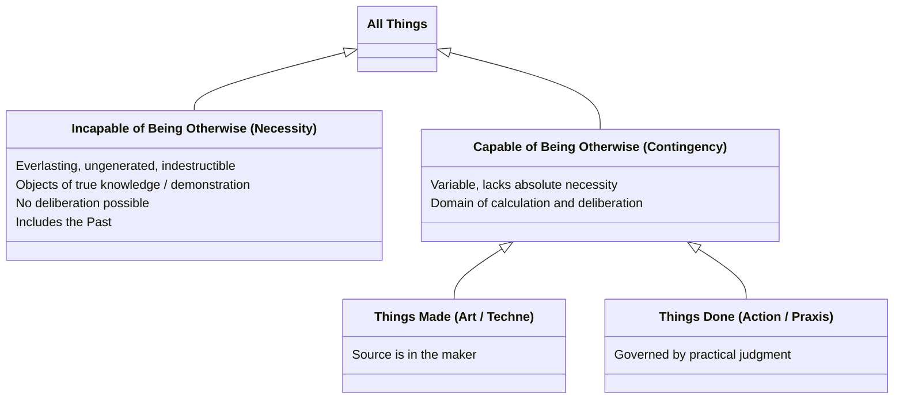

# Necessity and Contingency

Aristotle's framework relies on a fundamental ontological division between two realms of being: that which is strictly necessary and that which is contingent. This distinction governs both the structure of the world and the parts of the rational soul designed to apprehend it.

## The Two Realms

- **[[concepts/incapable-of-being-otherwise|Necessity (Incapable of Being Otherwise)]]**: The realm of eternal, fixed truths (including the past). These are the objects of true knowledge (*episteme*) and are contemplated by the knowing part of the soul. No one deliberates about them.
- **[[concepts/capable-of-being-otherwise|Contingency (Capable of Being Otherwise)]]**: The realm of variable things that can be otherwise. This is the domain of human deliberation, contemplated by the calculating part of the soul. It further divides into:
  - **Things made** (the realm of art / *[[art|techne]]*)
  - **Things done** (the realm of human action / *[[praxis]]*)

## Diagram

## Related

- [[synthesis/five-ways-of-truth]] — how this ontological division maps onto the five truth-disclosing capacities of the soul
- [[concepts/incapable-of-being-otherwise]] — the concept page for necessity and its Greek citations
- [[concepts/capable-of-being-otherwise]] — the concept page for contingency and its Greek citations
- [[concepts/soul/knowing-part]] — the part of the rational soul that contemplates necessity
- [[concepts/soul/calculating-part]] — the part of the rational soul that contemplates contingency
- [[concepts/art]] — the truth-disclosing capacity for things made
- [[concepts/phronesis]] — practical judgment, the truth-disclosing capacity for things done
