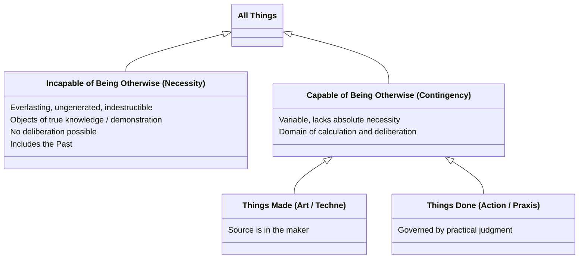

# Necessity and Contingency

Aristotle's framework relies on a fundamental ontological division between two realms of being: that which is strictly necessary ("incapable of being otherwise") and that which is contingent ("capable of being otherwise"). This distinction governs both the structure of the world and the parts of the rational soul designed to apprehend it.

## Incapable of Being Otherwise (Necessity)

Things that exist by necessity share several absolute characteristics:
- They are **everlasting, ungenerated, and indestructible**. ^[extracted]
- Their nature is entirely fixed, meaning **no one deliberates about them**. ^[extracted]
- They constitute the proper objects of true knowledge (*episteme*) and demonstration. ^[extracted]
- **The past** falls into this category: what has happened is not capable of not having happened, because its nature is now fixed. ^[extracted]

Because these things are invariable, they are contemplated exclusively by the [[concepts/soul/knowing-part|knowing part]] of the rational soul.

## Capable of Being Otherwise (Contingency)

Conversely, things that are capable of being otherwise are variable and lack absolute necessity. Because they are not eternal or fixed, when they occur outside of our immediate view, we cannot even be certain whether they currently exist or not. ^[extracted]

This realm of contingency is contemplated by the [[concepts/soul/calculating-part|calculating part]] of the rational soul, and it is the sole domain of human deliberation. It broadly divides into two categories:

- **Things that are made (the realm of art):** Art (*techne*) is concerned with bringing into being things that are capable of either being or not being. Unlike natural phenomena (which have their source within themselves) or necessary facts, the source of things made by art resides entirely in the maker. ^[extracted]
- **Things that are done (the realm of human action):** Human action (*praxis*) and affairs are governed by [[concepts/phronesis|practical judgment]] rather than absolute knowledge. Because a "thing done is capable of being otherwise" and is not bound by necessity, human actions are the proper subjects of our calculation and deliberation. ^[extracted]

## Diagram

## Related

- [[synthesis/five-ways-of-truth]] — how this ontological division maps onto the five truth-disclosing capacities of the soul
- [[concepts/soul/knowing-part]] — the part of the rational soul that contemplates necessity
- [[concepts/soul/calculating-part]] — the part of the rational soul that contemplates contingency
- [[concepts/art]] — the truth-disclosing capacity for things made
- [[concepts/phronesis]] — practical judgment, the truth-disclosing capacity for things done
