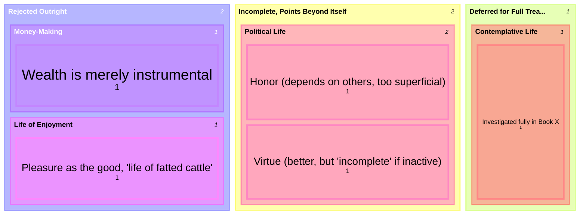

# Three Candidate Lives

Before Aristotle constructs the [[concepts/eudaimonia|ergon argument]], Bk. I, ch. 5 first clears the ground by testing the question against how people actually live: "there are three ways of life especially that hold prominence" — enjoyment, the political life, and the contemplative life. Each is weighed and found wanting (or deferred) in turn, narrowing the field before the positive argument even starts.

## Key Ideas

- **The life of enjoyment** is dismissed fastest and most bluntly: choosing pleasure as the good is a "life devoted to enjoyment," and "most people show themselves to be completely slavish by choosing a life that belongs to fatted cattle." Aristotle allows that "not without reason" do most people assume this, given how most lives actually look, but the verdict is scornful rather than argued at length here — the fuller, fairer treatment of pleasure comes later (see [[pleasure]]). ^[extracted]
- **The political life** fares better, since "refined and active people choose honor" as its goal — but Aristotle finds honor "too superficial to be what is sought," for two reasons: it "seems to be in the ones who give honor rather than in the one who is honored" (so it depends on others, not on oneself), and people who pursue it are really after confirmation that they *are* good, seeking honor specifically "from the wise and by those who know them, and for virtue." This reveals that **virtue, not honor, is what such people actually take to be the deeper end of political life** — but even virtue "seems too incomplete," since one could "have virtue" while "asleep or inactive throughout life," or crushed by misfortune, and no one would call that person happy. ^[extracted]
- **The contemplative life** is named third and set aside for full treatment later — "about which we shall make an investigation in what follows" — deferred rather than dismissed, the only one of the three not given a refutation in this chapter. ^[extracted]
- **A fourth candidate, money-making, is named and dismissed in a single line**: "the life of money making is a type of compulsory activity... wealth is not the good being sought, since it is instrumental and for the sake of something else" — wealth fails the test any candidate for the good must pass, being chosen always for something beyond itself. ^[extracted]
- **This chapter's verdicts foreshadow the book's whole arc**: the rejection of pleasure-as-the-good anticipates Book X's more careful (and more favorable) second look at pleasure; the incompleteness of honor-seeking, and the promotion of virtue over it, anticipates the ergon argument's conclusion that happiness is virtuous activity; and the deferred contemplative life anticipates Book X's eventual claim that contemplation specifically is complete happiness — see the unresolved tension already flagged on [[concepts/eudaimonia]] and [[concepts/contemplative-life]] between that narrow claim and the broader "virtuous activity" account this same chapter gestures toward. ^[inferred]

## Diagram

A direct classification of the candidates this chapter names and its verdict on each, not a metaphor.

## Related

- [[concepts/eudaimonia]] — the ergon argument this chapter's ground-clearing sets up
- [[concepts/contemplative-life]] — the third candidate, deferred here and vindicated in Book X
- [[pleasure]] — the fuller, fairer treatment of pleasure this chapter's quick dismissal anticipates
- [[references/nicomachean-ethics]] — source text (Book I, ch. 5)
