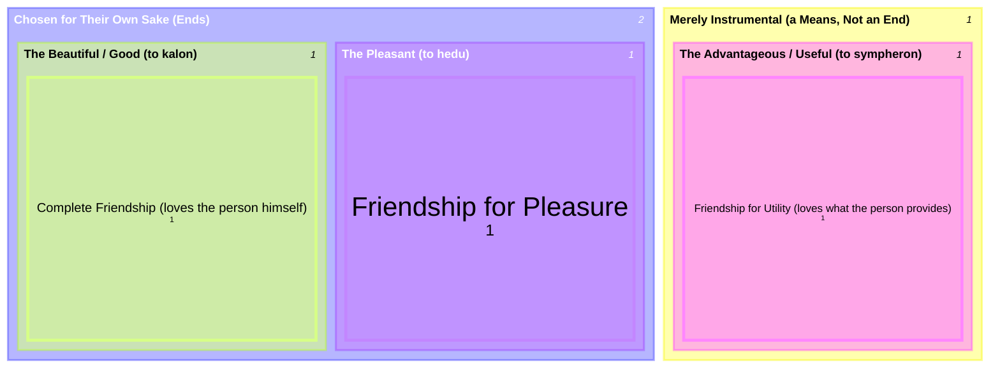

# The Threefold Good: What's Loveable at All

The same triad recurs in two places that look independent until you set them side by side: Book I-III's general theory of goods ("the pleasant, the beautiful, and the beneficial/advantageous," with the advantageous "dropping out as merely instrumental" — see [[concepts/to-kalon]]), and Book VIII's account of what makes a person loveable at all ("not everything is loved, but only what is loveable, and this is what is good or pleasant or useful" — see [[concepts/philia]]). Philia's three species of friendship aren't a separate three-way division invented for the friendship discussion — they're the *same* triad, applied to the specific case of loving a person rather than a thing.

## Key Ideas

- **The abstract triad has an internal split that matters more than the count of three**: only the beautiful and the pleasant are chosen for their own sake as genuine ends; the advantageous is explicitly demoted to a mere means, useful only because it produces one of the other two. This ends/means distinction, not the bare fact of "three kinds," is what does the real work — it's why Aristotle can treat the useful as a lesser case without denying it's loveable at all. ^[extracted]
- **Friendship for utility structurally mirrors treating a person as a mere instrument** — exactly the same means/end logic the general theory of goods already establishes, just applied to a person instead of a thing. This is why `philia.md` calls it a friendship "incidentally": the person is loved the way any merely useful thing is loved, not for himself. ^[inferred]
- **Complete friendship is friendship "in the primary and governing sense" for the identical reason the beautiful is the primary sense of the good** — both are the case where the object is loved as an end in itself, not instrumentally. The parallel isn't decorative; it's the same logical structure showing up twice. ^[inferred]

## Diagram

Direct containment, no invented data: the top split is Aristotle's own ends/means distinction for goods generally; each leaf nests the species of friendship that same kind of good grounds, showing the abstract classification and its concrete application as one tree rather than two separate ideas.

## Related

- [[concepts/philia]] — the three species of friendship this triad grounds
- [[concepts/to-kalon]] — the abstract theory of goods this triad is drawn from, and the argument for the beautiful as its primary sense
- [[synthesis/virtue-taxonomy]] — the companion treemap for virtue of character's own triadic structure (deficiency/mean/excess), a differently-shaped classification from this one
- [[references/nicomachean-ethics]] — source text (Book I, ch. 8; Book II, ch. 3; Book III, ch. 4; Book VIII, ch. 2-4)
