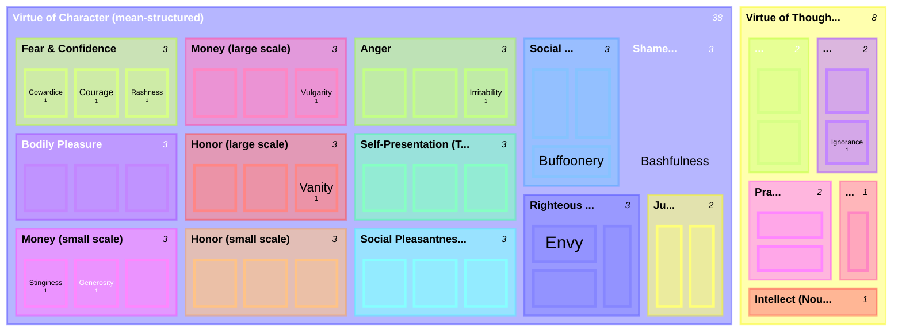

# The Shape of Aristotle's Virtue Taxonomy

A treemap synthesizing [[concepts/doctrine-of-the-mean]], [[concepts/akolasia]], [[concepts/phronesis]], and [[concepts/justice-nicomachean]] into a single visual: virtue of character (Bk. I, ch. 13) is structured almost uniformly by the mean doctrine, while virtue of thought is not — this page exists to make that asymmetry visible rather than just stated in prose.

## Key Ideas

- **How to read it**: every leaf is weighted `1`. Rectangle size encodes leaf-*count*, not importance — the point is the *shape* of each branch's internal structure, not a claim about which virtues matter more. ^[inferred]
- **Virtue of Character** renders as a set of uniform 3-way splits — one deficiency/mean/excess triad per domain (fear, bodily pleasure, money at two scales, honor at two scales, anger, truthfulness, social pleasantness at two registers, plus the two "quasi-virtue" feelings shame and righteous indignation). [[concepts/justice-nicomachean|Justice]] is the one visible exception even inside this branch: it renders as a plain 2-way split ([[concepts/distributive-justice|distributive]] / [[concepts/corrective-justice|corrective]]), with no deficiency or excess pole at all — exactly matching Aristotle's own statement that justice is "a mean... not in the same way" as the rest. ^[extracted]
- **Virtue of Thought** renders as irregular, shrinking branches — 2 leaves for art (true production / inartfulness), 2 for knowledge (knowledge / ignorance), 2 for [[concepts/phronesis|practical judgment]] (paired with cleverness misapplied), then single, undivided blocks for wisdom and intellect, to which Aristotle gives no stated contrary at all. The leaf-count irregularity is the diagram's way of showing, visually, that the intellectual virtues never get the mean doctrine's uniform triadic treatment. See [[concepts/phronesis]] for the textual argument: truth-disclosure doesn't come in "too much/too little" the way feelings do, so the triadic structure has nothing to attach to on that side. ^[inferred]
- **Non-exhaustiveness caveat**: treat the "Character" branch as one representative cut through the material, not a closed system — Aristotle's own virtue-of-character roster varies between his own works (13 in the *Nicomachean Ethics*, 14 in the *Eudemian Ethics*, differing by two virtues in each direction); a footnote on Bk. II, ch. 7 calls the avoidance of a fixed diagram deliberate, since forcing the particular virtues into "too rigid an application of a general scheme" would undermine Aristotle's actual purpose. ^[extracted]

## Related

- [[concepts/doctrine-of-the-mean]] — the structure this treemap visualizes for virtue of character
- [[concepts/akolasia]] — depicted as the excess leaf in the bodily-pleasure triad
- [[concepts/phronesis]] — the textual argument for why virtue of thought resists the same triadic structure
- [[concepts/justice-nicomachean]] — the one domain inside "Character" that already breaks the triad pattern
- [[concepts/distributive-justice]] — one of justice's two leaves
- [[concepts/corrective-justice]] — the other of justice's two leaves
- [[synthesis/justice-taxonomy]] — the companion treemap that expands justice's single 2-leaf node here into its own full taxonomy
- [[references/nicomachean-ethics]] — source text
